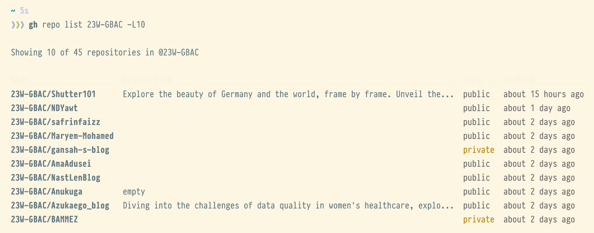
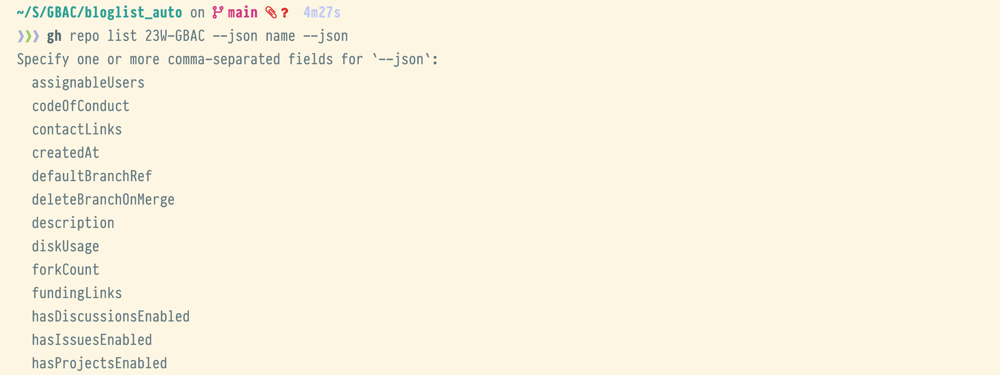
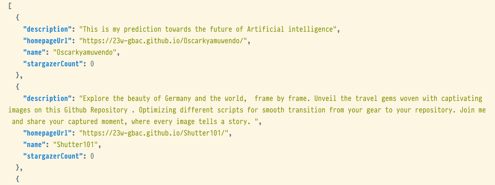

# Creating an automated overview on Github Repos

In many of my classes students use Github to host files or project documentation. Keeping track of changes and progress as well as the ability to provide instant feedback seems like being positive impact on me and the students' learning journeys.

Keeping and overview on somewhere between 50 and a few hundred repos is challenging though. I am engaging in various project to visualize data from Github. I'll report about one of them in this post: the bloglist.

## The Bloglist - Keep track of 50 blogs

In our first semester class students write an individual blog about some topic of their interest. They also create simple automation scripts. This wild mix of content will be published on Github Pages. The challenge: Getting and keeping an overview on 50+ Blogs.

What I was interested in:
- The student's name (yes, you are not a number!)
- The URL for the blog post
- Tags and Topics
- The last update
- Latest titles of blogposts

## The Github API

Github offers a spectacular yet complex API. You can get data about almost anything from repos over commits to the outcome of workflow runs. In our case we mainly need the repo resource for a Github group. You can retrieve JSON via either curl or more easily via gh - the Github Commandline Tool:

```{bash}
gh repo list 23W-GBAC -L 10
```
This lists all repos as a group. In our case the 23W-GBAC group. We only show 10 results ("-L 10") from 45 repos. The output is a table as shown below.



The gh command also allows us to output json by using the '--json' flag for each field we would like to add. A bit clumsy, but very direct:

```{bash}
gh repo list 23W-GBAC -L100 --json name
```


This outputs a JSON array with a repo being each record. In the screenshot above only the name of each repo is shown. However, we can tweak this by adding more fields. By adding another '--json' flag with an on-existent name, we directly get to see all possible names:

```{bash}
gh repo list 23W-GBAC -L100 --json name --json
```



Let's pick some more and complete the records, which are then the basis for our table. Here's the final command:

```{bash}
gh repo list 23W-GBAC -L 100 --json name --json description --json stargazerCount --json homepageUrl
```


## Wrangle JSON on the command-line with jq

The JSON itself is not very helpful. What we need in the end is a table formatted in Markdown. jq comes to the rescue... at least some steps of the way.


