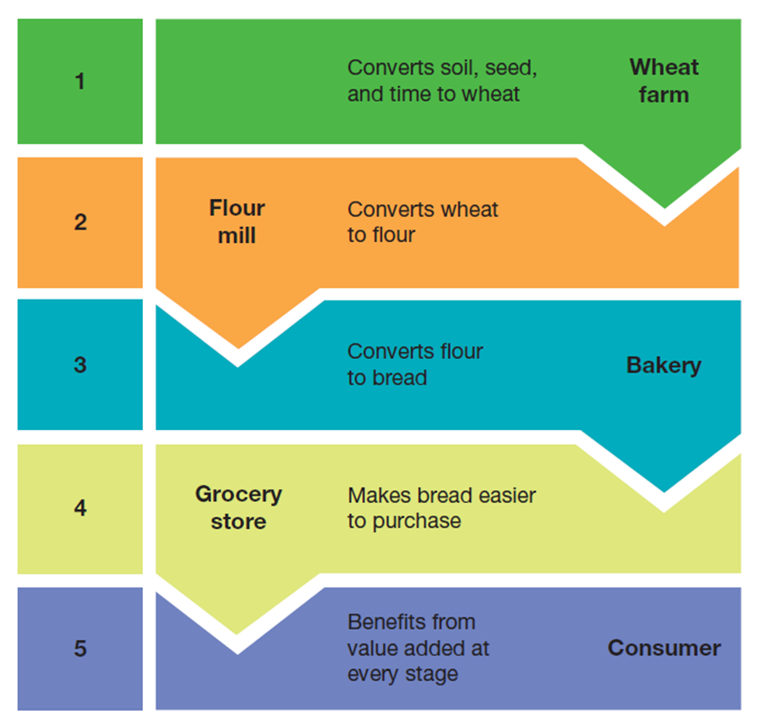
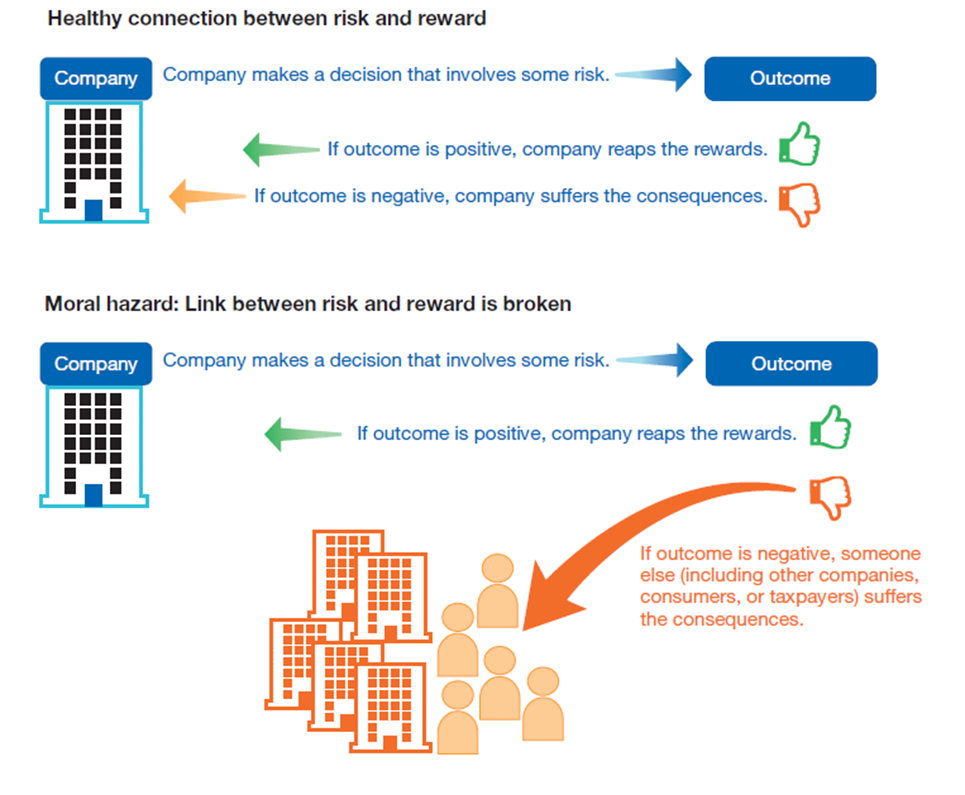
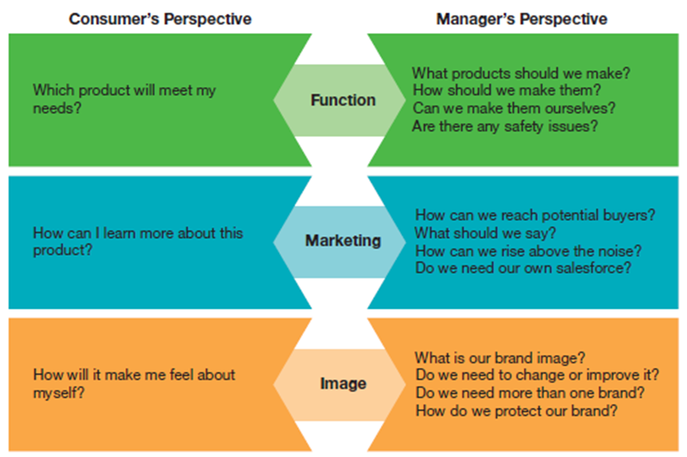
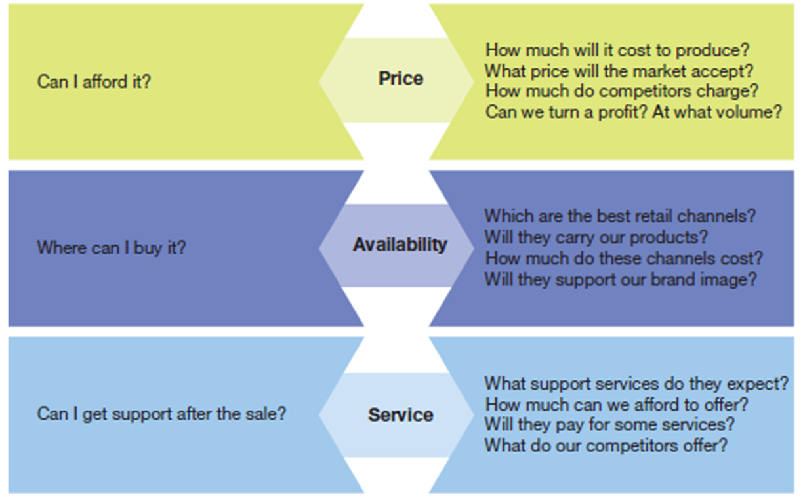
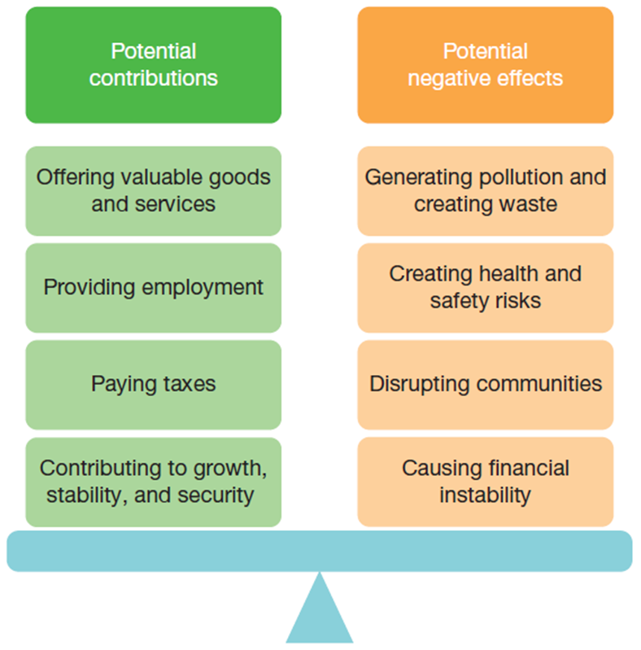
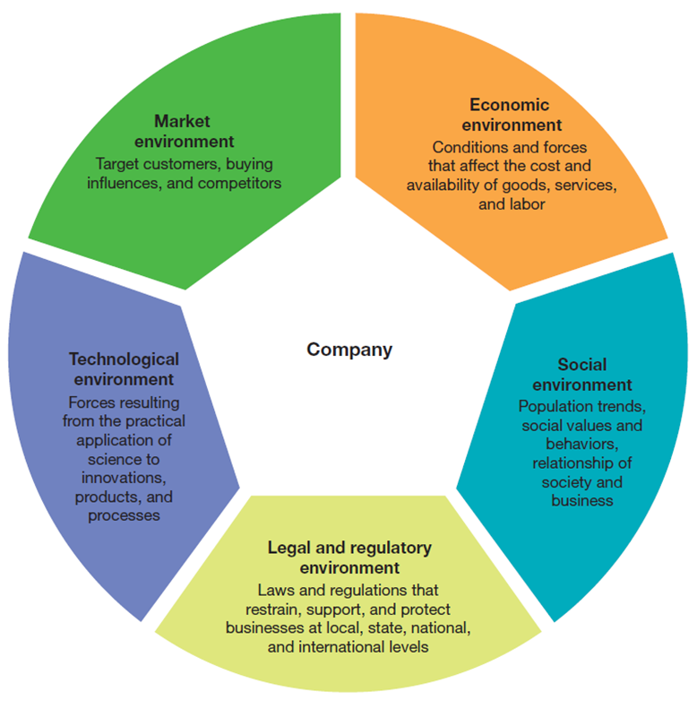
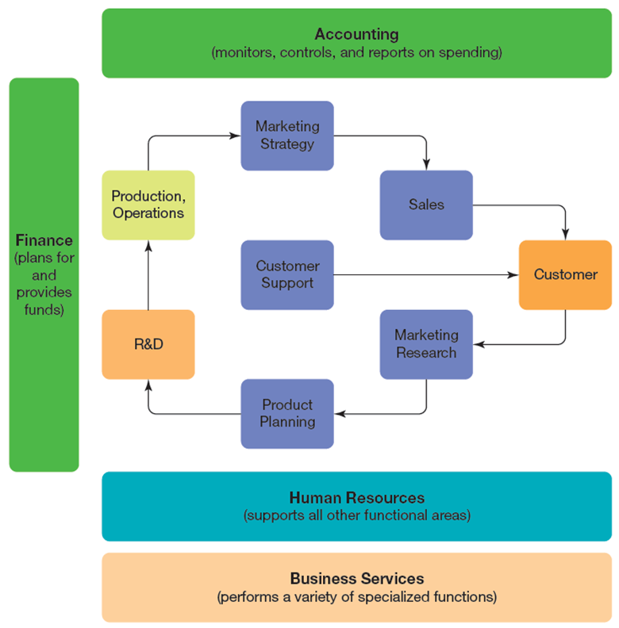
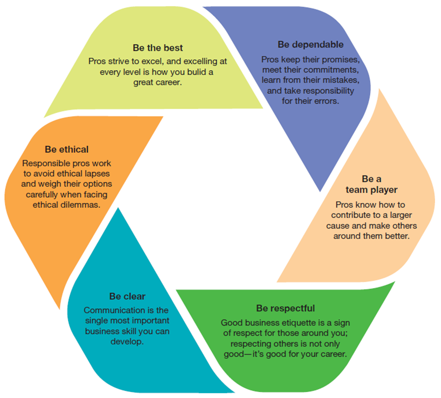
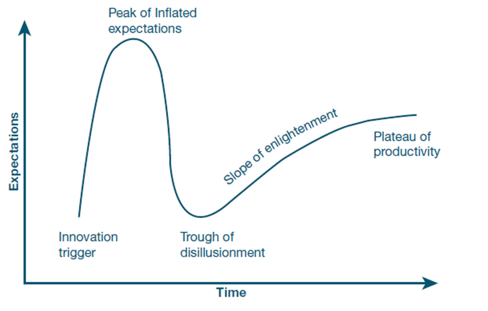

## Business in Action: Thriving in the Digital Enterprise

Ninth Edition' Global Edition

__Chapter 1__

Developing a Business Mindset

###### Copyright © 2020 Pearson Education Ltd. All Rights Reserved.

---

## Introduction

This chapter gets you ready for the whirlwind tour of the business world you will get in this course' starting with a quick overview of what businesses do' and then some advice on making the leap from consumer to business professional.

---

## Learning Objectives (1 of 2)

1.1 Explain the concept of adding value in a business' and identify four useful ways to categorize businesses.
1.2 List three steps you can take to help make the leap from consumer to business professional.
1.3 Discuss the five major environments in which every business operates.
1.4 Explain the purpose of the six major functional areas in a business enterprise.
1.5 Summarize seven of the most important business professions.
1.6 Identify six components of professionalism.
1.7 Describe the concepts of disruptive innovation and digital transformation.
1.8 Identify seven essential business skills that you will have the opportunity to develop during this course.

---

## Understanding What Businesses Do

* __Business__: Any profit-seeking organization that provides goods and services designed to satisfy the customers’ needs.

- Startup: Temporary institution in search of a profitable business model

---

## Exhibit 1.1 Adding Value to Satisfy Customers

---

## Adding Value: The Business of Business (1 of 2)

* __Revenue__:  * Money that a company brings in through the sale of goods and services.
* __Business model__: A concise description of how a business intends to generate revenue.
* __Profit__: Money left over after all the costs involved in doing business have been deducted from the revenue.

---

## Competing to Attract and Satisfy Customers

* __Competitive advantage__: Some aspects of a product or company that make it more appealing to its target customers.

- __Michael Porter:__
Price | Differentiation | Niche Market

<!--
Why do we need competition? Are there alternatives?
-->

---

## Identifying Major Types of Businesses (1 of 2)

* __Not-for-profit organizations__
  * Organizations that provide goods and services without having a profit motive; these are also called not.for.profit organizations.

* __Goods-producing businesses__
  * Companies that create value by making“things'”most of which are tangible.

* __Service businesses__
  * Companies that create value by performing activities that deliver some benefit to customers.

---

## Exhibit 1.2 Risk, Reward, and Moral Hazard (1 of 3)

---

## Capital and Barriers-to-Entry

Goods-producing businesses are often capital-intensive businesses.

Service businesses tend to be labor-intensive businesses.

* __Barrier to entry__
  * Any resource or capability a company must have before it can start competing in a given market.

<!--
What could be barriers to entry in a digital world?
-->

---

## Seeing Business from the Inside Out

* __Business mindset__
  * A view of business that considers the myriad decisions that must be made and the many problems that must be overcome before companies can deliver the products that satisfy customer needs.

<!--
Think about somethin you would like to start? How would you do that right now?
-->

---

---

---

## Exhibit 1.4 Positive and Negative Effects of Business

---

## Exhibit 1.5 The Multiple Environments of Business

---

## Recognizing the Multiple Environments of Business (1 of 2)

* __Social environment__
  * Trends and forces in society at large

* * __Stakeholders__
  * Internal and external groups affected by a company’s decisions and activities.

* __Technological environment__
  * Forces resulting from the practical application of science to innovations' products' and processes

* * __Disruptive technologies__
  * Those that fundamentally change the nature of an industry
  * Can be powerful enough to create or destroy entire companies

---

## Recognizing the Multiple Environments of Business (2 of 2)

* __Economic environment__
  * The conditions and forces that affect the cost and availability of goods' services' and labor and thereby shape the behavior of buyers and sellers

* __Legal and regulatory environment__
  * Laws and regulations at local' state' national' and even international levels

* __Market environment__
  * A company’s target customers' the buying influences that shape the behavior of those customers' and competitors that market similar products to those customers.

---

## Exhibit 1.6 Major Functional Areas in a Business Enterprise

---

## Identifying the Major Functional Areas in a Business Enterprise (1 of 3)

* __Research and development .R&D.__
  * Functional area responsible for conceiving and designing new products
* __Information technology .I__  __T.__
  * Systems that promote communication and information usage through the company' or that allow companies to offer new services to their customers.

* __Manufacturing' production' or operations__
  * An area where the company makes whatever it makes .for goods.producing businesses. or does whatever it does .for service businesses.
  * Purchasing' logistics' facilities management

---

## Identifying the Major Functional Areas in a Business Enterprise (2 of 3)

* * __Marketing__
  * Charging with identifying opportunities in the marketplace
  * Working with R&D to develop the products to address those opportunities
  * Creating branding and advertising strategies to communicate with potential customers and setting prices

* __Finance and accounting__
  * Responsible for virtually every aspect of a firm’s finances
  * Ensuring that the company has the funds it needs to operate
  * Monitoring and controlling how those funds are spent
  * Drafting reports for company management and outside audiences such as investors and government regulators

---

## Identifying the Major Functional Areas in a Business Enterprise (2 of 3)

* __Human resources .H__  __R.__
  * Responsible for recruiting' hiring' developing' and supporting employees

* __Business services__
  * Exist to help companies with specific needs in law' banking' real estate' and other areas

---

## Exploring Careers in Business

* __Operations management__
  * Management of the people and processes involved in creating goods and services

* __Information Technology (IT)__
  * The functional area of business as well as systems responsible for gathering' processing' and distributing information where needed throughout an organization

---

## Achieving Professionalism

* __Professionalism__
  * The quality of performing at a high level and conducting oneself with purpose and pride

<!--
Have you experienced unprofessional behavior?
-->

---

## Exhibit 1.7 Elements of Professionalism

---

## Being a Team Player

Professionals know that they are contributors to a larger cause.

Great team players know how to make those around them more effective.

Being a team player also means showing loyalty to your organization and protecting your employer’s reputation.

---

## Communicating Effectively

- Listen actively.
- Provide practical information.
- Give facts rather than vague impressions.
- Don’t present opinions as facts.
- Present information in a concise and effective manner.
- Clarify expectations and responsibilities.
- Offer compelling' persuasive arguments' and recommendations.

---

## Demonstrating Etiquette

* __Etiquette__
  * The expected norms of behavior in any particular situation

---

## Thriving in the Digital Enterprise: Disruptive Technologies and Digital Transformation

* __Digital enterprise__
  * Any company that uses digital systems as one of the foundations of its value.creation processes' regardless of what industry it is in or what products it makes.
* __Disruptive innovation__
  * Development so fundamentally different and far reaching that it can create new professions' companies' or even entire industries while damaging or destroying others.

---

## Exhibit 1.8 The Gartner Hype Cycle

---

## Digital Transformation

* __Digital transformation:__ Process of reimagining a company’s business model and operations to become a digital enterprise
  * New forms of organizing, culture, and leadership
  * Scarcity as main paradigm for economic action questions
  * Growth strategies with long stretches of initial losses
  * Highly focus yet scalable businesses
  * Frequent reconfiguration of product offering and position in the value chain

---

## Elements of Digital Transformation (1 of 3)

|||
|:--------------------------:|:--------------------------------------------------------------------------:|
| Process optimization | Redesigning or refining existing business processes to make them more effective and more efficient|
|   Big data and analytics   | Big data refers to the massive flows of data coming from customer records, social media, process sensors, financial transactions, and many other sources; analytics encompasses a variety of computer-driven efforts to extract meaning from all those data, often using forms of artificial intelligence  |

---

## Elements of Digital Transformation (2 of 3)

|||
|:--------------------------:|:--------------------------------------------------------------------------:|
| Internet of Things (I o T) |                                               Refers to the many billions of devices now connected to the internet, from simple sensors to complex machinery; the goal of IoT is to make systems smarter, more autonomous, and more responsive to user needs                                               |
|      Cloud computing       | An on-demand approach to computing in which companies essentially rent online computing capacity and software from a service provider, rather than buying and maintaining the assets themselves (“cloud” here refers somewhat vaguely to the internet, since cloud computing is accessed via the internet) |

---

## Elements of Digital Transformation (3 of 3)

|||
|:--------------------------:|:--------------------------------------------------------------------------:|
| Robotic process automation | Aims to do for knowledge work what robots do for manufacturing and other physical processes; targets the high-volume “paperwork” aspects of business and can automate some of the routine communication that this sort of work typically involves |
| Artificial intelligence | The application of computing power to replicate one of more aspects of human intelligence; generally speaking, it’s a three stage process: collecting data or information, analyzing or processing that input to make decisions, then applying the results of that decision-making activity |
| Digital twins | Accurate, detailed digital models of equipment that update in real time using data from their physical counterparts; can aid in troubleshooting, predictive maintenance, and design Improvement |
| Low-code app development | Systems that allow subject-matter experts to create apps without having in-depth programming knowledge or skills |

---

## Developing Skills for Your Career (1 of 2)

__Communication__ —communicating effectively is important at any stage in your career.

__Critical thinking__ —you will need to define and solve problems and make decisions or form judgments about a particular situation or set of circumstances.

__Collaboration__ —building team skills is critical.

__Knowledge application and analysis__ —the ability to learn a concept and then apply that knowledge to other challenges is a skill that employers value highly.

---

## Developing Skills for Your Career (2 of 2)

__Business ethics and social responsibility__ —as you work on projects throughout the course' be mindful of the ethical implications you could encounter in similar projects on the job.

__Information technology skills__ —use projects and activities to build your skills with technology' including word.processing apps' spreadsheets' presentation software' blogging' and messaging systems.

__Data literacy__ —you’ll have multiple opportunities to fine.tune your data literacy skills' which include the ability to access' assess' interpret' manipulate' summarize' and communicate data.

---

## Applying What You’ve Learned (1 of 2)

Explain the concept of adding value in a business' and identify the major types of businesses.

List three steps you can take to help make the leap from consumer to business professional.

Discuss the five major environments in which every business operates.

Explain the purpose of the six major functional areas in a business enterprise.

---

## Exercises

- Build or extend your LinkedIN Profile (30min)
- Connect with me (https://www.linkedin.com/in/dominikb1888/)
- Register for Digital Health Summit (10min)
- Sign into Slack Workspace, build your profile there, and leave an Intro Message (30min)
	- Share your interest an motivation for Digital Health
	- Think about what could be interesting at the Summit for you?
	-
- Get in touch with me on Slack :-)

---

## Applying what You've Learned (2 of 2)

Summarize seven of the most important business professions.

Identify six components of professionalism.

Describe the concepts of disruptive innovation and digital transformation.

Identify seven essential business skills that you will have the opportunity to develop during this course.
