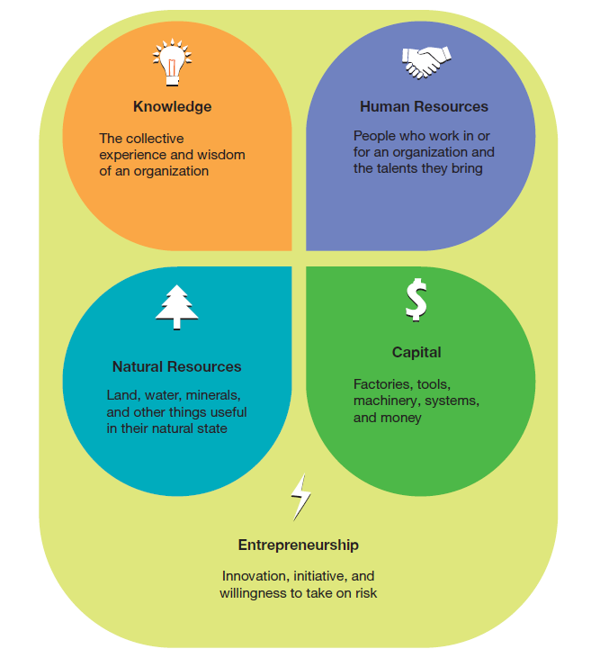
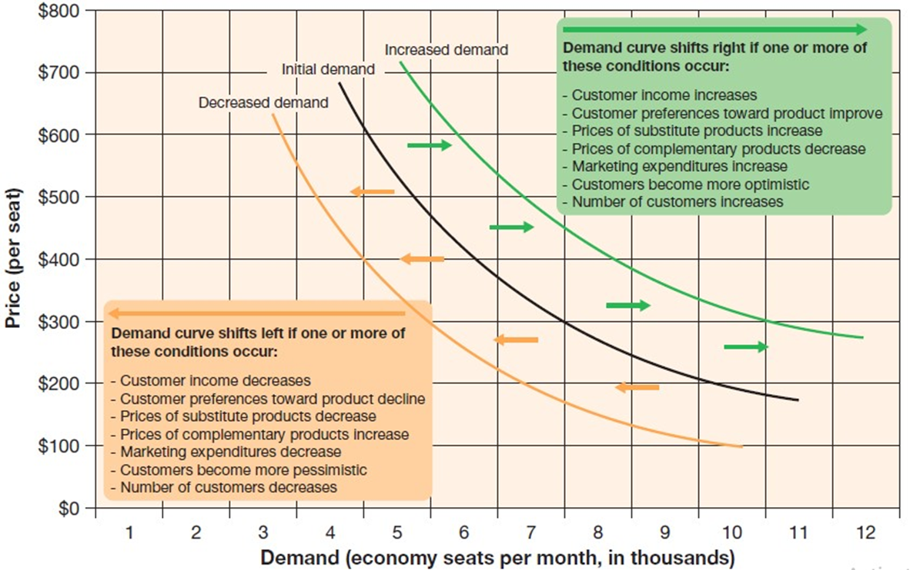
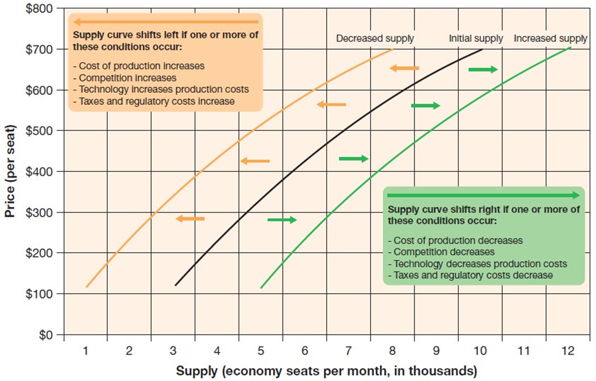
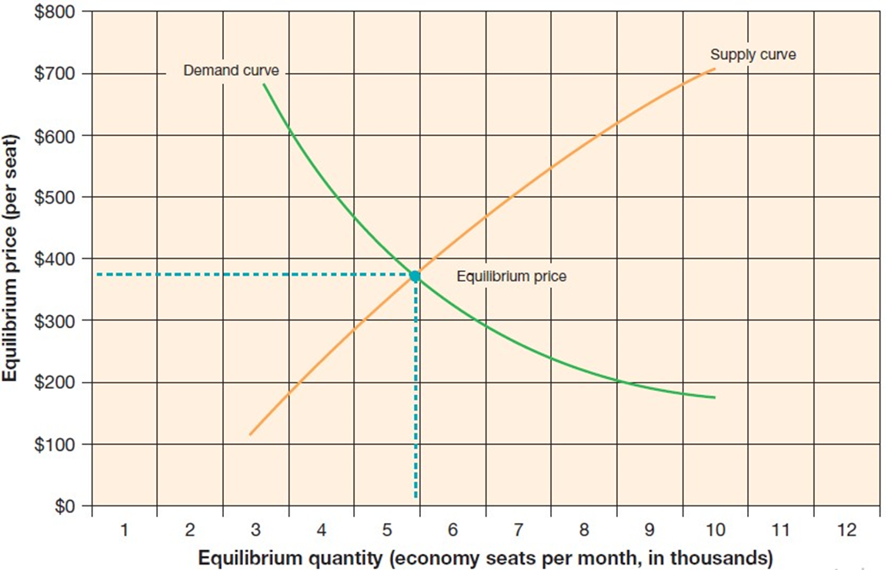
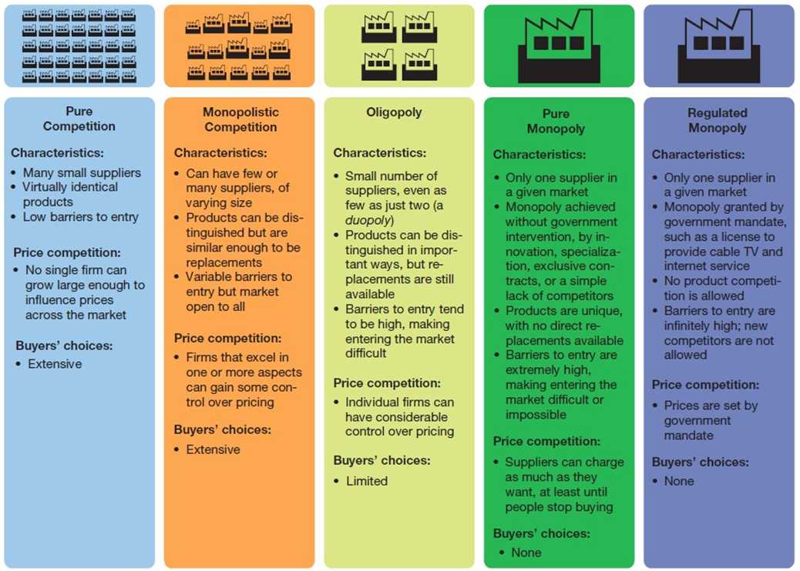
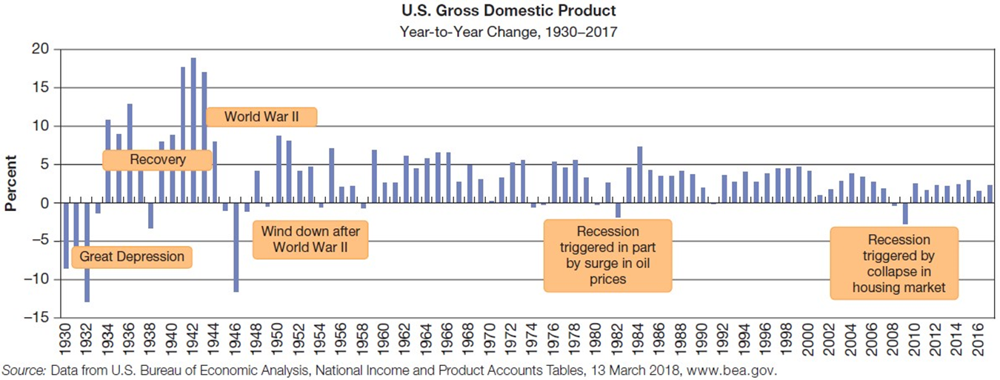
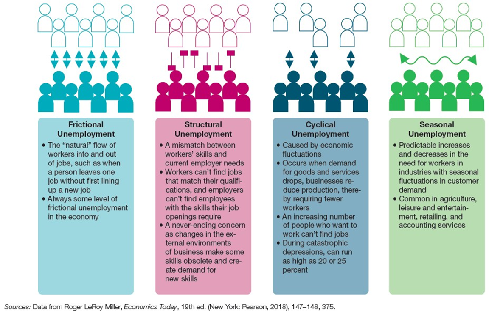
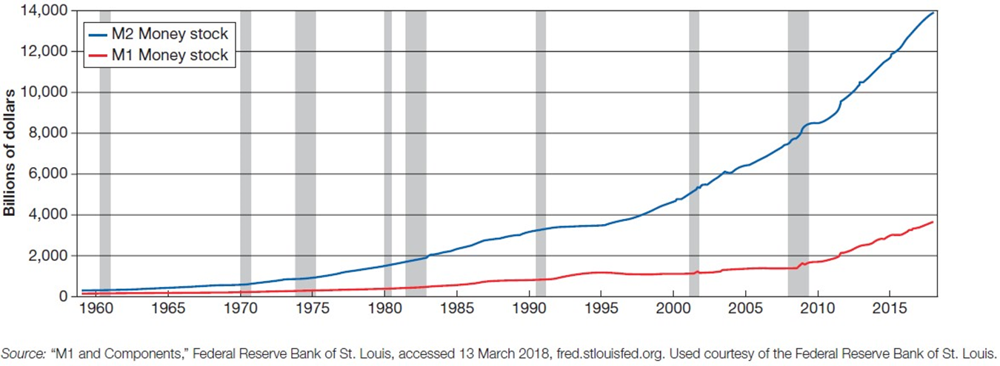
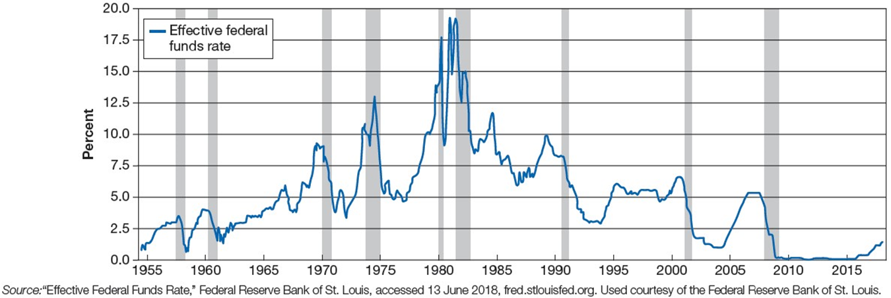
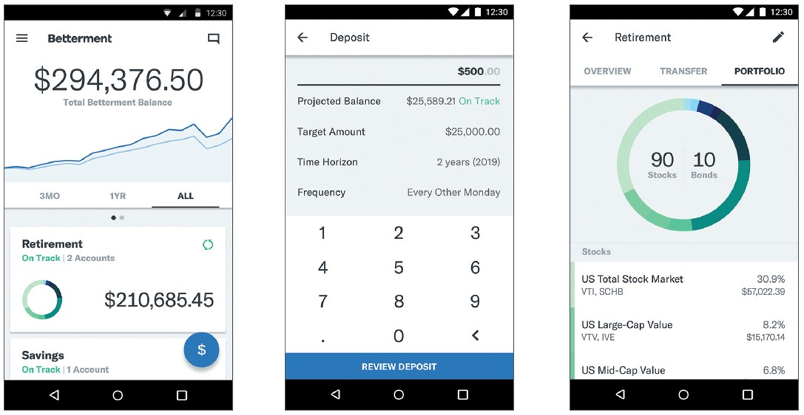

## Business in Action: Thriving in the Digital Enterprise

Ninth Edition' Global Edition

__Chapter 2__

Economics' Money' and Banking

##### Copyright © 2020 Pearson Education Ltd. All Rights Reserved.

---

## Introduction

* This chapter offers:
  * A brief introduction to economics from a business professional’s perspective
  * A overview of the interaction of supply and demand and a macro view of the economy
  * An exploration of money' banking' and the digital revolution known as __fintech__

## Excercise

- Make a personal experiment and track your time and spending
  - How much do spend on each of your tasks?
  - For which tasks are you getting something in return?
  - What are you spending money on?
  - How much time does decision-making and actually spending money take?
  - Can you save money?  Where are you putting/investing that money?

---

## Learning Objectives (1 of 2)

2.1 Define __economics__ ' explain why scarcity is central to economic decision making' and identify the major ways of measuring economic activity.
2.2 Define __economic__ system' and explain the government’s role in a free.market economy.
2.3 Explain the interaction between demand and supply.
2.4 Identify four macroeconomic issues that are essential to understanding the behavior of the economy.
2.5 List the four financial functions of money' and define two key measures of the money supply.
2.6 Explain the role of the Federal Reserve System' list the major types of banking institutions' and summarize banking’s role in the economy.
2.7 Define __fintech__ ' and discuss five ways that financial institutions are innovating with digital technology.

---

## What Is This Thing Called the Economy? (1 of 2)

* __Economy__
  * The sum total of all the economic activity within a given region
* __Economics__
  * The study of how a society uses its scarce resources to produce and distribute goods and services

* __Microeconomics__
  * The study of how consumers' businesses' and industries collectively determine the quantity of goods and services demanded and supplied at different prices
* __Macroeconomics__
  * The study of“big picture”issues in an economy' including competitive behavior among firms' the effect of government policies' and overall resource allocation issues

---

## Factors of Production (1 of 3)

* __Natural resources__
  * Land' forests' minerals' water' and other tangible assets usable in their natural state
* __Human resources__
  * All the people who work in an organization or on its behalf

* __Capital__
  * The funds that finance the operations of a business as well as the physical' human.made elements used to produce goods and services' such as factories and computers
* __Entrepreneurship__
  * The combination of innovation' initiative' and willingness to take the risks required to create and operate new businesses

* __Knowledge__
  * Expertise gained through experience or association

---

## Exhibit 2.1 Factors of Production

---

## The Economic Impact of Scarcity

* __Scarcity__
  * A condition of any productive resource that has finite supply
* __Opportunity cost__
  * The value of the most appealing alternative not chosen

---

## Economic Measures and Monitors

* __Economic indicators__
  * Statistics that measure the performance of the economy
  * Leading and lagging

---

## Exhibit 2.2 Key Economic Indicators (1 of 2)

Here are some of the key indicators that help policymakers and business leaders assess the state of the economy.

---

## Price Indexes

* __Consumer Price Index CPI__
  * A monthly statistic that measures changes in the prices of a representative collection of consumer goods and services
* __Producer Price Index PPI__
  * A statistical measure of price trends at the producer and wholesaler levels

---

## National Economic Output

* __Gross domestic product GDP__
  * The value of all the final goods and services produced by businesses located within a nation’s borders; excludes outputs from overseas operations of domestic companies

---

## Economic Systems

* __Economic system__
  * The policies that define a society’s particular economic structure; the rules by which a society allocates economic resources

---

## Planned Systems

* __Planned system__
  * Economic system in which the government controls most of the factors of production and regulates their allocation
  * Also called a command system or command.and.control system

---

## Exhibit 2.3 World’s Healthiest Economies

__Source:__ “The Legatum Prosperity Index 2017'” Legatum Institute'[www.prosperity.com](http://www.prosperity.com/).

---

## Free-Market Systems

* __Free-market system__
  * An economic system in which decisions about what to produce and in what quantities are decided by the market’s buyers and sellers
* __Capitalism__
  * Economic system based on economic freedom and competition

---

## Nationalization and Privatization

* __Nationalization__
  * A government’s takeover of selected companies or industries
* __Privatization__
  * Turning over services once performed by the government and allowing private businesses to perform them instead

---

## Government’s Role in a Free-Market System (1 of 2)

* __Regulation__
  * Relying more on laws and policies than on market forces to govern economic activity
* __Deregulation__
  * Removing regulations to allow the market to prevent excesses and correct itself over time

Protecting stakeholders

Fostering competition

Encouraging innovation and economic development

Stabilizing and stimulating the economy

---

## Exhibit 2.4 Major Government Agencies and What They Do (1 of 2)

---

## Stabilizing and Stimulating the Economy

* __Monetary policy__
  * Government policy and actions taken by the Federal Reserve Board to regulate the nation’s money supply
* __Fiscal policy__
  * Strategy for the use of government revenue collection and spending to influence the business cycle

---

## Exhibit 2.5 Major Types of Taxes

---

## The Forces of Demand and Supply

* __Demand__
  * Buyers’willingness and ability to purchase products at various price points
* __Supply__
  * A specific quantity of a product that the seller is able and willing to provide at various prices
* __Demand curve__
  * A graph of the quantities of a product that buyers will purchase at various prices

---

## Exhibit 2.6 Demand Curve

---

## Understanding Supply

* __Supply curve__
  * A graph of the quantities of a product that sellers will offer for sale' regardless of demand' at various prices

---

## Exhibit 2.7 Supply Curve

---

## Understanding How Demand and Supply Interact

* __Equilibrium price__
  * The point at which quantity supplied equals quantity demanded
* Because the supply and demand curves are dynamic' so is the equilibrium point
* As variables affecting supply and demand change' so will the equilibrium price

---

## Exhibit 2.8 The Relationship Between Supply and Demand

---

## Competition in a Free-Market System (1 of 3)

* __Competition__
  * Rivalry among businesses for the same customers
* __Pure competition__
  * A situation in which so many buyers and sellers exist that no single buyer or seller can individually influence market prices

---

## Exhibit 2.9 Categories of Competition

---

## Competition in a Free-Market System (2 of 3)

* __Monopoly__
  * A situation in which one company dominates a market to the degree that it can control prices
* __Monopolistic competition__
  * A situation in which many sellers differentiate their products from those of competitors in at least some small way

* __Oligopoly__
  * A market situation in which a very small number of suppliers' sometimes only two' provide a particular good or service

---

## Business Cycles

* __Recession__
  * A period during which national income' employment' and production all fall; defined as at least six months of decline in the GDP
* __Business cycles__
  * Fluctuations in the rate of growth that an economy experiences over a period of several years

---

## Unemployment

* __Unemployment rate__
  * The portion of the labor force .everyone over 16 who has or is looking for a job. currently without a job

---

## Inflation and Deflation

* __Inflation__
  * An economic condition in which prices rise steadily throughout the economy
* __Deflation__
  * An economic condition in which prices fall steadily throughout the economy

---

## Exhibit 2.10 Fluctuations in the U.S. Economy

__Source:__ Data from U.S. Bureau of Economic Analysis' National Income and Product Accounts Tables' 13 March 2018'[www.bea.gov](http://www.bea.gov/).

---

## Exhibit 2.11 Types of Unemployment

__Sources:__ Data from Roger LeRoy Miller' __Economics Today__ ' 19th ed. .New York: Pearson' 2018.' 147–148' 375.

---

## The Meaning of Money

* __Money__
  * Anything generally accepted as a means of paying for goods and services
  * Serves as a medium of exchange' a unit of accounting' a store of value' and a standard of deferred value

---

## Exhibit 2.12 The Money Supply

__Source:__ “M1 and Components'” Federal Reserve Bank of St. Louis' accessed 13 March 2018'[fred.stlouisfed.org](http://fred.stlouisfed.org/). Used courtesy of the Federal Reserve Bank of St. Louis.

---

## Exhibit 2.13 Federal Reserve System

__Sources:__ The Federal Reserve System: Purposes & Functions' 10th ed. .Washington' D.C.: Board of Governors of the Federal Reserve system' 2016.' 1.

---

## The Federal Reserve System (1 of 2)

* __Federal funds rate__
  * The interest rate that member banks charge each other to borrow money overnight from the funds they keep in the Federal Reserve accounts

---

## Exhibit 2.14 Federal Funds Rate

__Source:__ “Effective Federal Funds Rate'” Federal Reserve Bank of St. Louis' accessed 13 June 2018'[fred.stlouisfed.org](http://fred.stlouisfed.org/). Used courtesy of the Federal Bank of St. Louis.

---

## The Federal Reserve System (2 of 2)

* __Discount rate__
  * The interest rate that member banks pay when they borrow funds from the Fed
* __Prime rate__
  * The interest rate a bank charges its best loan customers

---

## Investment Banking

* __Investment banks__
  * Firms that offer a variety of services related to initial public stock offerings' mergers and acquisitions' and other investment matters

---

## Commercial Banking and Other Financial Services

* __Commercial banks__
  * Financial institutions that accept deposits' offer various types of checking and savings accounts' and provide loans
* __Retail banks__
  * Banks that provide financial services to consumers

---

## Thriving in the Digital Enterprise: Fintech

* __Fintech__
  * Technologies with the potential to improve or disrupt financial services

---

## Exhibit 2.15 Fintech Apps

---

## Improving the Customer Experience in Financial Services

* __Neobanks__
  * Banks that provide services entirely through mobile and digital channels

---

## Applying What You’ve Learned (1 of 2)

Define economics' explain why scarcity is central to economic decision making' and identify the major ways of measuring economic activity.

Define __economic__ system' and explain the government’s role in a free.market economy.

Explain the interaction between demand and supply.

Identify four macroeconomic issues that are essential to understanding the behavior of the economy.

List the four financial functions of money' and define two key measures of the money supply.

Explain the role of the Federal Reserve System' list the major types of banking institutions' and summarize banking’s role in the economy.

Define __fintech__ ' and discuss five ways that financial institutions are innovating with digital technology.

