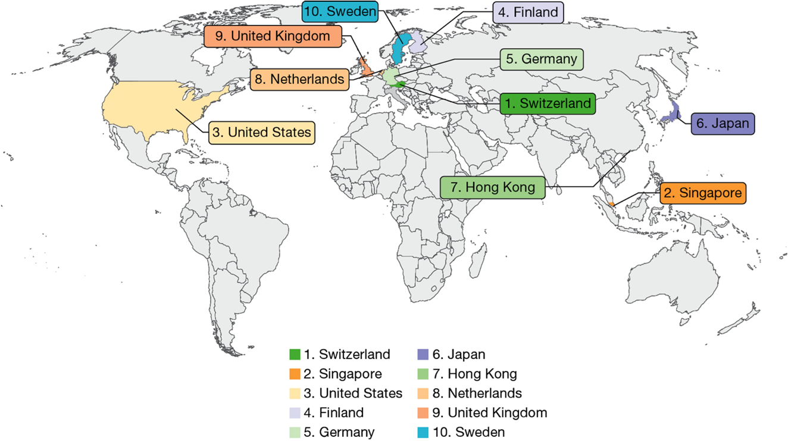
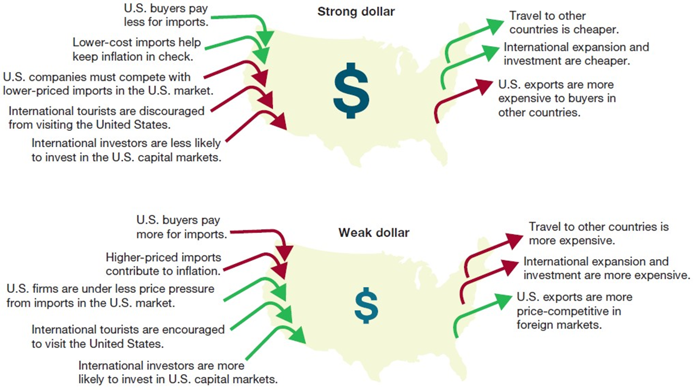
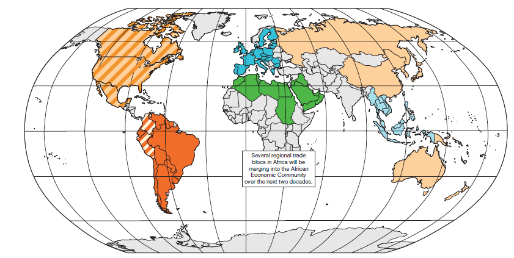
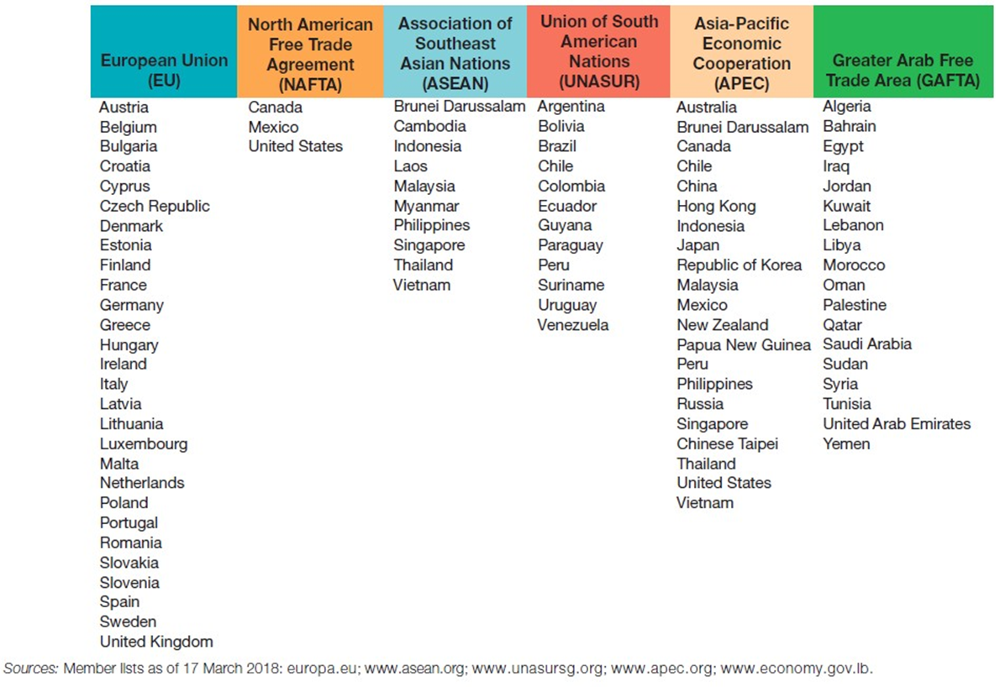
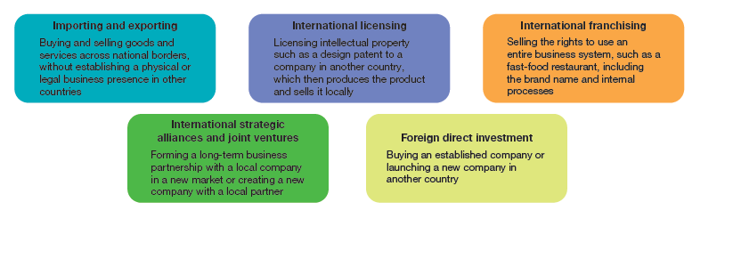
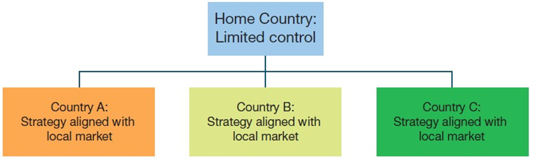
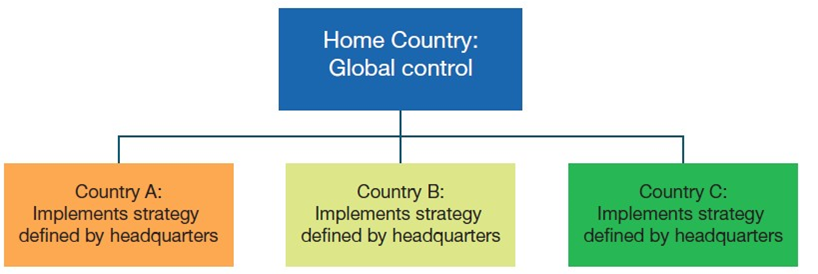
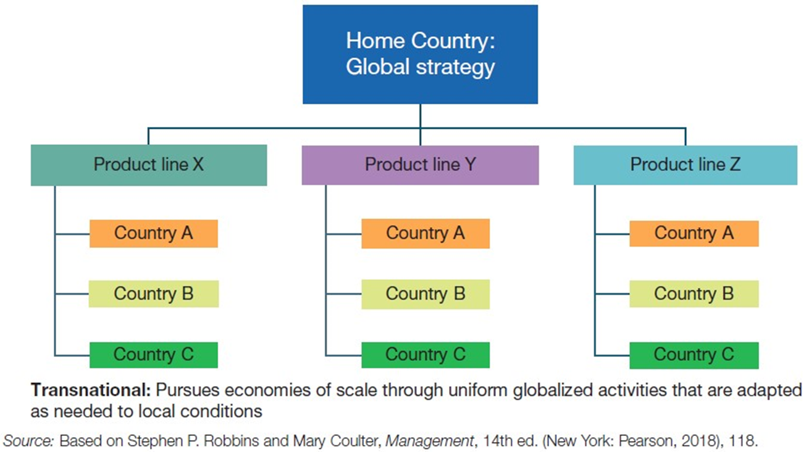
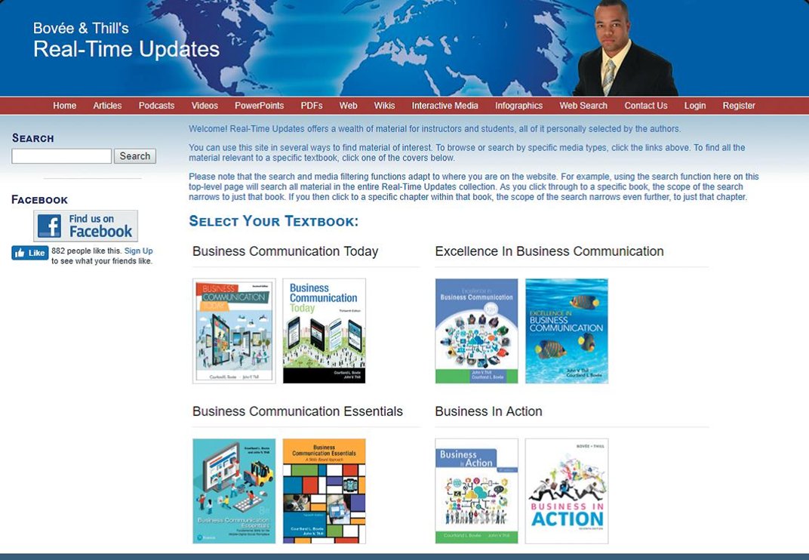
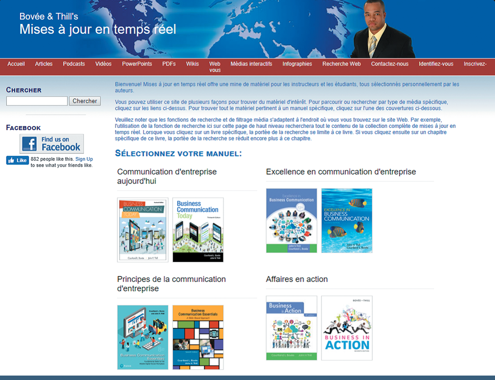

## Business in Action: Thriving in the Digital Enterprise

Ninth Edition' Global Edition

__Chapter 3__

The Global Marketplace

Copyright © 2020 Pearson Education Ltd. All Rights Reserved.

---

## Learning Objectives (1 of 2)

 Explain why nations trade' and describe how international trade is measured.

 Discuss the nature of conflicts in global business' including free trade and government interventions in international trade.

 Identify the major organizations that facilitate international trade and the major trading blocs around the world.

 Discuss the importance of understanding cultural and legal differences in the global business environment.

 Define the major forms of international business activity.

 Discuss the strategic choices that must be considered before entering international markets.

 Describe the current state of AI.assisted translation and its value to international businesses.

---

## Why Nations Trade (1 of 2)

* __Economic globalization__
  * The increasing integration and interdependence of national economies around the world
* __Economies of scale__
  * Savings from buying parts and materials' manufacturing' or marketing in large quantities

Focusing on relative strengths

Expanding markets

Pursuing economies of scale

Acquiring materials' goods' and services

Keeping up with customers

Keeping up with competitors

---

## How International Trade is Measured

* __Balance of trade__
  * Total value of the products a nation exports minus the total value of the products it imports' over some period of time.
* __Trade deficit__
  * An unfavorable trade balance is created when a country imports more than it exports
* __Balance of payments__
  * The sum of all payments a country receives from other countries minus the sum of all payments it makes to the other countries' over some specified period of time

---

## Exhibit 3.1 The World’s Most Competitive Economies

---

## Foreign Exchange Rates and Currency Valuations

* __Exchange rate__
  * The rate at which the money of one country is traded for the money of another

---

## Exhibit 3.2 Strong and Weak Currencies: Who Gains, Who Loses?

---

## Free Trade

* __Free trade__
  * International trade unencumbered by restrictive measures
* Supporters of free trade generally acknowledge that it produces winners and losers but that the winners gain more than the losers lose' so the net effect is positive

---

## Government Intervention in International Trade (1 of 4)

* __Protectionism__
  * Government policies aimed at shielding a country’s industries from foreign competition
* __Tariffs__
  * Taxes levied on imports

* __Import quotas__
  * Limits placed on the quantity of imports a nation will allow for a specific product
* __Embargo__
  * A total ban on trade with a particular nation .a sanction. or of a particular product

* __Export subsidies__
  * A form of financial assistance in which producers receive enough money from the government to allow them to lower their prices in order to compete more effectively in the global market

* __Dumping__
  * Charging less than the actual cost or less than the home.country price for goods sold in other countries

---

## International Trade Organizations (1 of 3)

* __World Trade Organization .W__  __T__  __O.__
  * Permanent forum for negotiating' implementing' and monitoring international trade procedures' and for mediating trade disputes among the150 member countries

* __International Monetary Fund .I__  __M__  __F.__
  * Formed to monitor global financial developments' provide technical advice and training' provide short.term loans to countries that are unable to meet their financial obligations' and work to alleviate poverty in developing economies

  * Founded to finance reconstruction after World War

  * and is now involved in hundreds of projects around the world aimed at addressing poverty' health' education' and other concerns in developing countries
  * Is a United Nations agency owned by its 187 member nations

---

## Trading Blocs (1 of 4)

* __Trading blocs__
  * Organizations of nations that remove trade barriers among their member countries and establish uniform barriers to trade with nonmember nations

* __North American Free Trade Agreement .N__  __A__  __F__  __T__  __A.__
  * Formed by the United States' Canada' and Mexico to pave the way for the free flow of goods' services' and capital within the bloc through the phased elimination of tariffs and quotas

* __European Union .E__  __U.__
  * Constitutes more than two dozen countries and a half billion people
  * Now accounts for the world’s largest economy
* EU nations have eliminated hundreds of local regulations' variations in product standards' and protectionist measures that once limited trade among member countries

* __Asia-Pacific Economic Cooperation APEC
  * An organization of 21 countries working to liberalize trade in the Pacific Rim
  * Has a long.term goal of liberalizing and simplifying trade and investment among member countries and helping the region as a whole achieve sustainable economic growth

---

## Exhibit 3.3 Members of Major Trading Blocs (1 of 2)

__Sources:__ Member lists as of 17 March 2018:[europa.eu](http://www.europa.eu/);[www.unasursg.org](http://www.unasursg.org/);[www.apec.org](http://www.apec.org/);[www.econmy.gov.lb](http://www.econmy.gov.lb/).

---

## The Global Business Environment (1 of 3)

* __Culture__
  * A shared system of symbols' beliefs' attitudes' values' expectations' and norms for behavior

* __Stereotyping__
  * Assigning a wide range of generalized attributes' which are often superficial or even false' to an individual based on his or her membership to a particular culture or social group
  
* __Ethnocentrism__
  * Judging all other groups according to the standards' behaviors' and customs of one’s own group

* __Cultural pluralism__
  * The practice of accepting multiple cultures on their own terms

---

## Exhibit 3.4 Checklist for Doing Business Abroad (1 of 3)

---

## Legal Differences in the Global Business Environment

* __Tax haven__
  * A country whose favorable banking laws and low tax rates give companies the opportunity to shield some of their income from higher tax rates in their home countries or other countries where they do business

---

## Exhibit 3.5 Forms of International Business Activity

---

## Forms of International Business Activity (1 of 3)

* __Importing__
  * Purchasing goods or services from another country and bringing them into one’s own country
* __Exporting__
  * Selling and shipping goods or services to another country

* __Licensing__
  * Agreement to produce and market another company’s product in exchange for a royalty or fee

* __Foreign Direct Investment__ (FDI)
  * Investment of money by foreign companies in domestic business enterprises
* __Multinational Corporations__ (MNC)
  * Companies with operations in more than one country

---

## Strategic Approaches to International Markets (1 of 2)

* __Multidomestic strategy__
  * A decentralized approach to international expansion in which a company creates highly independent operating units in each new country

* __Global strategy__
  * A highly centralized approach to international expansion' with headquarters in the home country making all major decisions
* __Transnational strategy__
  * A hybrid approach that attempts to reap the benefits of international scale while being responsive to local market dynamics

---

## Exhibit 3.6 Organizing for Global Business (1 of 2)

__Multidomestic__  __:__ Decentralized control' with individual divisions or subsidiaries in various countries free to pursue strategies that align with local markets

__Global:__ Centralized control and single approach' applied as uniformly as possible around the world

__Transnational:__ Pursues economies of scale through uniform globalized activities that are adapted as needed to local conditions

__Source:__ Based on Stephen P. Robbins and Mary Coulter' __Management__ ' 14th ed. .New York: Pearson' 2018.' 118..

---

## AI-Assisted Translation

* __Text translation__
  * Translates written text' text within images' and spoken language' includes translation features of web browsers and mobile apps
* __Real.time voice translation__
  * Requires multiple levels of technology including speech recognition' synthesis' natural language processing' and natural language generation

---

## Exhibit 3.7 Automated Website Translation (1 of 2)

---

## Applying What You’ve Learned (1 of 2)

- Explain why nations trade' and describe how international trade is measured.
- Discuss the nature of conflicts in global business' including free trade and government interventions in international trade.
- Identify the major organizations that facilitate international trade and the major trading blocs around the world.
- Discuss the importance of understanding cultural and legal differences in the global business environment.
- Define the major forms of international business activity.
- Discuss the strategic choices that must be considered before entering international markets.
- Describe the current state of AI.assisted translation and its value to international businesses.
