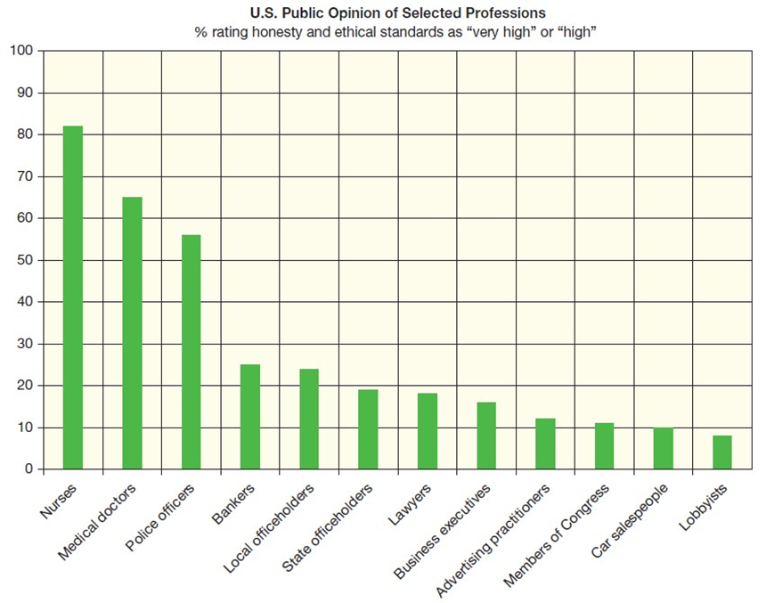
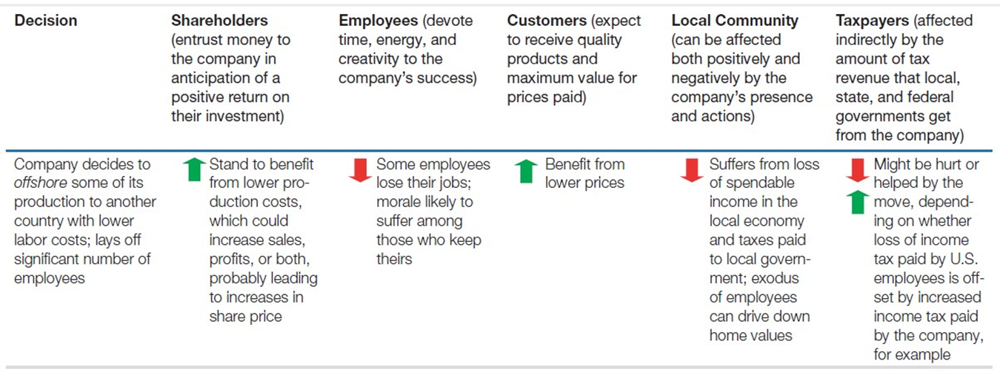
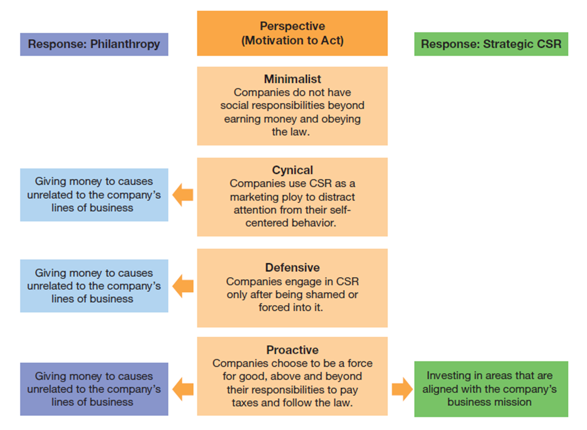
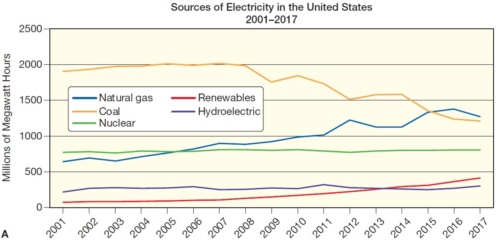
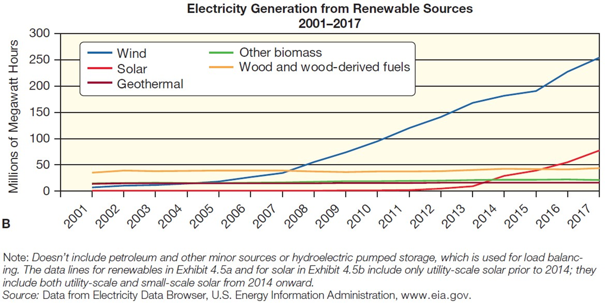
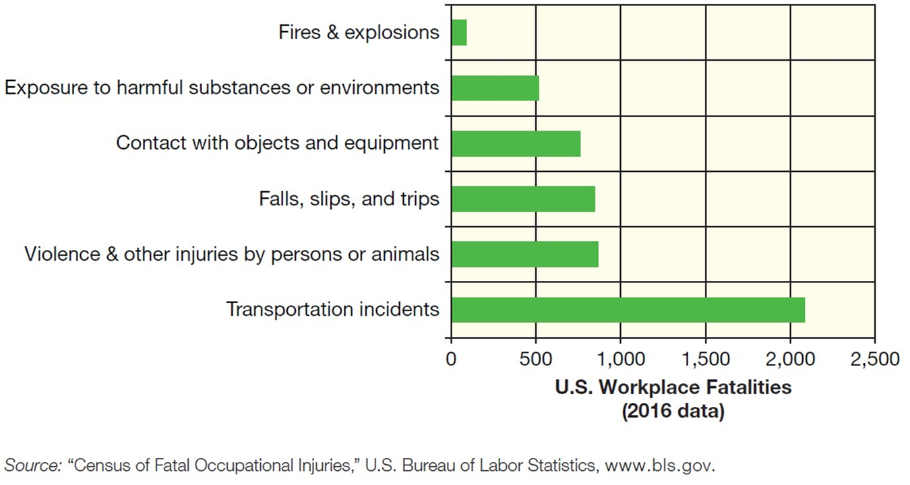

---

## Business in Action: Thriving in the Digital Enterprise

Ninth Edition' Global Edition

__Chapter 4__

Business Ethics and Corporate Social Responsibility

Copyright © 2020 Pearson Education Ltd. All Rights Reserved.

---

## Learning Objectives (1 of 2)

 Discuss what it means to practice good business ethics' and highlight the forces that can influence ethical decision. making.

 Define corporate social responsibility .CSR.'and explain the difference between philanthropy and strategic CSR.

 Distinguish among the four perspectives on corporate social responsibility.

 Discuss the role of business in protecting the natural environment' and define sustainable development _._

 Identify five fundamental consumer rights and the responsibility of business to respect them.

 Explain the responsibilities businesses have toward their employees.

 Identify two categories of ethical concerns with artificial intelligence.

---

## Introduction

As a future business leader' you will face some of the challenges discussed in this chapter' and your choices won’t always be easy. You may struggle to find ethical clarity in some situations or even to understand what your choices are and how each option might affect your company’s various stakeholders.

---

## Ethics in Contemporary Business

* __Ethics__
  * The rules or standards governing the conduct of a person or group

---

## Exhibit 4.1 Public Perceptions of Business Ethics

__Source:__ Data from Megan Brenan' “Nurses Keep Healthy Leads as Most Honest' Ethical Profession'” Gallup' 26 December 2017'[www.gallup.com](https://www.gallup.com/).

---

## Defining Ethical Behavior (1 of 2)

* __Insider trading__
  * The use of unpublicized information that an individual gains from the course of his or her job to benefit from fluctuations in the stock market

* __Competing fairly and honestly__
  * Businesses are expected to compete fairly
* __Communicating truthfully__
  * Communicating truthfully is a simple enough concept: Tell the truth' the whole truth' and nothing but the truth
* __Not causing harm to others__
  * All businesses have the capacity to cause harm to employees' customers' other companies' their communities' and investors

---

## Strategies for Supporting Ethical Behavior

* __Code of ethics__
  * A written statement that sets forth the principles that guide an organization’s decisions
* __Transparency__
  * The degree to which affected parties can observe relevant aspects of transactions or decisions
* __Whistle.blowing__
  * The disclosure by a company insider of information that exposes illegal or unethical behavior by others within the organization

---

## Exhibit 4.2 Stakeholders’ Rights: A Difficult Balancing Act (1 of 2)

---

## Guidelines for Making Ethical Decisions

* __Ethical dilemma__
  * A situation in which more than one side of an issue can be supported with valid ethical arguments
* __Conflicts of interest__
  * Situations in which competing loyalties can lead to ethical lapses' such as when a business decision may be influenced by the potential for personal gain.

---

## Exhibit 4.3 Approaches to Resolving Ethical Dilemmas

__Sources:__ Manuel Velasquez' Claire Andre' Thomas Shanks' S. J.' and Michael J. Meyer' “Thinking Ethically: A Framework for Moral Decision Making'” Markkula Center for Applied Ethics' Santa Clara University' accessed 3 June 2009'[www.scu.edu](https://www.scu.edu/); Ben Rogers' “John Rawls'” The Guardian' 27 November 2002'[www.guardian.co.uk](https://www.guardian.co.uk/); Irene Van Staveren' “Beyond Utilitarianism and Deontology: Ethics in Economics'” Review of Political Economy' January 2007' 21–35.

---

## Finding the Right Answer When Faced with an Ethical Dilemma

Make sure you frame the situation accurately' taking into account all relevant issues and questions.

Identify all parties who might be affected by your decision.

Be as objective as possible.

---

## Corporate Social Responsibility

* __Corporate social responsibility .C__  __S__  __R.__
  * The idea that business has obligations to society beyond the pursuit of profits

---

## The Relationship Between Business and Society (1 of 2)

Consumers in contemporary societies __enjoy__ and __expect__ a wide range of benefits' from education and healthcare to credit and products that are safe to use.

Profit.seeking companies are the __economic engine__ that powers modern society; they generate the vast majority of the money in a nation’s economy.

Much of what we consider when assessing a society’s standard of living involves goods and services created by __profit.seeking__ companies.

Companies cannot hope to operate profitably without the many benefits provided by a __stable' functioning__ society.

---

## Philanthropy versus Strategic C S R

* __Philanthropy__
  * The donation of money' time' goods' or services to charitable' humanitarian' or educational institutions
* __Strategic C__  __S__  __R__
  * Social contributions that are directly aligned with a company’s overall business strategy

---

## Exhibit 4.4 Perspectives on Corporate Social Responsibility

---

## Defensive C S R

* __Nongovernmental organizations .N__  __G__  __Os.__
  * Nonprofit groups that provide charitable services or promote social and environmental causes

---

## The Proactive Stance: Moving Beyond C S R

* __Purpose.driven business__
  * A company that aspires to accomplish more than just making money for owners and investors

---

## Exhibit 4.5 Sources of Electricity in the United States (1 of 2)

__Note:__ Doesn’t include petroleum and other minor sources or hydroelectric pumped storage' which is used for load balancing. The data lines for renewables in Exhibit 4.5a and for solar in Exhibit 4.5b include only utility.scale solar prior to 2014; they include both utility.scale and small.scale solar for 2014 onward.

__Source:__ Data from Electricity Data Browser' U.S. Energy Information Administration'[www.eia.gov](https://www.eia.gov/).

---

## Exhibit 4.6 Major Federal Environmental Legislation (1 of 2)

Clean Air Act .1963.

Solid Waste Disposal Act .1965.

National Environmental Policy Act .1969.

Resource Recovery Act .1970.

Clean Water Act .1972.

Noise Control Act .1972.

Endangered Species Act .1973.

Safe Drinking Water Act .1974.

Toxic Substances Control Act .1976.

Nuclear Waste Policy Act .1982.

Marine Protection' Research' and Sanctuaries Act .1988.

Oil Pollution Act .1990.

Energy Independence and Security Act .2007.

---

## The Trend Toward Sustainability

* __Sustainable development__
  * Operating business in a manner that minimizes pollution and resource depletion' ensuring that future generations will have vital resources

---

## C S R: Consumers (1 of 2)

* __Consumerism__
  * A movement that pressures businesses to consider consumer needs and interests
* __Identity theft__
  * A crime in which thieves steal personal information and use it to take out loans and commit other types of fraud

The right to buy safe products—and to buy them safely

The right to be informed

The right to choose which products to buy

The right to be heard

---

## C S R: Employees (1 of 2)

* __Discrimination__
  * In a social and economic sense' denial of opportunities to individuals on the basis of some characteristic that has no bearing on their ability to perform in a job

* __Affirmative action__
  * Activities undertaken by businesses to recruit and promote members of groups whose economic progress has been hindered through either legal barriers or established practices

---

## Exhibit 4.8 Fatal Occupational Injuries

__Source:__ “Census of Fatal Occupational Injuries'” U.S. Bureau of Labor Statistics'[www.bls.gov](https://www.bls.gov/).

---

## Applying What You’ve Learned (1 of 2)

Discuss what it means to practice good business ethics' and highlight three factors that influence ethical decision making.

Define __corporate social responsibility .C__  __S__  __R.__ 'and explain the difference between philanthropy and strategic CSR.

Distinguish among the four perspectives on corporate social responsibility.

Discuss the role of business in protecting the natural environment' and define __sustainable development__  _._

Identify five fundamental consumer rights and the responsibility of business to respect them.

Explain the responsibilities businesses have toward their employees.

Identify two categories of ethical concerns with artificial intelligence.

