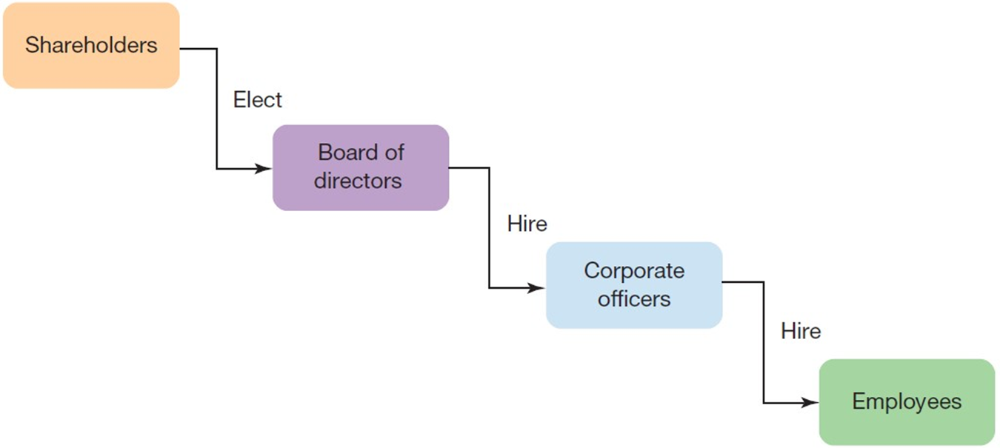
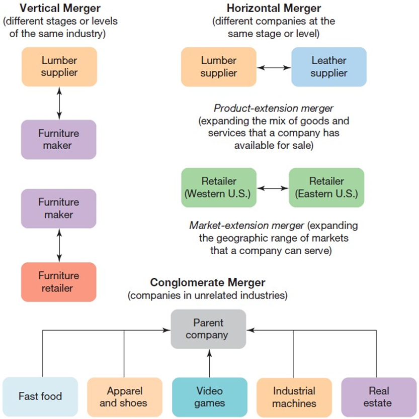
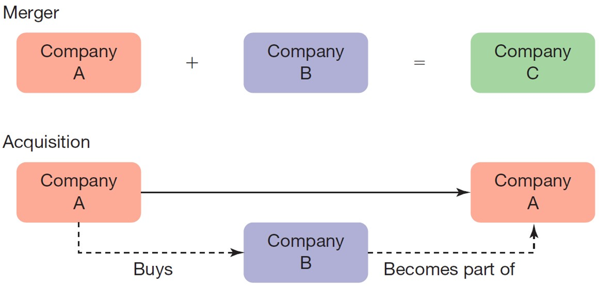
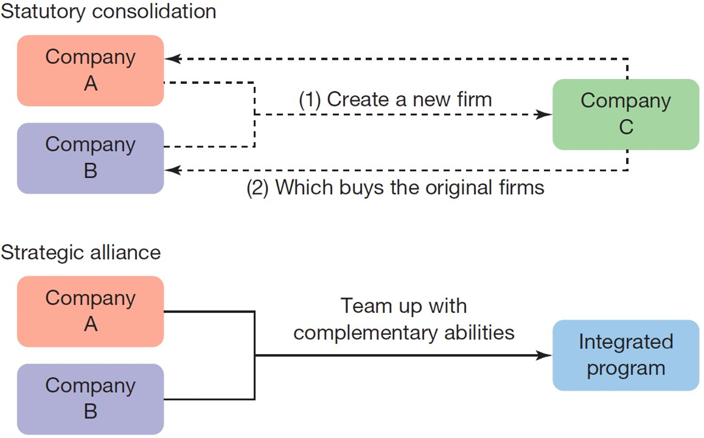
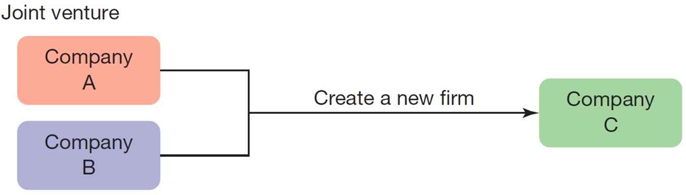

---

## Business in Action: Thriving in the Digital Enterprise

Ninth Edition' Global Edition

__Chapter 5__

Forms of Ownership

Copyright © 2020 Pearson Education Ltd. All Rights Reserved.

---

## Learning Objectives (1 of 2)

 Define __sole proprietorship__ 'and explain the six advantages and six disadvantages of this ownership model.

 Define __partnership__ 'and explain the six advantages and three disadvantages of this ownership model.

 Define __corporation__ 'and explain the four advantages and six disadvantages of this ownership model.

 Explain the concept of __corporate governance__ 'and identify the three groups responsible for ensuring good governance.

 Identify the potential advantages of pursuing mergers and acquisitions as a growth strategy' along with the potential difficulties and risks.

 Define __strategic alliance__ and __joint venture__ 'and explain why a company would choose these options over a merger or an acquisition.

 Explain how companies can use big data and analytics to create value and find competitive advantages.

---

## Exhibit 5.1 Forms of Business Ownership (1 of 2)

---

## Sole Proprietorships

* __Sole proprietorship__
  * A business owned by a single person
* __Unlimited liability__
  * A legal condition under which any damages or debts incurred by a business are the owner’s personal responsibility

---

## Advantages of Sole Proprietorships

Simplicity

Single layer of taxation

Privacy

Flexibility and control

Fewer limitations on personal income

Personal satisfaction

Financial liability

Demands on the owner

Limited managerial perspective

Resource limitations

No employee benefits for the owner

Finite life span

---

## Partnerships (1 of 4)

* __Partnership__
  * An unincorporated company owned by two or more people
* __Limited liability__
  * A legal condition in which the maximum amount each owner is liable for is equal to whatever amount each invested in the business

* __General partnership__
  * A partnership in which all partners have joint authority to make decisions for the firm and joint liability for thefirm’s financial obligations
* __Limited partnership__
  * A partnership in which one or more persons act as __general partners'__ run the business' and have the same unlimited liability as sole proprietors

* __Master limited partnership .M__  __L__  __P.__
  * A partnership that is allowed to raise money by selling units of ownership to general public partnerships and can bring together business professionals with diverse skill sets and perspectives

* __Limited liability partnership .L__  __L__  __P.__
  * A partnership in which each partner has unlimited liability only for his or her own actions and at least some degree of limited liability for the partnership as a whole

---

## Advantages of Partnerships

Simplicity

Single layer of taxation

More resources

Cost sharing

Broader skill and experience base

Longevity

---

## Disadvantages of Partnerships

Unlimited liability

Potential for conflict

Expansion' succession' and termination issues

---

## Keeping It Together: The Partnership Agreement

A __partnership agreement__ should address investment percentages' profit.sharing percentages' management responsibilities and other expectations of each owner' decision.making strategies' succession and exit strategies' criteria for admitting new partners' and dispute.resolution procedures.

---

## Corporations (1 of 2)

* __Corporation__
  * A legal entity' distinct from any individual persons' that has the power to own property and conduct business
* __Shareholders__
  * Investors who purchase shares of stock in a corporation

* __Private corporation__
  * A corporation in which all the stock is owned by only a few individuals or companies and is not made available for purchase by the public
* __Public corporation__
  * A corporation in which stock is sold to anyone who has the means to buy it

---

## Advantages of Corporations

* Ability to raise capital
* __Liquidity__
  * A measure of how easily and quickly an asset such as corporate stock can be converted into cash by selling it
* Longevity
* Limited liability

---

## Disadvantages of Corporations

Cost and complexity

Reporting requirements

Managerial demands

Possible loss of control

Double taxation

Short.term orientation of the stock market

---

## Special Types of Corporations (1 of 3)

* __S corporation__
  * A type of corporation that combines the capital.raising options and limited liability of a corporation with the federal taxation advantages of a partnership

* __Limited liability company .L__  __L__  __C.__
  * A structure that combines limited liability with the pass.through taxation benefits of a partnership
  * The number of shareholders is not restricted' nor is members’participation in management

* __Benefit corporation__
  * A profit.seeking corporation whose charter specifies a social or environmental goal that the company must pursue in addition to profit

---

## Exhibit 5.2 Corporate Structures (1 of 2)

---

## Corporate Governance (1 of 2)

* __Board of directors__
  * A group of professionals elected by shareholders as their representatives' with responsibility for the overall direction of the company and the selection of top executives

* __Corporate governance__
  * Describes all the policies' procedures' relationships' and systems in place to oversee the successful and legal operation of the enterprise
  * Also refers to the responsibilities and performance of the board of directors specifically

---

## Exhibit 5.3 Corporate Governance

---

## Shareholders

* __Proxy__
  * A document that authorizes another person to vote on behalf of a shareholder in a corporation
* __Shareholder activism__
  * Activities undertaken by shareholders to influence executive decision making in areas ranging from strategic planning to social responsibility

---

## Corporate Officers

* __Corporate officers__
  * The top executives who run a corporation
* __Chief executive officer .C__  __E__  __O.__
  * The highest.ranking officer of a corporation

---

## Mergers and Acquisitions (1 of 2)

* __Merger__
  * An action taken by two companies to combine and perform as a single entity
* __Acquisition__
  * An action taken by one company to buy a controlling interest in the voting stock of another company

* __Hostile takeover__
  * Acquisition of another company against the wishes of management
* __Leveraged buyout .L__  __B__  __O.__
  * Acquisition of a company’s publicly traded stock' using funds that are primarily borrowed' usually with the intent of using some of the acquired assets to pay back the loans used to acquire the company

---

## Advantages of Mergers and Acquisitions

Increase their buying power as a result of their larger size

Increase revenue by cross.selling products to each other’s customers

Increase market share by combining product lines

Gain access to new expertise' systems' and teams of employees

Executives have to agree on how the merger will be financed

Managers need to decide who will be in charge after they join forces

Marketing departments need to figure out how to blend product lines' branding strategies' and advertising and sales efforts

Companies must often deal with layoffs

---

## Exhibit 5.4 Types of Mergers

---

## Strategic Alliances and Joint Ventures

* __Strategic alliance__
  * A long.term partnership between companies to jointly develop' produce' or sell products
* __Joint venture__
  * A separate legal entity established by two or more companies to pursue shared business objectives

---

## Exhibit 5.5 Options for Joining Forces (1 of 3)

---

## Thriving in the Digital Enterprise: Big Data and Analytics

* __Big data__
  * The massive data sets that companies collect and analyze to find important trends and insights
* __Analytics__
  * Computing tools and techniques used to analyze big data; major types include data mining' text mining' and predictive analytics

---

## Exhibit 5.6 Big Data and Analytics

---

## Applying What You’ve Learned (1 of 2)

Define __sole proprietorship__ 'and explain the six advantages and six disadvantages of this ownership model.

Define __partnership__ 'and explain the six advantages and three disadvantages of this ownership model.

Define __corporation__ 'and explain the four advantages and six disadvantages of this ownership model.

Explain the concept of __corporate governance__ 'and identify the three groups responsible for ensuring good governance.

Identify the potential advantages of pursuing mergers and acquisitions as a growth strategy' along with the potential difficulties and risks.

Define __strategic alliance__ and __joint venture__ 'and explain why a company would choose these options over a merger or an acquisition.

Explain how companies can use big data and analytics to create value and find competitive advantages.

