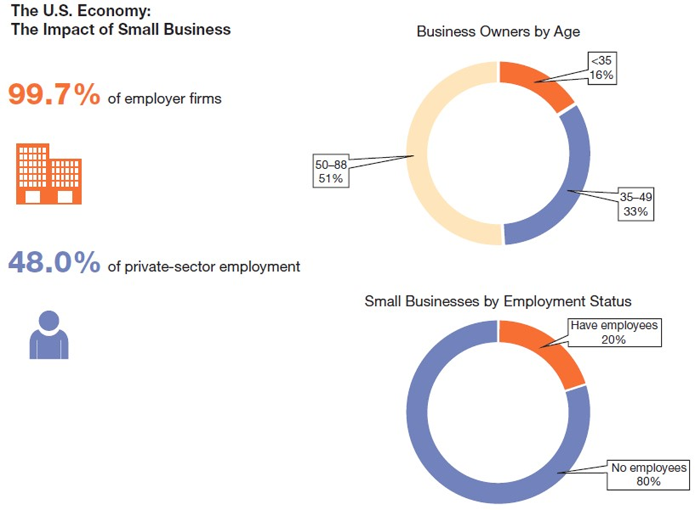
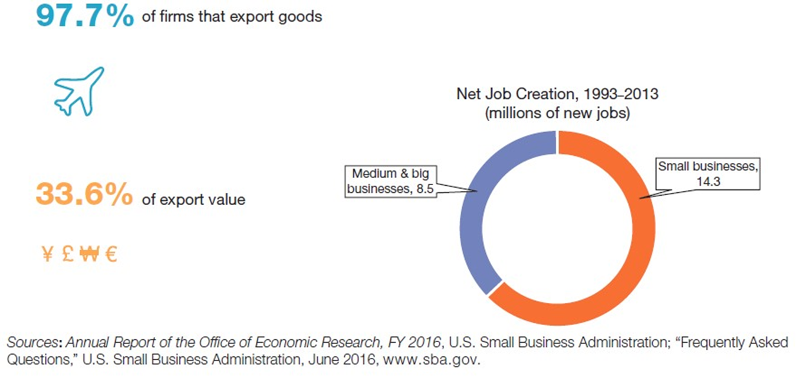
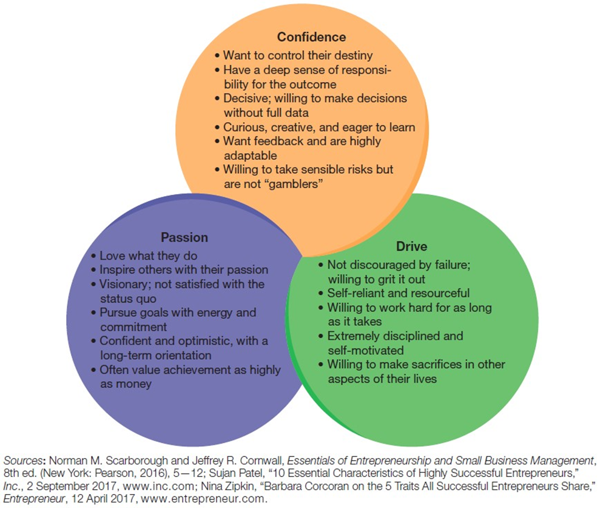
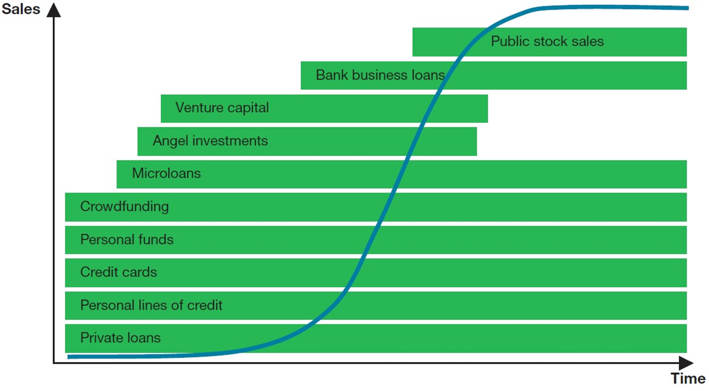
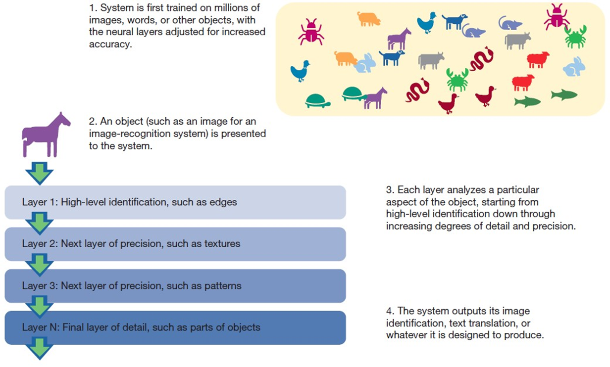

---

## Business in Action: Thriving in the Digital Enterprise

Ninth Edition' Global Edition

__Chapter 6__

Entrepreneurship and Small.Business Ownership

Copyright © 2020 Pearson Education Ltd. All Rights Reserved.

---

## Learning Objectives (1 of 2)

 __6.1__  Highlight the contributions small businesses make to the U.S. economy.

 __6.2__  List the most common reasons people start their own companies and identify the common traits of successful entrepreneurs.

 __6.3__  Explain the importance of planning a new business and outline the key elements in a business plan.

 __6.4__  Identify the major causes of business failures and identify sources of advice and support for struggling business owners.

 __6.5__  Discuss the principal sources of small.business private financing.

 __6.6__  Explain the advantages and disadvantages of franchising.

 __6.7__  Define machine learning and deep learning' and describe their importance to contemporary business.

---

## The Big World of Small Business

* __Small business__
  * A company that is independently owned and operated' is not dominant in its field' and employs fewer than 500 people .although this number varies by industry.

---

## Economic Roles of Small Business

They provide jobs

They introduce new products

They meet the needs of larger organizations

They inject a considerable amount of money into the economy

They take risks that larger companies sometimes avoid

They provide specialized goods and services

---

## Exhibit 6.1 The Impact of Small Business on the U.S. Economy (1 of 2)

__Sources: Annual Report of the Office of Economic Research' F__  __Y 2016'__ U.S. Small Business Administration; “Frequently Asked Questions'” U.S. Small Business Administration' June 2016'[www.sba.gov](http://www.sba.gov/).

---

## Characteristics of Small Businesses

Most small firms have a narrow focus

Small businesses have to get by with limited resources

Small businesses often have more freedom to innovate

Entrepreneurial firms find it easier to make decisions quickly and react to changes in the marketplace

---

## The Entrepreneurial Spirit

* __Entrepreneurial spirit__
  * The positive' forward.thinking desire to create profitable' sustainable business enterprises

---

## Why People Start Their Own Companies

More control over their futures

Tired of working for someone else

Passion for new product ideas

Pursue business goals that are important to them on a personal level

Inability to find attractive employment anywhere else

---

## Exhibit 6.2 Qualities Shared by Successful Entrepreneurs

__Sources:__ Norman M.Scarborough and Jeffrey R. Cornwall' __Essentials of Entrepreneurship and Small Business Management'__ 8th ed. .New York: Pearson' 2016.' 5–12; Sujan Patel' “10 Essential Characteristics of Highly Successful Entrepreneurs'” __Inc.'__ 2 September 2017'[www.inc.com](http://www.inc.com/); Nina Zipkin' “Barbara Corcoran on the 5 Traits All Successful Entrepreneurs Share'” __Entrepreneur__ ' 12 April 2017'[www.entrepreneur.com](http://www.entrepreneur.com/).

---

## Exhibit 6.3 Business Start-Up Options (1 of 3)

---

## Blueprint for an Effective Business Plan (1 of 3)

* __Business plan__
  * A document that summarizes a proposed business venture' goals' and plans for achieving those goals

Summary

Mission and objectives

Company overview

Products and services

Management and key personnel

Target market

Marketing strategy

Design and development plans

Operations plan

Start.up schedule

Major risk factors

Financial projections

Exit strategy

---

## Exhibit 6.4 Why New Businesses Fail

---

## Government Agencies and Not-For-Profit Organizations

Small Business Administration

Minority Business Development Agency

__Score__

U.S. Chamber of Commerce

---

## Mentors and Advisory Boards

* __Advisory board__
  * A team of people with subject.area expertise or vital contacts who help a business owner review plans and decisions

---

## Business Incubators

* __Business incubators__
  * Facilities that house small businesses and provide support services during the company’s early growth phases

---

## Financing Options for Small Businesses (1 of 4)

* __Seed money__
  * The first infusion of capital used to get a business started
* __Micro lenders__
  * Organizations' often not.for.profit' that lend smaller amounts of money to business owners who might not qualify for conventional bank loans

---

## Exhibit 6.5 Financing Possibilities over the Life of a Small Business

---

## Financing Options for Small Businesses (2 of 4)

* __Venture capitalists .V__  __Cs.__
  * Investors who provide money to finance new businesses or turnarounds in exchange for a portion of ownership' with the objective of reselling the business at a profit

* __Angel investors__
  * Private individuals who invest money in start.ups' usually earlier in a business’s life and in smaller amounts than VCs are willing to invest or banks are willing to lend
* __Initial public offering .I__  __P__  __O.__
  * A corporation’s first offering of shares to the public

* __Crowd funding__
  * Soliciting project funds' business investment' or business loans from members of the public

---

## The Franchise Alternative (1 of 2)

* __Franchise__
  * A business arrangement in which one company .the franchisee. obtains the rights to sell the products and use various elements of a business system of another company .the franchisor.

* __Franchisee__
  * A business owner who pays for the rights to sell the products and use the business system of a franchisor
* __Franchisor__
  * A company that licenses elements of its business system to other companies .franchisees.

---

## Advantages of Franchising

Combines at least some of the freedom of working for yourself with many of the advantages of being part of a larger' established organization

Name recognition' national advertising programs' standardized quality of goods and services' and a proven formula for success

---

## Disadvantages of Franchising

Typically agree to follow the business format

Little control over decisions the franchisor makes that affect the entire system

Don’t have the option of independently changing your business in response to market changes

---

## Exhibit 6.6 Key Questions to Ask Before Signing a Franchise Agreement (1 of 2)

What are the total start.up costs? What does the initial franchise fee cover? Does it include a starting inventory of supplies and products?

Who pays for employee training?

How are the periodic royalties calculated and when must they be paid?

Who provides and pays for advertising and promotional items? Do you have to contribute to an advertising fund?

Are all trademarks and names legally protected?

Who selects or approves the location of the business?

Are you restricted to selling certain goods and services?

Are you allowed to sell online?

How much control will you have over the daily operation of the business?

Is the franchise assigned an exclusive territory?

If the territory is not exclusive' does the franchisee have the right of first refusal on additional franchises established in nearby locations?

Is the franchisee required to purchase equipment and supplies from the franchisor or other suppliers?

Under what conditions can the franchisor or the franchisee terminate the franchise agreement?

Can the franchise be assigned to heirs?

---

## Thriving in the Digital Enterprise: Machine Learning and Deep Learning

* __Machine learning__
  * The general capability of computers to learn
* __Deep learning__
  * A type of machine learning that uses layers of neural networks to attack problems at multiple levels

---

## Exhibit 6.7 Deep Learning

---

## Applying What You’ve Learned (1 of 2)

Highlight the contributions small businesses make to the U.S. economy.

List the most common reasons people start their own companies and identify the common traits of successful entrepreneurs.

Explain the importance of planning a new business and outline the key elements in a business plan.

Identify the major causes of business failures and identify sources of advice and support for struggling business owners.

Discuss the principal sources of small.business private financing.

Explain the advantages and disadvantages of franchising.

Define machine learning and deep learning' and describe their importance to contemporary business.

