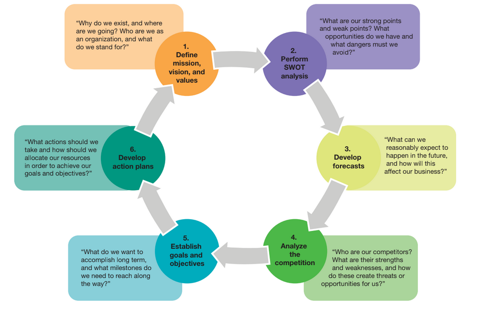
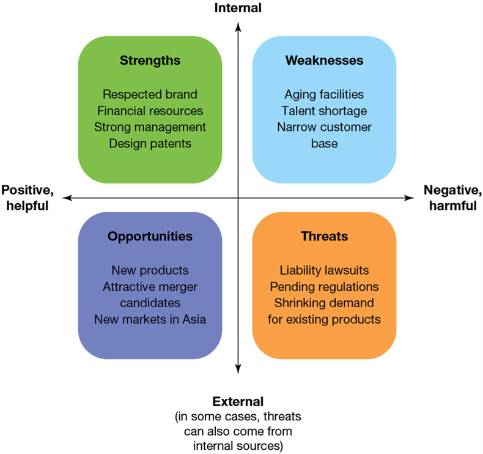
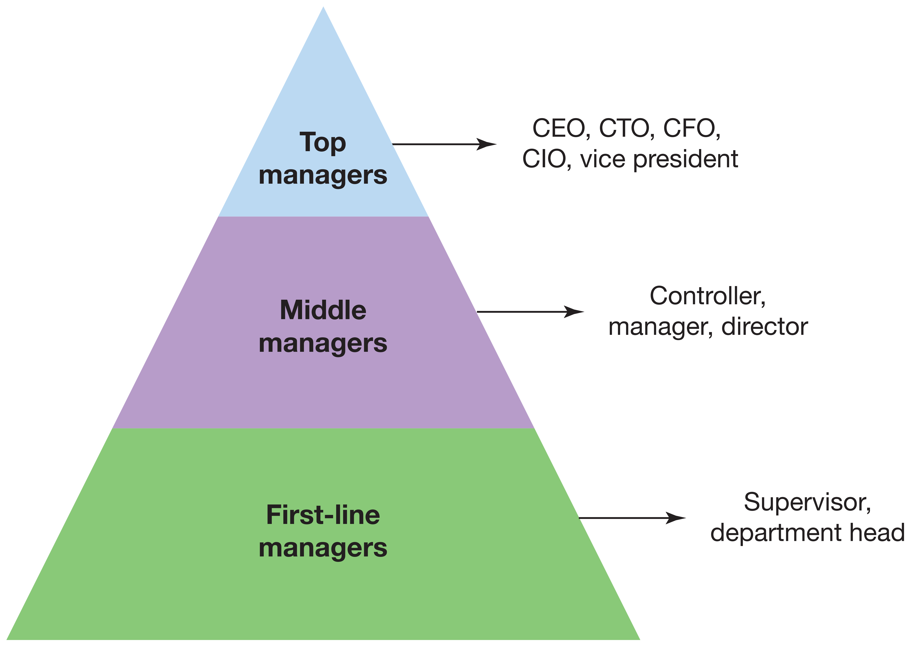
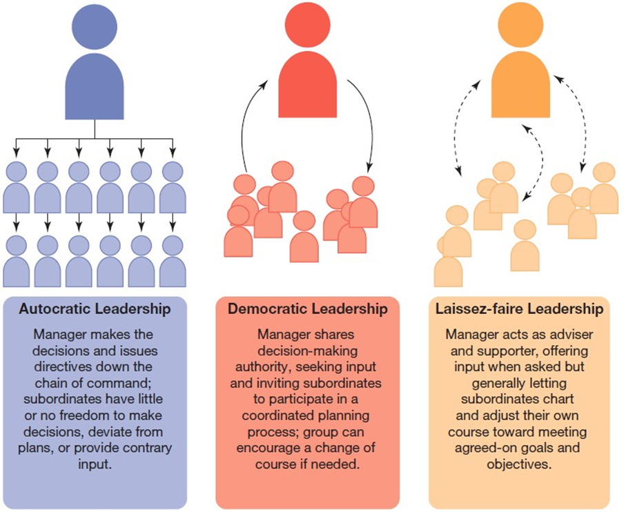
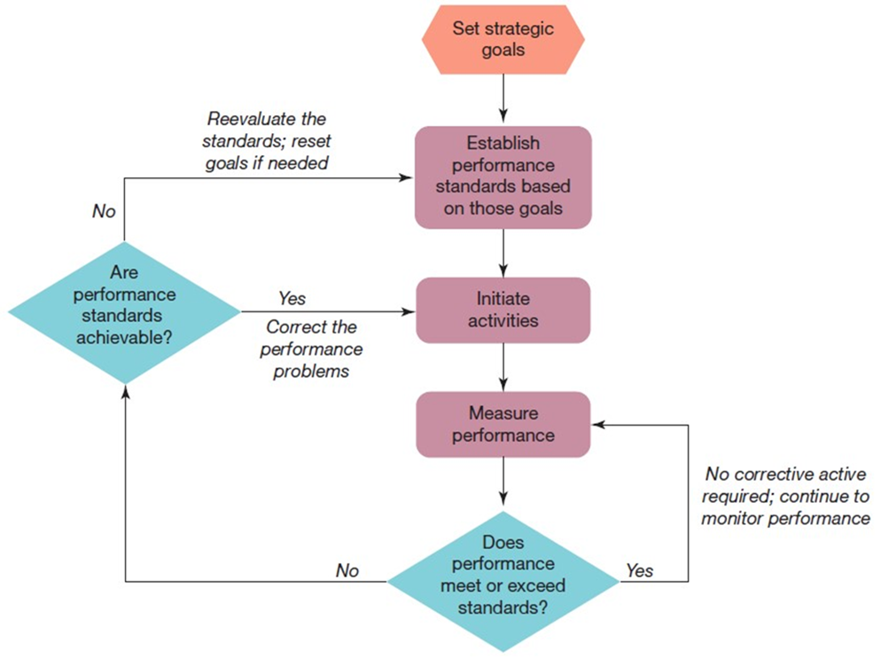
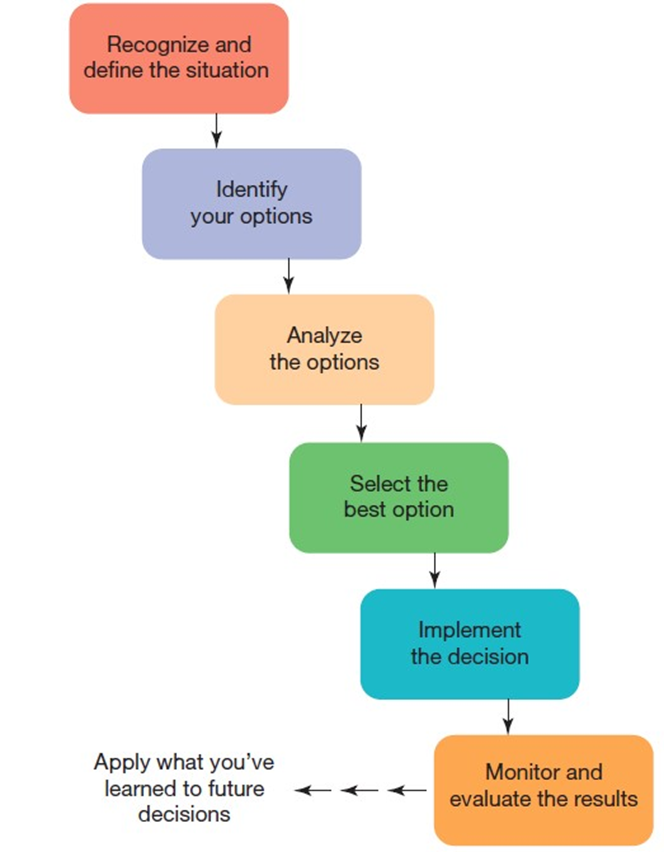
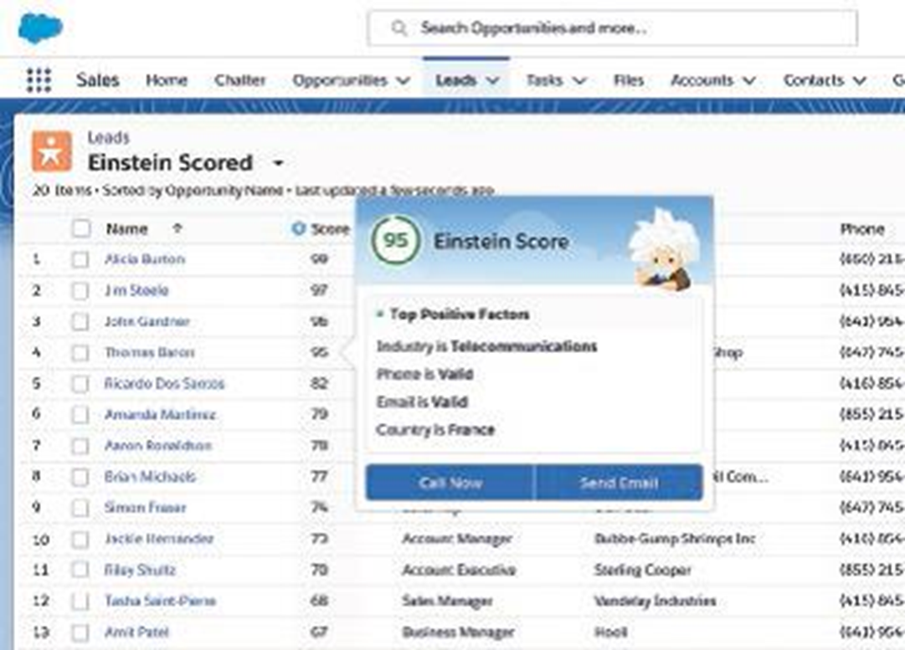

---

## Business in Action: Thriving in the Digital Enterprise

Ninth Edition' Global Edition

__Chapter 7__

Management Roles' Functions' and Skills

Copyright © 2020 Pearson Education Ltd. All Rights Reserved.

---

## Learning Objectives (1 of 2)

 __7.1__  Explain the importance of management and identify the three vital management roles.

 __7.2__  Describe the planning function and outline the strategic planning process.

 __7.3__  Describe the organizing function and differentiate among top' middle' and first.line management.

 __7.4__  Describe the leading function' leadership style' and organizational culture.

 __7.5__  Describe the controlling function and explain the four steps in the control cycle.

 __7.6__  Identify and explain four important types of managerial skills.

 __7.7__  Discuss the potential of cognitive automation in management decision making.

---

## Management

* __Management__
  * The process of planning' organizing' leading' and controlling to meet organizational goals

---

## The Roles of Management (1 of 2)

* __Managerial roles__
  * Behavioral patterns and activities involved in carrying out the functions of management; includes interpersonal' informational' and decision.making roles

* __Interpersonal roles__
  * Providing leadership to employees' acting as a liaison between groups' networking' and fostering relationships
* __Informational roles__
  * Gathering information from inside and outside the organization' sharing information
* __Decisional roles__
  * Facing an endless stream of decisions' some which need to be made on the spot

---

## The Planning Function (1 of 2)

* __Planning__
  * Establishing objectives and goals for an organization and determining the best ways to accomplish them

* __Strategic plans__
  * Plans that establish the actions and the resource allocation required to accomplish strategic goals
  * Usually defined for periods of two to five years and developed by top managers

---

## Exhibit 7.1 The Strategic Planning Process

---

## Defining the Purpose and Values

* __Mission statement__
  * A brief statement of why an organization exists; in other words' what the organization aims to accomplish for customers' investors' and other stakeholders
* __Values statement__
  * A brief articulation of the principles that guide a company’s decisions and behaviors

---

## Developing Forecasts

* __Quantitative forecasts__
  * Typically based on historical data or tests and often involve complex statistical computations
* __Qualitative forecasts__
  * Based on intuitive judgments

---

## Exhibit 7.2 S W O T Analysis

---

## Establishing Goals and Objectives (1 of 2)

* __Goal__
  * A broad' long.range target or aim
* __Objective__
  * A specific' short.range target or aim

Specific

Measurable

Attainable

Relevant

Time limited

---

## The Organizing Function

* __Organizing__
  * The process of arranging resources to carry out the organization’s plans
* __Management pyramid__
  * An organizational structure divided into top' middle' and first.line management

---

## Exhibit 7.3 The Management Pyramid

---

## The Management Pyramid (1 of 3)

* __Top managers__
  * Those at the highest level of the organization’s management hierarchy
  * Responsible for setting strategic goals; they have the most power and responsibility in the organization

* __Middle managers__
  * Those in the middle of the management hierarchy
  * They develop plans to implement the goals of top managers and coordinate the work of first.line managers

* __First.line managers__
  * Those at the lowest level of the management hierarchy
  * They supervise the operating employees and implement the plans set at the higher management levels

---

## The Leading Function

* __Leading__
  * The process of guiding and motivating people to work toward organizational goals

---

## Exhibit 7.4 Leadership Styles

---

## Leadership Styles (1 of 3)

* __Autocratic leaders__
  * Leaders who do not involve others in decision making
* __Democratic leaders__
  * Leaders who delegate authority and involve employees in decision making

* __Laissez.faire leaders__
  * Leaders who leave most decisions up to employees' particularly those concerning day.to.day matters

* __Participative management__
  * A philosophy of allowing employees to take part in planning and decision making
* __Employee empowerment__
  * Granting decision.making and problem.solving authorities to employees so they can act without getting approval from management

---

## Coaching and Mentoring (1 of 2)

* __Coaching__
  * Helping employees reach their highest potential by meeting with them' discussing problems that hinder their ability to work effectively' and offering suggestions and encouragement to overcome these problems

* __Mentoring__
  * A process in which experienced managers guide less.experienced colleagues in the nuances of office politics' serving as a role model for appropriate business behavior' and helping to negotiate the corporate structure

---

## Managing Change

Identify everything that needs to change

Identify the forces acting for and against a change

Choose the approach best suited to the situation

Reinforce changed behavior and monitor continued progress

---

## Building a Positive Organizational Culture

* __Organizational culture__
  * A set of shared values and norms that support the management system and that guide management and employee behavior

---

## Exhibit 7.5 Creating the Ideal Culture in Your Company (1 of 2)

__Vision__

Have you articulated a compelling vision for the company?

Based on that vision' have you defined a mission statement that employees understand and can implement?

__Company Values__

Do employees know how their work relates to this vision?

Is there a common set of values that binds the organization together?

Do you and other executives or owners demonstrate these values day in and day out?

__People__

How are people treated?

Do you foster an atmosphere of civility and respect?

Do you value and encourage teamwork' with all ideas welcomed?

Do you acknowledge' encourage' and act upon .when appropriate. ideas from employees?

Do you give employees credit for their ideas?

Have you shown a positive commitment to a balance between work and life?

__Community__

Have you clarified how the company views its relationship with the communities it affects?

Do your actions support that commitment to community?

__Communication__

Do you practice and encourage open communication?

Do you share operating information throughout the company so that people know how the company is doing?

Do you regularly survey employees on workplace issues and ask for their input on solutions?

Is there an open.door policy for access to management?

__Employee Performance__

Do you handle personnel issues with fairness and respect?

Do employees receive feedback regularly?

Are employee evaluations based on agreed.on objectives that have been clearly communicated?

---

## The Controlling Function

* __Controlling__
  * The process of measuring progress against goals and objectives' and correcting deviations if results are not as expected

---

## Exhibit 7.6 The Control Cycle

---

## Establishing Performance Standards

* __Benchmarking__
  * Collecting and comparing processes and performance data from other companies
* __Quality__
  * A measure of how closely an activity or outcome conforms to predetermined standards and customer expectations

---

## Measuring Performance

* __Balanced scorecard__
  * A method of monitoring the performance from four perspectives: finances' operations' customer relationships' and the growth and development of employees and intellectual property

---

## Essential Management Skills (1 of 2)

* __Interpersonal skills__
  * Skills required to understand other people and to interact effectively with them
* __Technical skills__
  * The ability and knowledge to perform the mechanics of a particular job

---

## Exhibit 7.7 Communicating in a Crisis

__When a Crisis Hits:__

---

## Essential Management Skills (2 of 2)

* __Conceptual skills__
  * The ability to understand the relationship of parts to the whole
* __Decision.making skills__
  * The ability to identify a decision situation' analyze the problem' weigh the alternatives' choose an alternative' implement it' and evaluate the results

---

## Exhibit 7.8 Steps in the Decision-Making Process

---

## Thriving in the Digital Enterprise: Cognitive Automation

* __Cognitive automation__
  * AI technology that aims to help professionals and managers with complex questions that present
  * Some of the most daunting decision scenarios

---

## Exhibit 7.9 Cognitive Automation

---

## Applying What You’ve Learned (1 of 2)

Explain the importance of management and identify the three vital management roles.

Describe the planning function and outline the strategic planning process.

Describe the organizing function and differentiate among top' middle' and first.line management.

Describe the leading function' leadership style' and organizational culture.

Describe the controlling function and explain the four steps in the control cycle.

Identify and explain four important types of managerial skills.

Discuss the potential of cognitive automation in management decision making.

