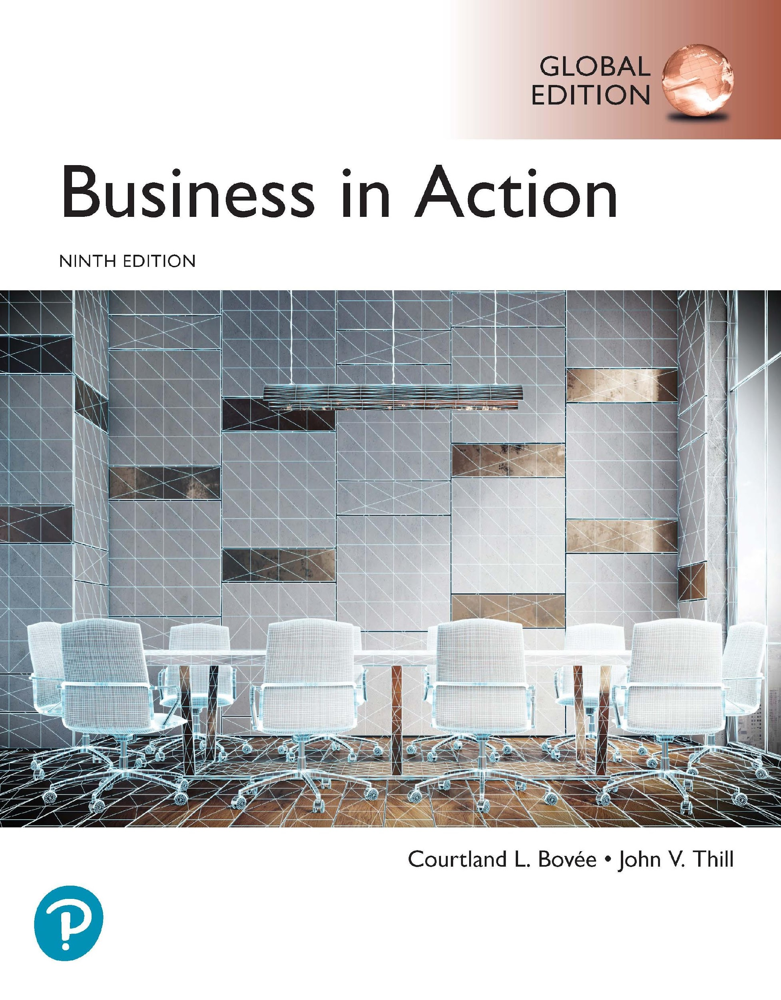
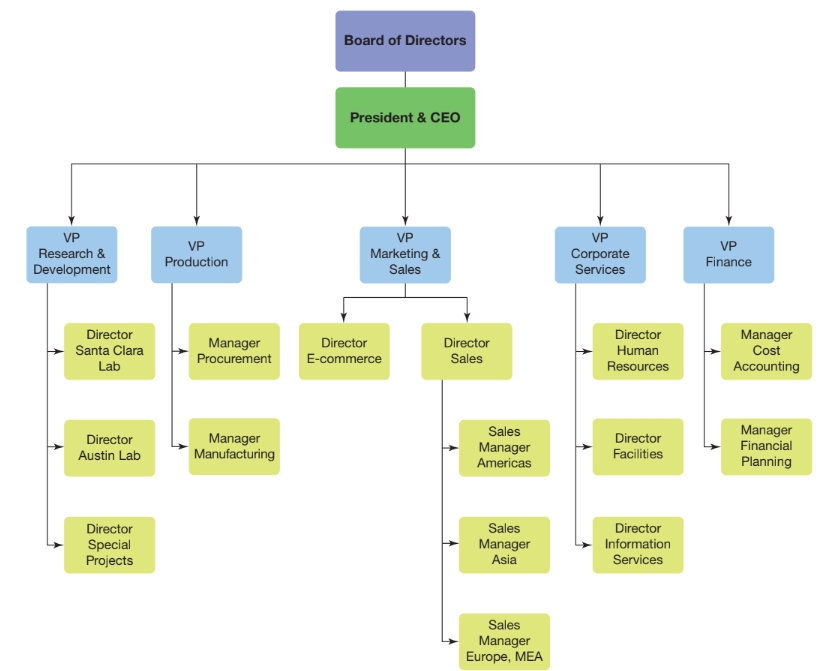
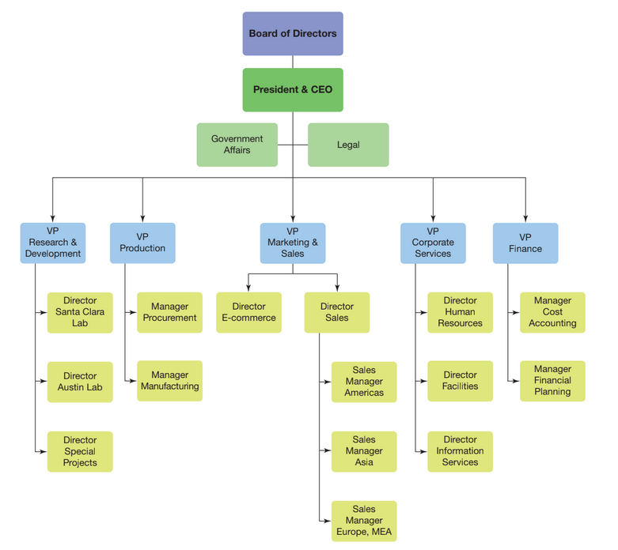
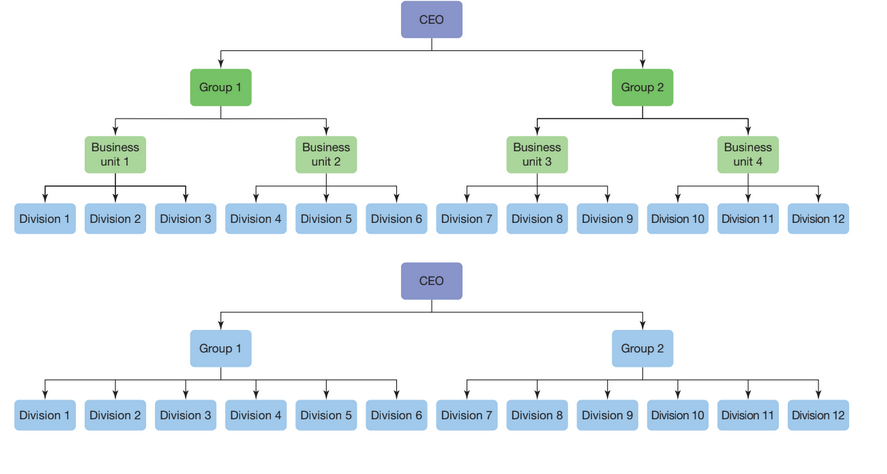
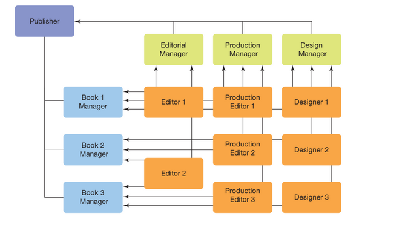
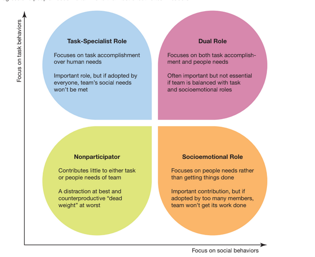
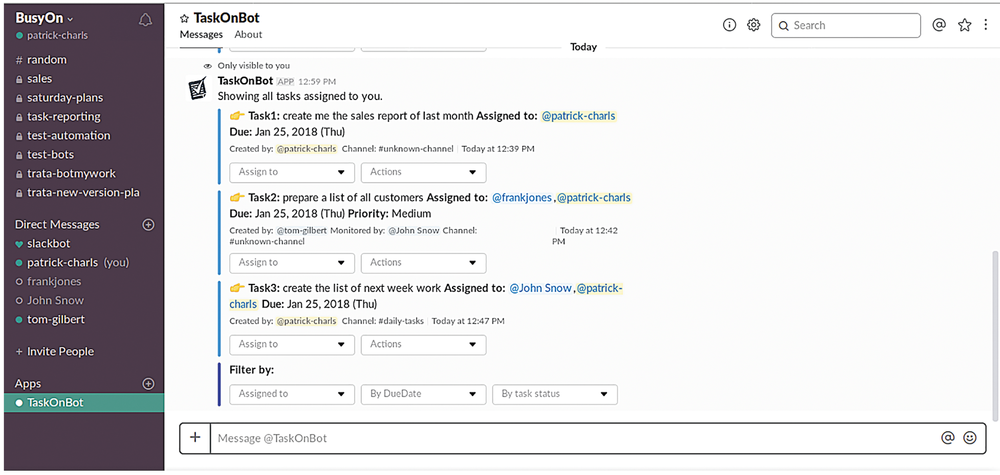
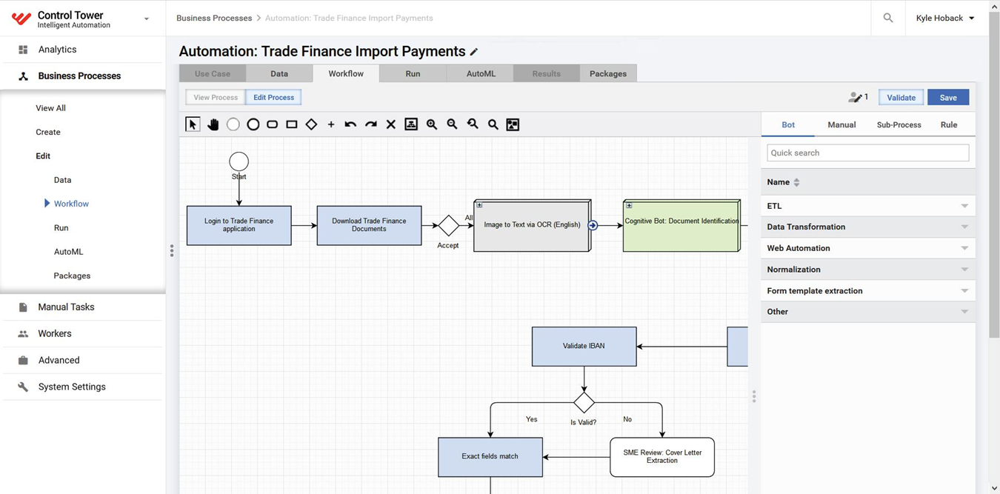

---

## Business in Action: Thriving in the Digital Enterprise

Ninth Edition' Global Edition

__Chapter 8__

Organization and Teamwork

__Copyright © 2020 Pearson Education Ltd. All Rights Reserved.__

---

## Learning Objectives (1 of 2)

 __8.1__  Explain the major decisions needed to design an organization structure.

 __8.2__  Define four major types of organization structure.

 __8.3__  Explain how a team differs from a group' and describe the six most common forms of teams.

 __8.4__  Highlight the advantages and disadvantages of working in teams' and list the characteristics of effective teams.

 __8.5__  Review the five stages of team development' and explain why conflict can arise in team settings.

 __8.6__  Explain the concept of an unstructured organization' and identify the major benefits and challenges of taking this approach.

 __8.7__  Describe the use of taskbots and robotic procession automation in contemporary business.

---

## Designing an Effective Organization Structure

* __Organization structure__
  * A framework that enables managers to divide responsibilities' ensure employee accountability' and distribute the decision.making authority
* __Organization chart__
  * A diagram that shows how employees and tasks are grouped and where the lines of communication and authority flow

---

## Exhibit 8.1 Simplified Organization Chart

---

## Identifying Core Competencies

* __Core competencies__
  * Activities that a company considers central and vital to its business

---

## Identifying Job Responsibilities

* __Work specialization__
  * Specialization in or responsibility for some portion of an organization’s overall work tasks
  * Also called __division of labor__

---

## Defining the Chain of Command

* __Chain of command__
  * A pathway for the flow of authority from one management level to the next
* __Span of management__
  * The number of people under one manager’s control
  * Also known as __span of control__

---

## Exhibit 8.2 Simplified Line-and-Staff Structure

---

## Centralization versus Decentralization

* __Centralization__
  * Concentration of decision.making authority at the top of an organization
* __Decentralization__
  * Delegation of decision.making authority to employees in lower.level positions

---

## Exhibit 8.3 Flattening an Organization

---

## Agile Organization

* __Agile organization__
  * A company whose structure' policies' and capabilities allow employees to respond quickly to customer needs and changes in the business environment

---

## Organizing the Workforce (1 of 2)

* __Departmentalization__
  * Grouping people within an organization according to function' division' matrix' or network

* __Functional structure__
  * Grouping workers according to the similarity in their skills' resource use' and expertise
* __Divisional structure__
  * Grouping departments according to similarities in product' process' customers' or geography

---

## Exhibit 8.4 Customer Division Structure

---

## Matrix Structure

* __Matrix structure__
  * A structure in which employees are assigned to both a functional group and a project team .thus using functional and divisional patterns simultaneously.

---

## Exhibit 8.5 Matrix Structure

---

## Network Structure

* __Network structure__
  * A structure in which individual companies are connected electronically to perform selected tasks for a small headquarters organization
  * Also called __virtual organization__

---

## Organizing in Teams

* __Team__
  * A unit of two or more people who share a mission and collective responsibility as they work together to achieve a goal

---

## Types of Teams (1 of 3)

* __Problem.solving team__
  * A team that meets to find ways of improving quality' efficiency' and the work environment
* __Self.managed team__
  * A team in which members are responsible for an entire process or operation

* __Functional team__
  * A team whose members come from a single functional department which is based on the organization’s vertical structure
* __Cross.functional team__
  * A team that draws together employees from different functional areas

---

## Cross-Functional Teams

* __Task force__
  * A team of people from several departments who are temporarily brought together to address a specific issue
* __Committee__
  * A team that may become a permanent part of the organization and is designed to deal with regularly recurring tasks

---

## Types of Teams (3 of 3)

* __Virtual team__
  * A team that uses communication technology to bring together geographically distant employees to achieve goals

---

## Exhibit 8.6 Business Uses of Social Networking Technology (1 of 3)

---

## Advantages of Working on Teams

Higher quality decisions

Increased __diversity__ of views

Increased commitment to solutions and changes

__Lower levels__ of stress and destructive internal competition

Improved __flexibility__ and __responsiveness__

Inefficiency

Groupthink

Diminished individual motivation

Structural disruption

Excessive workloads

---

## Characteristics of Effective Teams

Clear sense of __purpose__

Open and honest communication

__Creative__ thinking

Accountability

Focus

Decision by __consensus__

---

## Exhibit 8.7 Characteristics of Effective Teams (1 of 2)

__Make Effective Teamwork A Top Management Priority__

Recognize and reward group performance where appropriate

Provide ample training opportunities for employees to develop team skills

__Select Team Members Wisely__

Involve key stakeholders and decision makers

Limit team size to the minimum number of people needed to achieve team goals

Select members with a diversity of views

Select creative thinkers

__Build a Sense of Fairness in Decision Making__

Encourage debate and disagreement without fear of reprisal

Allow members to communicate openly and honestly

Consider all proposals

Build consensus by allowing team members to examine' compare' and reconcile differences—but don’t let a desire for 100 percent consensus bog the team down

Avoid quick votes

Keep everyone informed

Present all the facts

__Manage Conflict Constructively__

Share leadership

Encourage equal participation

Discuss disagreements openly and calmly

Focus on the issues' not the people

Don’t let minor disagreements boil over into major conflicts

__Stay on Track__

Make sure everyone understands the team’s purpose

Communicate what is expected of team members

Stay focused on the core assignment

Develop and adhere to a schedule

Develop rules and follow norms

---

## Team Development (1 of 2)

Forming

Storming

Norming

Performing

Adjourning

---

## Exhibit 8.8 Team Member Roles

---

## Team Development (2 of 2)

* __Cohesiveness__
  * A measure of how committed team members are to their team’s goals
* __Norms__
  * Informal standards of conduct that guide team behavior

---

## Team Conflict

* __Constructive conflict__
  * Brings important issues into the open' increases the involvement of team members' and generates creative ideas for solving a problem
* __Destructive conflict__
  * Diverts energy from more important issues' destroys the morale of teams or individual team members' or polarizes or divides the team

---

## Exhibit 8.9 Sources of Team and Workplace Conflict

---

## Solutions to Team Conflict

Proactive attention

Communication

Openness

Research

Flexibility

Fair play

Alliance

---

## Managing an Unstructured Organization

* __Unstructured organization__
  * An organization that doesn’t have a conventional structure but instead assembles talent as needed from the open market; the virtual and networked organizational concepts taken to the extreme

---

## Exhibit 8.10 Benefits and Challenges of Unstructured Organizations (1 of 3)

__Potential Benefits__

__Potential Challenges__

__Potential Challenges__

---

## Potential Challenges of Unstructured Organizations

Complexity and control issues

Uncertainty

Loss of meaning and connection

Diminished loyalty

Career development

Management succession

Accountability and liability

---

## Thriving in the Digital Enterprise: Taskbots and Robotic Process Automation

* __Taskbot__
  * A software agent that can be assigned to complete a variety of tasks within an app or business system

---

## Exhibit 8.11 Taskbots

Bots such as TaskOnBot .show here. are now a common feature of collaboration platforms such as Slack. They function as virtual team members and can be assigned a variety of tasks and assign tasks to their human teammates.

---

## Robotic Process Automation

* __Robotic process automation .R__  __P__  __A.__
  * A software capability that does for knowledge work what mechanical robots do for manufacturing and other physical processes

---

## Exhibit 8.12 Robotic Process Automation

---

## Applying What You’ve Learned (1 of 2)

Explain the major decisions needed to design an organization structure.

Define four major types of organization structure.

Explain how a team differs from a group' and describe the six most common forms of teams.

Highlight the advantages and disadvantages of working in teams' and list the characteristics of effective teams.

Review the five stages of team development' and explain why conflict can arise in team settings.

Explain the concept of an unstructured organization' and identify the major benefits and challenges of taking this approach.

Describe the use of taskbots and robotic procession automation in contemporary business.

