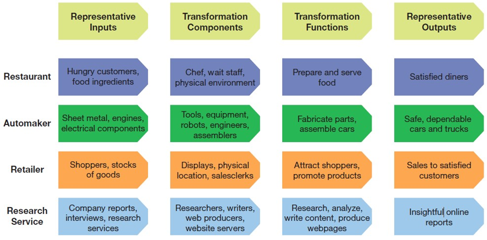
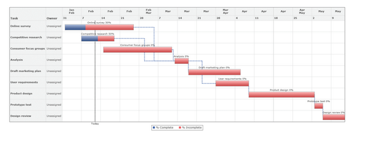
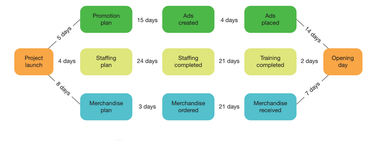
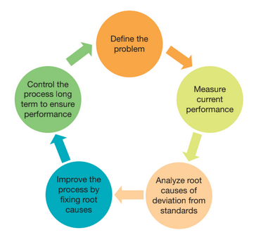

---

## Business in Action: Thriving in the Digital Enterprise

Ninth Edition' Global Edition

__Chapter 9__

Production Systems

Copyright © 2020 Pearson Education Ltd. All Rights Reserved.

---

## Learning Objectives (1 of 2)

 __9.1__  Explain the systems perspective' and identify seven principles of systems thinking that can improve your skills as a manager.

 __9.2__  Describe the __value chain__ and __value web__ concepts' and discuss the controversy over off shoring.

 __9.3__  Define __supply chain__ management' and explain its strategic importance.

 __9.4__  Identify the major planning decisions in production and operations management.

 __9.5__  Explain the unique challenges of service delivery.

 __9.6__  Define __quality__ ' explain the challenge of quality and product complexity' and identify four major tools and strategies for ensuring product quality.

 __9.7__  Explain the concept of Industry 4.0 and the smart factory.

---

## The Systems View of Business

* __System__
  * An interconnected and coordinated set of __elements__ and __processes__ that converts __inputs__ to desired outputs

---

## Exhibit 9.1 From Point to Line to Circle: The Systems View

---

## Managing Systems for Peak Performance (1 of 2)

Help everyone see the big picture

Understand how __individual systems__ really work and how they __interact__

Understand problems before you try to __fix__ them

Understand the __potential impact__ of solutions before you implement them

Don’t just move problems __around—solve them__

Understand how feedback works in the system

Use mistakes as __opportunities__ to learn and improve

---

## Exhibit 9.2 Business Transformation Systems

---

## Value Chains and Value Webs

* __Value chain__
  * All the elements and processes that add value as raw materials are transformed into the final products made available to the ultimate customer

---

## Redefining Organizations with Value Webs

* __Outsourcing__
  * Contracting out certain business functions or operations to other companies
* __Value webs__
  * Multidimensional networks of suppliers and outsourcing partners

---

## The Offshoring Controversy

* __Offshoring__
  * Transferring a part or all of a business function to a facility .a different part of the company or another company entirely. in another country

---

## Supply Chain Management (1 of 2)

* __Supply chain__
  * A set of connected systems that coordinates the flow of goods and materials from suppliers all the way through to final customers

* __Supply chain management .S__  __C__  __M.__
  * The business procedures' policies' and computer systems that integrate the various elements of the supply chain into a cohesive system

---

## Strategic Impact of S C M

Managing risks

Managing relationships

Managing trade.off

Promoting sustainability

---

## Supply Chain Systems and Methods (1 of 3)

* __Inventory__
  * Goods and materials kept in stock for production or sale
* __Inventory control__
  * Determining the right quantities of supplies and products to have on hand and tracking where those items are

* __Procurement__
  * The acquisition of the raw materials' parts' components' supplies' and finished products required to produce goods and services
* __Material requirements planning .M__  __R__  __P.__
  * A planning system that works backward from a company’s sales forecasts to make sure it has enough of everything required to build those goods or perform those services in a timely manner

* __Manufacturing requirements planning .M__  __R__  __P.__
  * A planning system that works backward from a company’s sales forecasts to make sure it has enough of everything required to build those goods or perform those services in a timely manner
* __Enterprise resource planning .E__  __R__  __P.__
  * A planning system that addresses the needs of the entire organization' from manufacturing to sales to human resources

---

## Production and Operations Management (1 of 3)

* __Production and operations management__
  * Overseeing all the activities involved in producing goods and services

Facilities location and design

Forecasting and capacity planning

Scheduling

Lean systems

* __Capacity planning__
  * Establishing the overall level of resources needed to meet customer demand
* __Critical path__
  * In a PERT network diagram' the sequence of operations that requires the longest time to complete

---

## Lean Systems (1 of 2)

* __Productivity__
  * The efficiency with which an organization can convert inputs to outputs
* __Lean systems__
  * Systems .in manufacturing and other functional areas. that maximize productivity by reducing waste and delays

---

## Exhibit 9.3 Gantt Chart

---

## Lean Systems (2 of 2)

* __Just.in.time .J__  __I__  __T.__
  * Inventory management in which goods and materials are delivered throughout the production process right before they are needed

---

## Mass Production, Customized Production, and Mass Customization (1 of 2)

* __Mass production__
  * The creation of identical goods or services' usually in large quantities
* __Customized production__
  * The creation of a unique good or service for each customer

* __Mass customization__
  * A manufacturing approach in which part of the product is mass produced and the remaining features are customized for each buyer

---

## Exhibit 9.4 Simplified P E R T Diagram for a Store Opening

---

## The Unique Challenges of Service Delivery

Perishability

Location constraints

Scalability challenges

Performance variability and perceptions of quality

Customer involvement

Service provider interaction

---

## Product and Process Quality (1 of 4)

* __Quality__
  * The degree to which a product or process meets reasonable or agreed.on expectations
* __Quality control__
  * Measuring quality against established standards after the good or service has been produced and weeding out any defective products

* __Quality assurance__
  * A more comprehensive approach of companywide policies' practices' and procedures to ensure that every product meets quality standards
* __Total quality management__
  * An approach to quality assurance that encompasses every aspect of a company’s operations

* __Statistical process control .S__  __P__  __C.__
  * The use of random sampling and tools such as control charts to monitor the production process
* __Six sigma__
  * A rigorous quality management program that strives to eliminate deviations between the actual and desired performance of a business system

---

## Exhibit 9.5 The D M A I C Process in Six Sigma Quality Management

---

## Product and Process Quality (4 of 4)

* __I__  __S__  __O 9000__
  * A globally recognized family of standards for quality management systems

---

## Thriving in the Digital Enterprise: Industry 4.0 and the Smart Factory

* __Industry 4.0__
  * The digital transformation of manufacturing' moving from automated factories to smart factories that emphasize the use of cyber.physical systems

---

## Applying What You’ve Learned (1 of 2)

Explain the systems perspective' and identify seven principles of systems thinking that can improve your skills as a manager.

Describe the value chain and value web concepts' and discuss the controversy over off shoring.

Define supply chain management' and explain its strategic importance.

Identify the major planning decisions in production and operations management.

Explain the unique challenges of service delivery.

Define quality' explain the challenge of quality and product complexity' and identify four major tools and strategies for ensuring product quality.

Explain the concept of Industry 4.0 and the smart factory.

