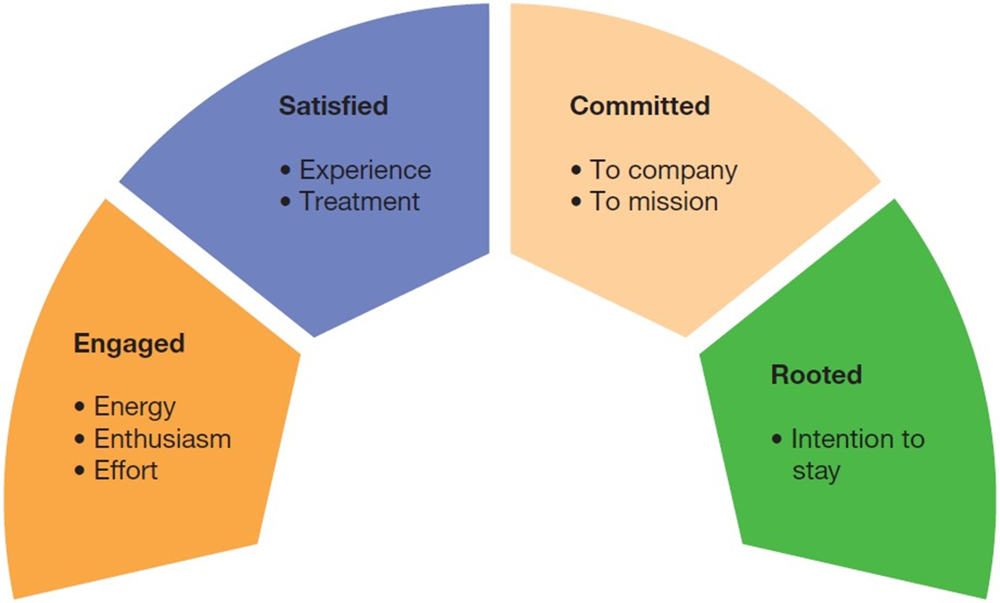
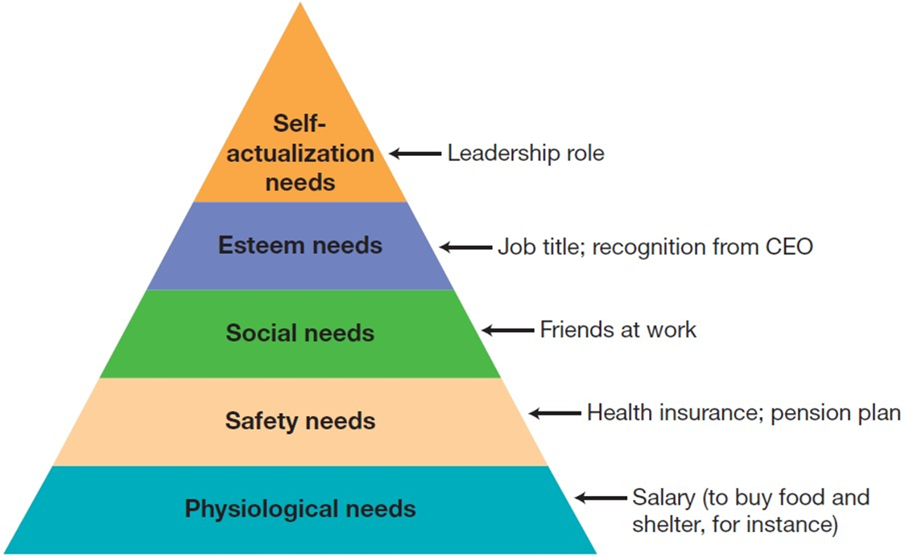
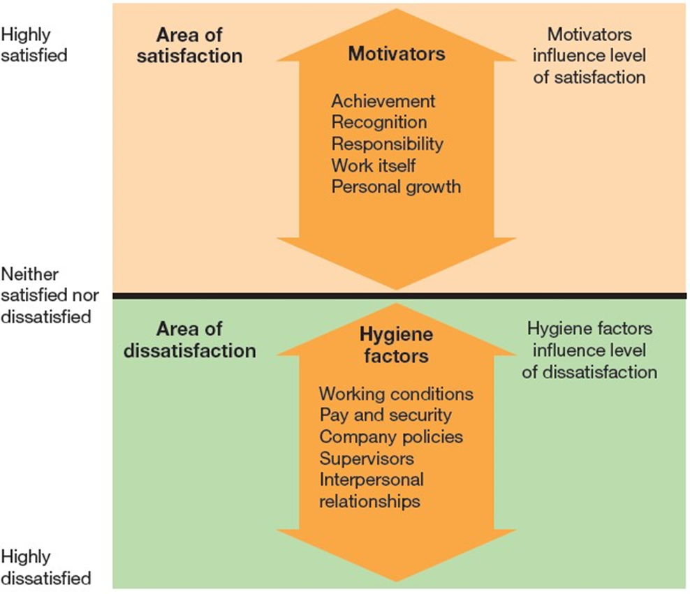
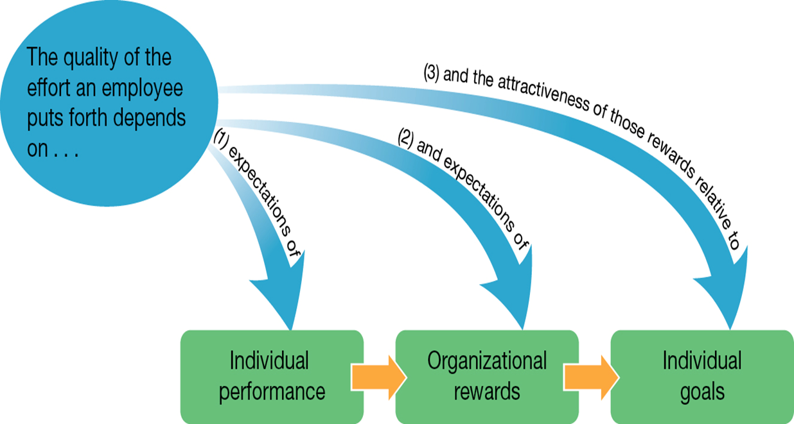
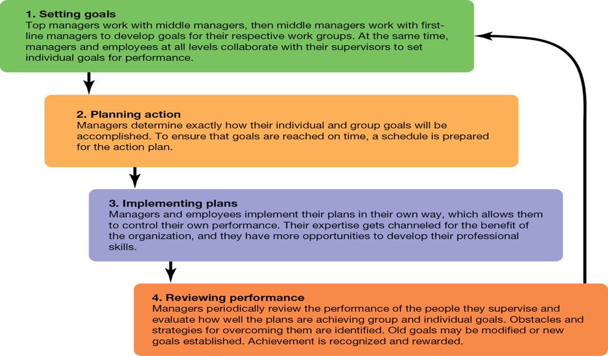
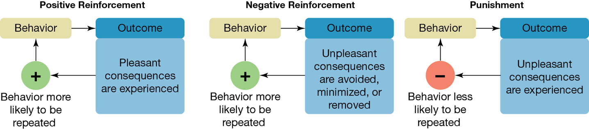
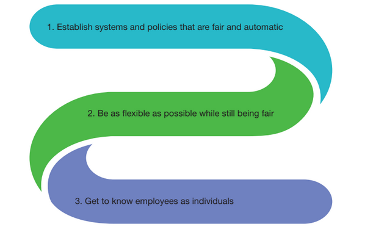

---

## Business in Action: Thriving in the Digital Enterprise

Ninth Edition. Global Edition

__Chapter 10__

Employee Motivation

Copyright © 2020 Pearson Education Ltd. All Rights Reserved.

---

## Learning Objectives (1 of 2)

 __10.1__  Define motivation and identify the classical motivation theories.

 __10.2__  Explain why many consider expectancy theory to be the best current explanation of employee motivation.

 __10.3__  Identify the strength and weaknesses of goal.setting theory.

 __10.4__  Describe the job characteristics model and explain how it helps predict motivatio and performance.

 __10.5__  Define reinforcement theory and differentiate between positiv and negative reinforcement.

 __10.6__  List five managerial strategies that are vital to maintaining a motivated workforce.

 __10.7__  Discuss the potential strength and weaknesses of performance management systems.

---

## What Motivates Employees to Peak Performance?

__Motivation__

The combination of forces that move individuals to take certain action and avoid other actions

__Engagement__

An employee’s rationa and emotional commitment to his or her work

---

## Exhibit 10.1 Four Indicators of Motivation

---

## Four Fundamental Needs

The drive to acquire

The drive to __bond__

The drive to comprehend

The drive to __defend__

---

## Classical Theories of Motivation

__Scientific management__

A management approach designed to improve employees’efficiency by scientifically studying their work

---

## The Hawthorne Studie and the “Hawthorne Effect”

__The Hawthorne effect__

A supposed effect of organizational research. in which employees change their behavior because they are being studie and given special treatment

Validity of the effect is uncertain and the Hawthorne studies were riche and more influential than this simple outcome would suggest

---

## Exhibit 10.2 Maslow’s Hierarchy of Needs (1 of 2)

__Maslow__  __’__  __s hierarchy__

A model inwhich human needs are arranged in order of their priority. with the most basic needs at the botto and the more advanced needs toward the top

---

## Theory X

A managerial assumption that employees are irresponsible. are unambitious and dislike wor and that managers must use force. control. or threats to motivate them

---

## Theory Y

A managerial assumption that employees enjoy meaningful work. are naturally committed to certain goals. are capable of creativity and seek out responsibility under the right conditions

---

## Herzberg’s Two Factors

__Herzberg__  __’__  __s two.factor theory__

A model that divides motivational forces into satisfiers .“motivators” and dissatisfiers .“hygiene factors”.

---

## Exhibit 10.3 Herzberg’s Two-Factor Theory

---

## McClelland’s Three Needs

__Three.needs theory__

David McClelland’s model of motivation that highlights the needs for power. affiliation and achievement

---

## Explaining Employee Choices (1 of 2)

__Expectancy theory__

The idea that the effort employees put into their work depends on expectations about their own ability to perform. expectations about likely rewards and the attractiveness of those rewards

---

## Exhibit 10.4 Expectancy Theory

---

## Explaining Employee Choices (2 of 2)

__Equity theory__

The idea that employees base their level of satisfaction on the ratio of their inputs to the jo and the outputs or rewards they receive from it

---

## Motivating with Challenging Goals (1 of 2)

__Goal.setting theory__

A motivational theory suggesting that setting goals can be an effective way to motivate employees

Goals should be specific enough to give employees clarit and focus

Goals should be difficult enough to inspire energeti and committed effort

There should be clear“ownership”of goals so that accountability can be established

Individuals’should have belief in their ability to meet their goals

---

## Management by Objectives

__Management by objectives .M__  __B__  __O.__

A motivational approach in which manager and employees work together to structure personal goal and objectives for every individual. department and project to mesh with the organization’s goals

---

## Exhibit 10.5 Management by Objectives (M B O)

---

## Risk and Limitations of Goal-Setting Theory

Overly narrow goals

Overly __challenging goals__

Inappropriate time horizons

Unintentional performance __limitations__

Missed learning opportunities

Unhealthy __internal competition__

Decreased intrinsic motivation

---

## Redesigning Jobs to Stimulate Performance

__Job characteristics model__

A model suggesting that five core job dimensions influence three critical psychological states that determine motivation. performance and other outcomes

---

## Critical Psychological States (1 of 2)

__Experienced meaningfulness of the work__

A measure of how much employees care about the jobs they are doing

__Experienced responsibility for results__

The sense each employee has that his or her efforts contribute to the outcome

__Knowledge of actual results__

Employees’awareness of the real.life results of their efforts

---

## Approaches to Modifying Core Job Dimensions

__Job enrichment__

Making jobs more challengin and interesting by expanding the range of skills required

__Cross.training__

Training workers to perform multiple job and rotating them through these various jobs to combat boredom or burnout

---

## Reinforcing High-Performance Behavior

__Reinforcement theory__

A motivational approach based on the idea that managers can motivate employees by influencing their behaviors with positiv and negative reinforcement

---

## Types of Reinforcement

__Positive reinforcement__

Encouraging desired behaviors by offering pleasant consequences for completing or repeating those behaviors

__Negative reinforcement__

Encouraging the repetition of a particular behavior .desirable or not. by removing unpleasant consequences for the behavior

---

## Exhibit 10.6 Reinforcemen and Punishment

---

## Motivational Strategies

Providing __timely_ and __frequent__ feedback

Personalizing motivational efforts

__Adapting__ to circumstance and special needs

Tackling workplace problems before they have a chance to __destroy morale__

Being inspirational leaders

---

## Exhibit 10.7 Personalizing Motivation

---

## Thriving in the Digital Enterprise: Performance Management Systems

__Performance management systems__

Systems that help companies establish goals for employee and track performance relative to those goals

---

## Applying What You’ve Learned (1 of 2)

Define __motivation__  and identify the classical motivation theories.

Explain why many consider expectancy theory to be the best current explanation of employee motivation.

Identify the strength and weaknesses of goal.setting theory.

Describe the job characteristics model and explain how it helps predict motivatio and performance.

Define __reinforcement theory__  and differentiate between positiv and negative reinforcement.

List five managerial strategies that are vital to maintaining a motivated workforce.

Discuss the potential strength and weaknesses of performance management systems.

