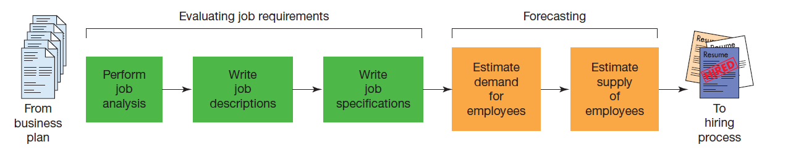
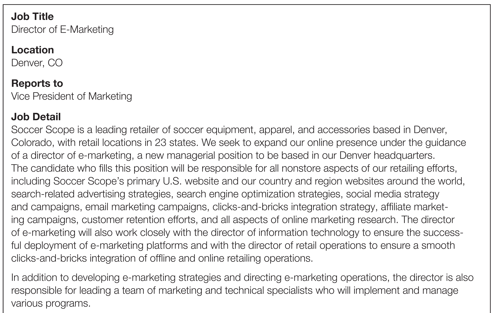
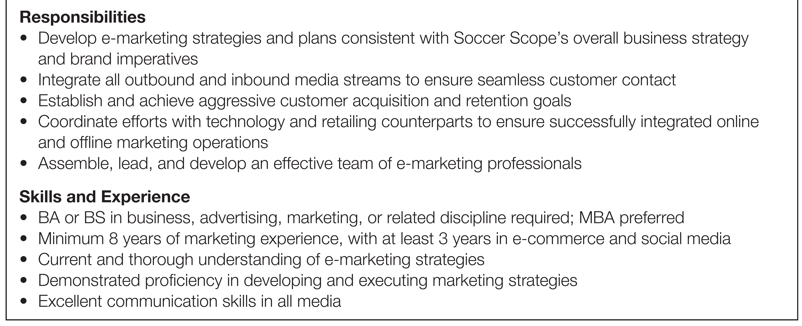
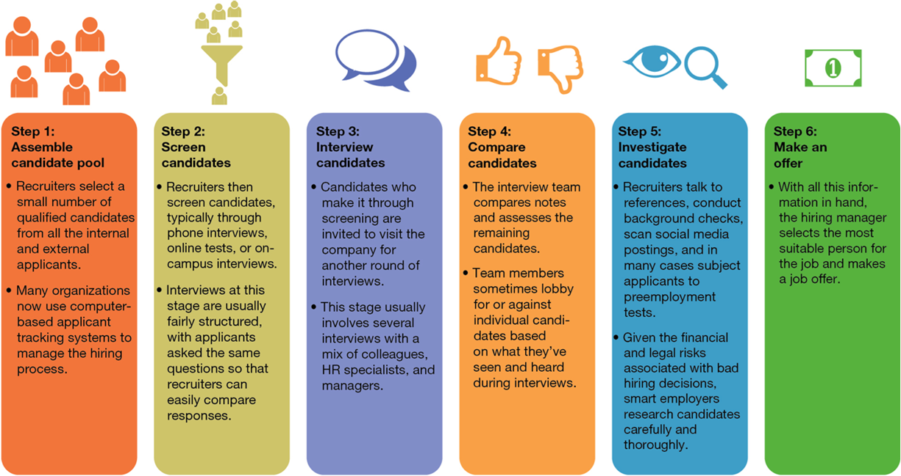
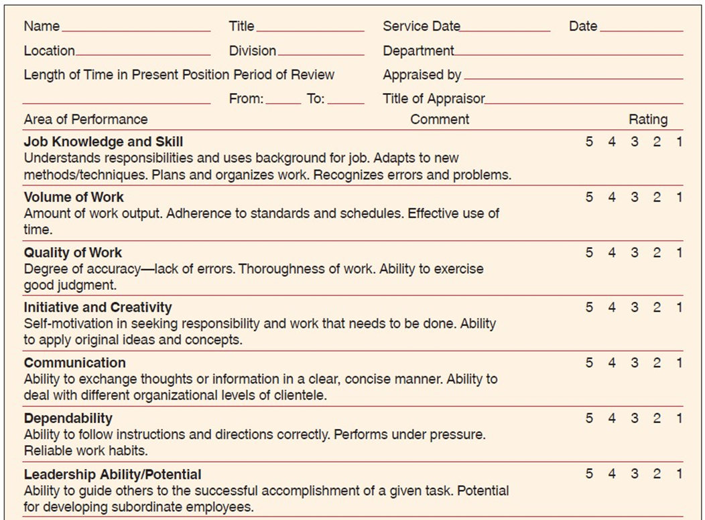
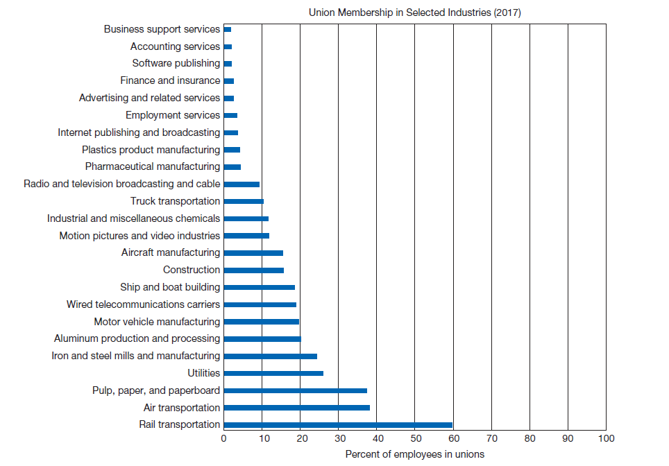
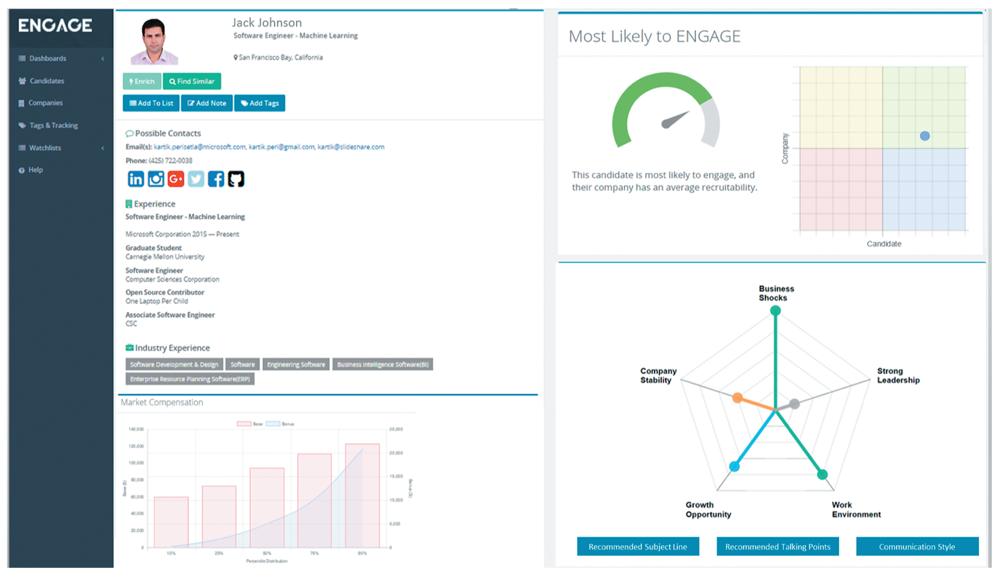

---

## Business in Action: Thriving in the Digital Enterprise

Ninth Edition. Global Edition

__Chapter 11__

Human Resources Management

Copyright © 2020 Pearson Education Ltd. All Rights Reserved.

---

## Learning Objectives (1 of 2)

 __11.1__  Identify four contemporary human resources .HR. challenges and discuss the evolving role of HR.

 __11.2__  Discuss the challenge and advantages of a diverse workforce and identify five major dimensions of workforce diversity.

 __11.3__  Describe the three phases involved in managing the employment life cycle.

 __11.4__  Explain the steps used to develo and evaluate employees.

 __11.5__  Describe the major elements of employee compensation. benefits and support services.

 __11.6__  Characterize the role of labor unions in today’s business world.

 __11.7__  Describe the use of workforce analytics in HR management.

---

## Guiding the Human Side of Business

* __Human resources .H__  __R. management__
  * The specialized function of planning how to obtain employees. oversee their training. evaluate them and compensate them

---

## Creating Safe Workplaces

__Sexual harassment__

Unwelcome sexual advance. request for sexual favors. or other verbal or physical conduct of a sexual nature within the workplace

---

## Ensuring Fair Treatmen and Equal Opportunity

* __Glass ceiling__
  * An invisible barrier attributable to subtle discrimination that keeps wome and minorities out of the top positions in business

---

## Promoting Employee Well-being

* __Work–life balance__
  * Efforts to help employees balance the competing demands of their persona and professional lives
* __Quality of work life .Q__  __W__  __L.__
  * An overall environment that results from jo and work conditions

---

## Managing a Diverse Workforce (1 of 3)

* __Diversity__
  * All the characteristic and experiences that define each of us as individuals
  * Includes race. age. military experience. parental status. marital status and thinking style

* __Sexism__
  * Discrimination on the basis of gender
* __Diversit and inclusion initiatives__
  * Program and policies that help companies support diverse workforce and markets

* __Sexual harassment__
  * Unwelcome sexual advances. request for sexual favors. or other verbal or physical conduct of a sexual nature within the workplace

---

## Exhibit 11.1: Generations in the Workplace

__Source:__ Michael Dimock. “Defining Generations: Where Millennials En and Post.Millennials Begin.” Pew Research Center.1 March 2018.[www.pewresearch.org](http://www.pewresearch.org/).

---

## Managing the Employment Life Cycle

* __Job description__
  * A statement of the tasks involved in a given jo and the conditions under which the holder of a job will work
* __Job specification__
  * A statement describing the kind of person who would be best for a given job—including the skills. education and previous experience that the job requires

---

## Evaluating Job Requirements

* __Job description__
  * A statement of the tasks involved in a given jo and the conditions under which the holder of a job will work
* __Job specification__
  * A statement describing the kind of person who would be best for a given job—including the skills. education and previous experience that the job requires

---

## Exhibit 11.3 Steps in Human Resource Planning

---

## Exhibit 11.4 Job Descriptio and Specification (1 of 2)

---

## Forecasting Suppl and Demand (1 of 2)

* __Turnover rate__
  * The percentage of the workforce that leaves every year
* __Employee retention__
  * Efforts to keep current employees

* __Succession planning__
  * Workforce planning efforts that identify possible replacements for specific employees. usually senior executives
* __Contingent employees__
  * Non.permanent employees. including temporary workers. independent contractors and full.time employees hired on a probationary basis

---

## Alternative Work Arrangements

__Flextime__

__Telecommuting__

__Job sharing__

---

## Hiring Employees

* __Recruiting__
  * The process of attracting appropriate applicants for an organization’s jobs

---

## Exhibit 11.5 The Recruiting Process

---

## Exhibit 11.6 Social Recruiting

---

## Exhibit 11.7 Major Employment Legislation (1 of 2)

---

## Terminating Employees

* __Termination__
  * The process of getting rid of an employee by firing him
* __Layoffs__
  * Termination of employees for economic or business reasons

---

## Replacing Retiring Employees

* __Worker buyouts__
  * Distributions of financial incentives to employees who voluntarily depart; usually undertaken in order to reduce the payroll
* __Mandatory retirement__
  * Required dismissal of an employee who reaches a certain age

---

## Appraising Employee Performance (1 of 2)

* __Performance appraisals__
  * Periodic evaluations of employees’work according to specific criteria
* __Electronic performance monitoring .E__  __P__  __M.__
  * Real.time. computer.based evaluation of employee performance

* __360.degree review__
  * A multidimensional review in which a person is given feedback from subordinates. peers. superiors and possibly outside stakeholders such as customer and business partners

---

## Trainin and Developing Employees (1 of 2)

* __Orientation programs__
  * Sessions or procedures for acclimating new employees to the organization
* __Skills inventory__
  * A list of the skills a company needs from its workforce. along with the specific skills that the individual employees currently possess

---

## Exhibit 11.8 Sample Performance Appraisal Form (1 of 2)

---

## Trainin and Developing Employees (2 of 2)

* __New.employee orientation__
  * Sessions or procedures for acclimating new employees to the organization
* __Onboarding__
  * Programs to help new employees get comfortabl and productive in their assigned roles
* __Skills inventory__
  * A list of the skills a company needs from its workforce. along with the specific skills that individual employees currently possess

---

## Compensatin and Supporting Employees

* __Compensation__
  * Money. benefits and services paid to employees for their work
  * __Salary__
    * Fixed cash compensation for work. usually by a yearly amount; independent of the number of hours worked
  * __Wages__
    * Cash payment based on the number of hours an employee has worked or the number of units an employee has produced

---

## Incentive Programs (1 of 3)

* __Bonus__
  * A cash payment. in addition to regular wage or salary. that serves as a reward for achievement
* __Commissions__
  * Employee compensation based on a percentage of sales made

* __Profit sharing__
  * The distribution of a portion of the company’s profits to employees
* __Gain sharing__
  * Tying rewards to profits or cost savings achieved by meeting specific goals

* __Pay for performance__
  * An incentive program that rewards employees for meeting specific. individual goals
* __Knowledge.based pay__
  * Pay tied to an employee’s acquisition of knowledge or skills
  * Also called competency.based pay or skill.based pay

---

## Employee Benefit and Services

* __Employee benefits__
  * Compensation other than wages. salaries and incentive programs
* __Cafeteria plans__
  * Flexible benefit programs that let employees personalize their benefits packages

---

## Retirement Benefits (1 of 2)

* __Retirement plans__
  * Company.sponsored programs for providing retirees with income
* __401.k. plan__
  * A defined.contribution retirement plan in which employers often match the amount employees invest

* __Employee stock.ownership plan .E__  __S__  __O__  __P.__
  * A program that enables employees to become partial owners of a company

---

## Stock Options

* __Stock options__
  * A contract that allows the holder to purchase or sell a certain number of shares of a particular stock at a given price by a certain date

---

## Other Employee Benefits

* __Employee assistance program .E__  __A__  __P.__
  * A company.sponsored counseling or referral plan for employees with personal problems
* Paid vacation and sick leave
* Famil and medical leave
* Child.care assistance
* Elder.care assistance
* Tuition loan and reimbursements

---

## Understanding the Role of Labor Unions in Today’s Business World

* __Labor relations__
  * The relationship between organized labo and management .in its role as the representative of company ownership.
* __Labor unions__
  * Organizations that represent employees in negotiations with management

---

## Exhibit 11.9 Union Membership in Selected Industries

---

## Unionization: The Employee’s Perspective

* __Seniority__
  * The length of time someone has worked for his or her current employer. relative to other employees
* Benefits for employees
  * Higher compensation
  * Greater benefits
  * Influence over hiring. promotions and layoffs
  * Working condition and workplace safety
  * Formal processes for employee grievances. discipline and other matters
  * Solidarit and recognition

---

## Unionization: Management’s Perspective

* Flexibility
* Productivity
* __Work rules__
  * A common element of labor contracts that specifies such things as the tasks certain employees are required to do or are forbidden to do

---

## Thriving in the Digital Enterprise: Workforce Analytics

* __Workforce analytics__
  * The application of big dat and analytics to workforce management

---

## Exhibit 11.10 Workforce Analytics

---

## Applying What You’ve Learned (1 of 2)

Identify four contemporary human resources .HR. challenges and discuss the evolving role of HR.

Discuss the challenge and advantages of a diverse workforc and identify five major dimensions of workforce diversity.

Describe the three phases involved in managing the employment life cycle.

Explain the steps used to develo and evaluate employees.

Describe the major elements of employee compensation. benefits and support services.

Characterize the role of labor unions in today’s business world.

Describe the use of workforce analytics in HR management.

