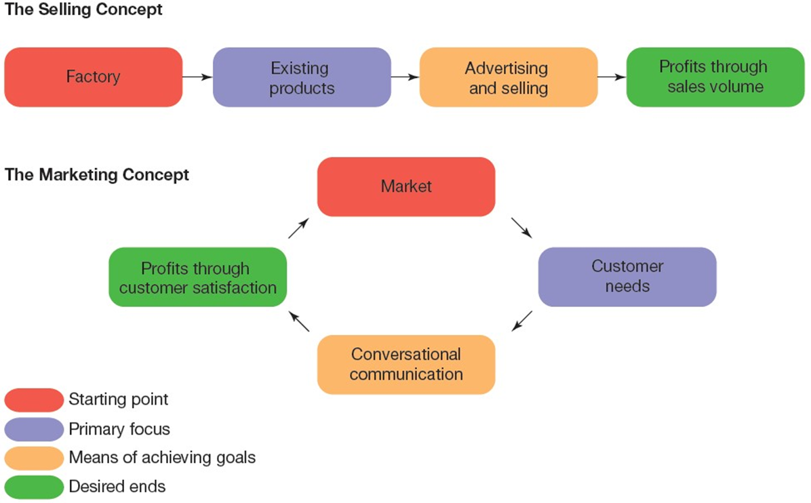
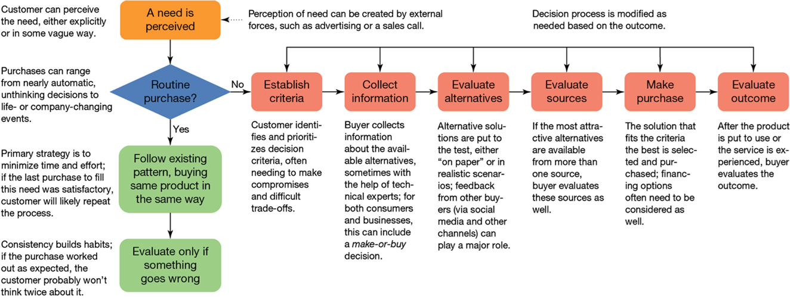
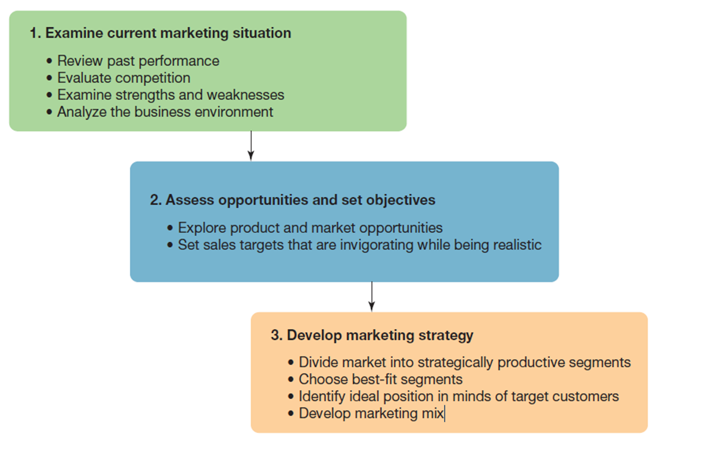
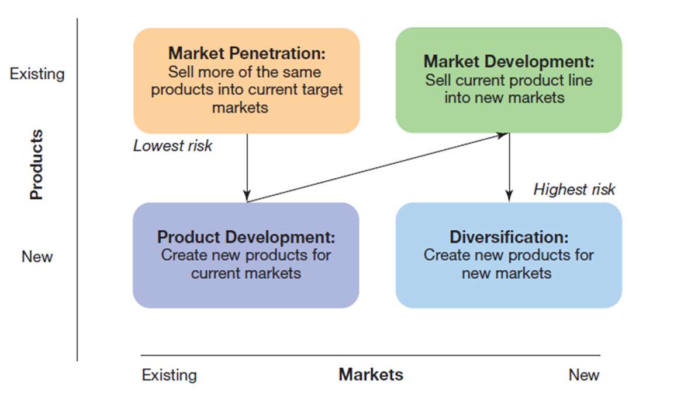
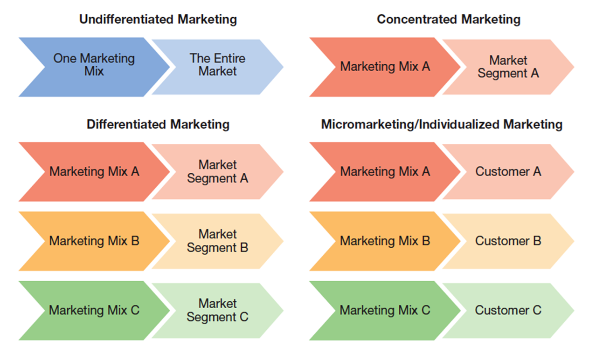
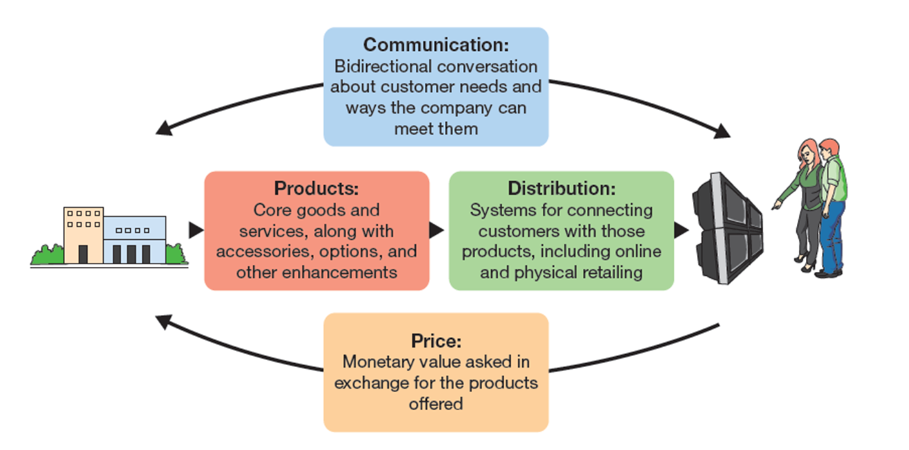

---

## Business in Action: Thriving in the Digital Enterprise

Ninth Edition. Ninth Edition

__Chapter 12__

The Ar and Science of Marketing

Copyright © 2020 Pearson Education Ltd. All Rights Reserved.

---

## Learning Objectives (1 of 2)

 __12.1__  Define __marketing_ and explain its role in society.

 __12.2__  Identify five trends that help define contemporary marketing.

 __12.3__  Differentiate between consumer buying behavio and organizational buying behavior.

 __12.4__  Describe __strategic marketing planning._ and identify the four basic options for pursuing new marketing opportunities.

 __12.5__  Identify the four steps in crafting a marketing strategy.

 __12.6__  Describe the four main components of the marketing mix.

 __12.7__  Define __marketing analytics._ and characterize its use in contemporary marketing.

---

## Marketing in a Changing World

* __Marketing__
  * The process of creating value for customer and building relationships with those customers in order to capture value back from them

---

## The Role of Marketing in Society (1 of 3)

* __Needs__
  * Differences between a person’s actual stat and his or her ideal state; they provide the basic motivation to make a purchase
* __Wants__
  * Specific goods. services. experiences. or other entities that are desirable in light of a person’s experiences. culture and personality

* __Exchange process__
  * The act of obtaining a desired object or service from another party by offering something of value in return
* __Transaction__
  * An exchange of value between parties

* __Utility__
  * The power of a good or service to satisfy a human need
  * Form. time. place. possession

---

## The Marketing Concept (1 of 2)

* __Marketing concept__
  * An approach to business management that stresses customer need and wants. seeks long.term profitability and integrates marketing with other functional units within the organization

* __Relationship marketing__
  * A focus on developin and maintaining long.term relationships with customers. suppliers and distribution partners for mutual benefit
* __Customer loyalty__
  * The degree to which customers continue to buy from a particular retailer or buy the products of a particular manufacturer or service provider

---

## Exhibit 12.1 The Selling Concept Versus the Marketing Concept

---

## Challenges in Contemporary Marketing

Involving the __customer__ in the marketing process

Making __data.driven__ decisions

Conducting marketing activities with greater concern for __ethics_ and __etiquette__

---

## Involving the Customer

* __Customer Relationship Management .C__  __R__  __M.__
  * A type of information system that captures. organizes and capitalizes on all the interactions that a company has with its customers
* __Social commerce__
  * The creatio and sharing of product.related information among customer and potential customers
* __Voice of the Customer V__  __o__  __C__
  * Everything that curren and potential customers are sayin and writing about a compan and its products; also refers to efforts to capture all this feedback

---

## Making Data-Driven Decisions

* __Attribution__
  * The contribution a given marketing activity makes to sale and other marketing goals
* __Marketing research__
  * The collectio and analysis of information for making marketing decisions
  * Observation. surveys. interviews. focus groups

---

## Marketing with Greater Concern for Ethic and Etiquette

* __Permission.based marketing__
  * A marketing approach in which firms first ask permission to deliver messages to an audienc and then promise to restrict their communication efforts to those subject areas in which audience members have expressed interest

---

## Exhibit 12.2 A I-Enhanced Marketing Research

---

## Exhibit 12.3 Marketing Research Techniques (1 of 2)

---

## Understanding Today’s Customers

* __Consumer market__
  * Individuals or households that buy good and services for personal use
* __Organizational market__
  * Companies. government agencies and other organizations that buy good and services either to resell or to use in the creation of their own good and services

---

## Exhibit 12.4 Buyer Decision-Making

---

## The Consumer Decision Process

* __Cognitive dissonance__
  * Tension that exists when a person’s beliefs don’t match his or her behaviors
  * Common example is __buyer__  __’__  __s remorse__ . when someone regrets a purchase immediately after making it

---

## Purchase Influences

Culture

Socioeconomic level

Reference groups

Situational factors

Self.image

---

## The Organizational Customer Decision Process

An emphasis on __economic payback_ and other rational factors

A formal buying process

Greater __complexity__ in product usage

The participatio and influence of multiple people

__Close relationships__ between buyer and sellers

---

## Identifying Market Opportunities

* __Strategic marketing planning__
  * The process of examining an organization’s current marketing situation. assessing opportunitie and setting objectives and then developing a marketing strategy to reach those objectives

---

## Exhibit 12.5 The Strategic Marketing Planning Process

---

## Assessing Opportunitie and Setting Objectives (1 of 2)

* __Market penetration__
  * Selling more of a firm’s existing products in the markets it already serves
* __Product development__
  * Creating new products for a firm’s current markets
* __Market development__
  * Selling existing products to new markets

* __Diversification__
  * Creating new products for new markets
* __Market share__
  * A firm’s portion of the total sales in a market

---

## Exhibit 12.6 Pursuing Market Opportunities

---

## Dividing Markets into Segments (1 of 3)

* __Marketing Strategy__
  * An overall plan for marketing a product; includes the identification of target market segments. a positioning strategy and a marketing mix
* __Market__
  * A group of customers who need or want a particular produc and have the money to buy it
* __Market segmentation__
  * The division of a diverse market into smaller. relatively homogeneous groups with similar needs. wants and purchase behaviors

* __Demographics__
  * The study of statistical characteristics of a population
* __Psychographics__
  * Classification of customers on the basis of their psychological makeup. interests and lifestyles

* __Geographic segmentation__
  * Categorization of customers according to their geographical location
* __Behavioral segmentation__
  * Categorization of customers according to their relationship with products or response to product characteristics

---

## Choosing Your Target Markets

* __Target markets__
  * Specific customer groups or segments to whom a company wants to sell a particular product
  * Undifferentiated. differentiated. concentrated and individualized

---

## Exhibit 12.7 Market-Coverage Strategies

---

## Staking out a Position in Your Target Markets

* __Positioning__
  * Managing a business in a way designed to occupy a particular place in the minds of target customers

---

## The Marketing Mix (1 of 4)

* __Marketing mix__
  * The four key elements of marketing strategy: product. price. distribution and customer communication

---

## Exhibit 12.8 The Marketing Mix

---

## The Marketing Mix (2 of 4)

* __Product__
  * A bundle of value that satisfies a customer need or want
* __Price__
  * The amount of money charged for a product or service

* __Distribution channels__
  * Systems for moving good and services from producers to customers
  * Also known as __marketing channels__

* __Promotion__
  * A wide variety of persuasive techniques used by companies to communicate with their target market and the general public

---

## Thriving in the Digital Enterprise: Marketing Analytics

* __Marketing analytics__
  * A range of analytical tool and techniques that help marketers pla and evaluate marketing activities

---

## Exhibit 12.9 Marketing Metrics (1 of 2)

---

## Applying What You’ve Learned (1 of 2)

Define __marketing_ and explain its role in society.

Identify three trends that help define contemporary marketing.

Differentiate between consumer buying behavio and organizational buying behavior.

Define __strategic marketing planning_ and identify the four basic options for pursuing new marketing opportunities.

Identify the four steps in crafting a marketing strategy.

Describe the four main components of the marketing mix.

Define marketing analytic and characterize its use in contemporary marketing.

