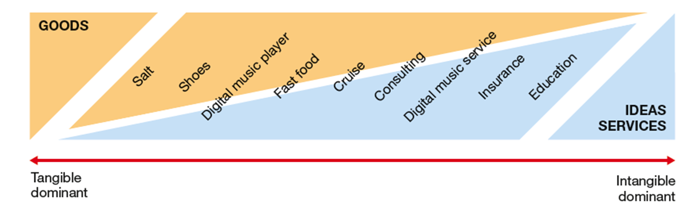
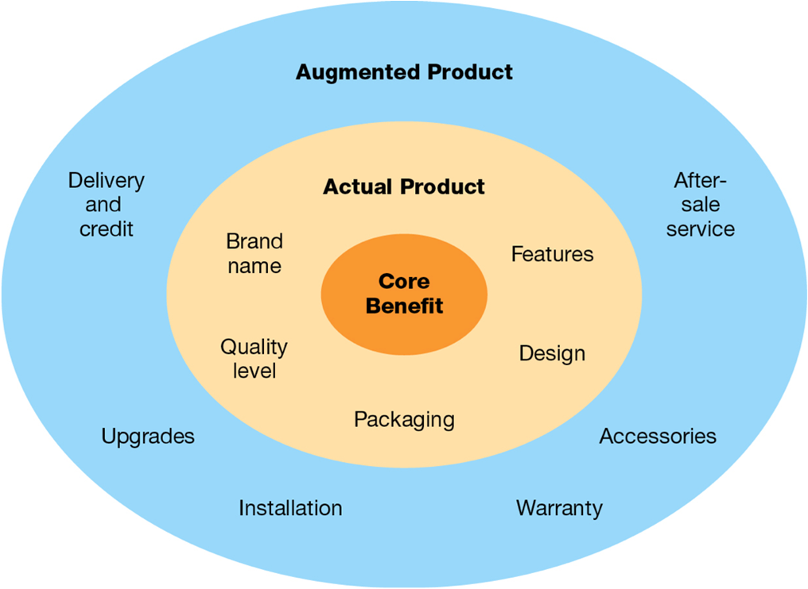
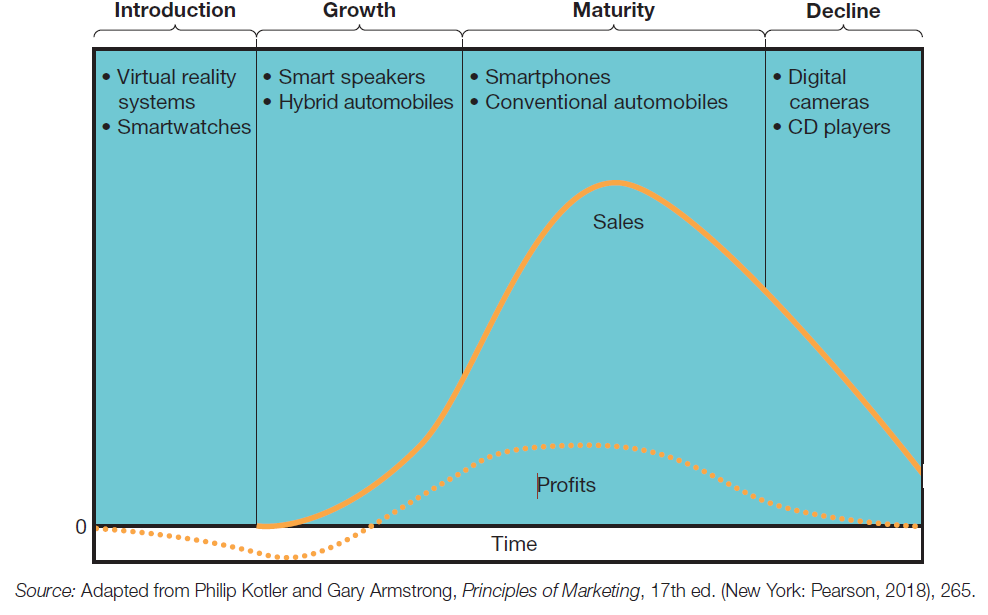
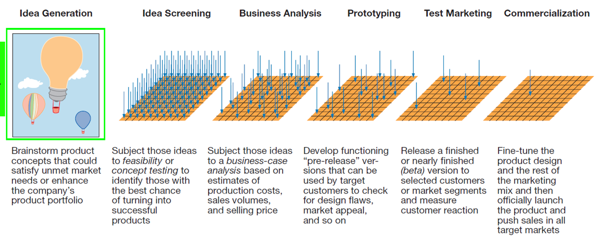
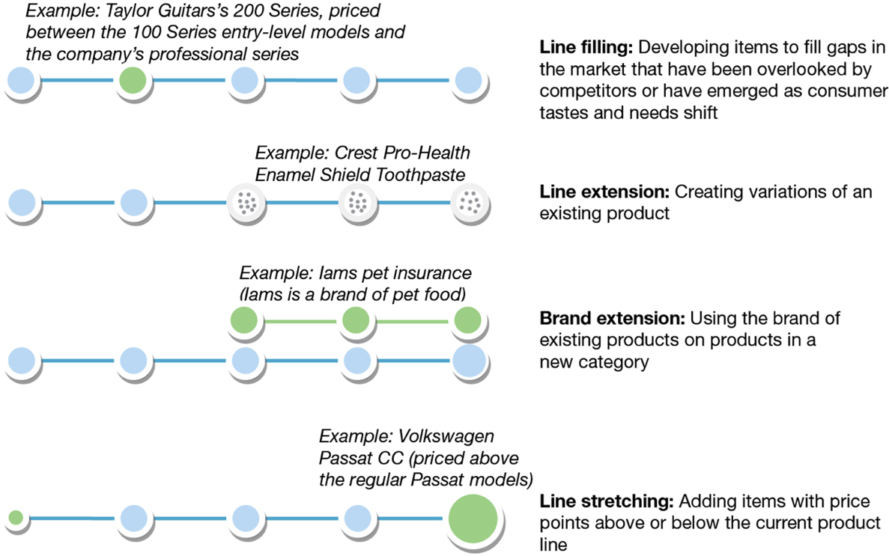
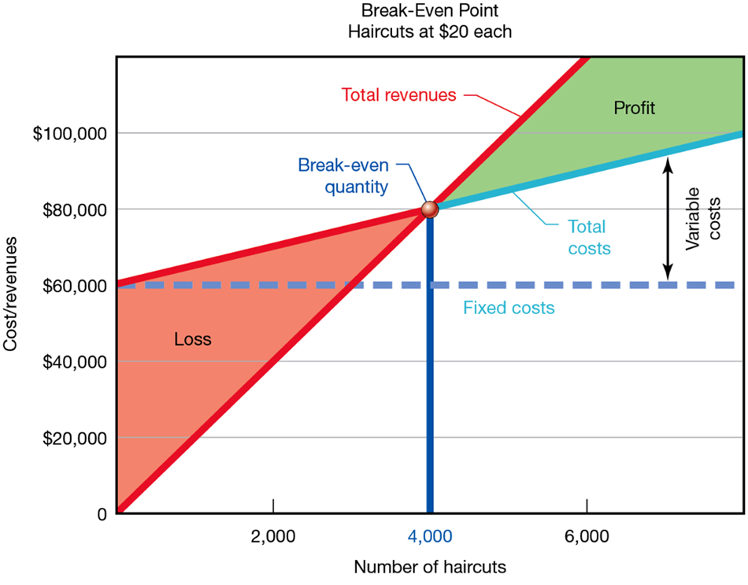
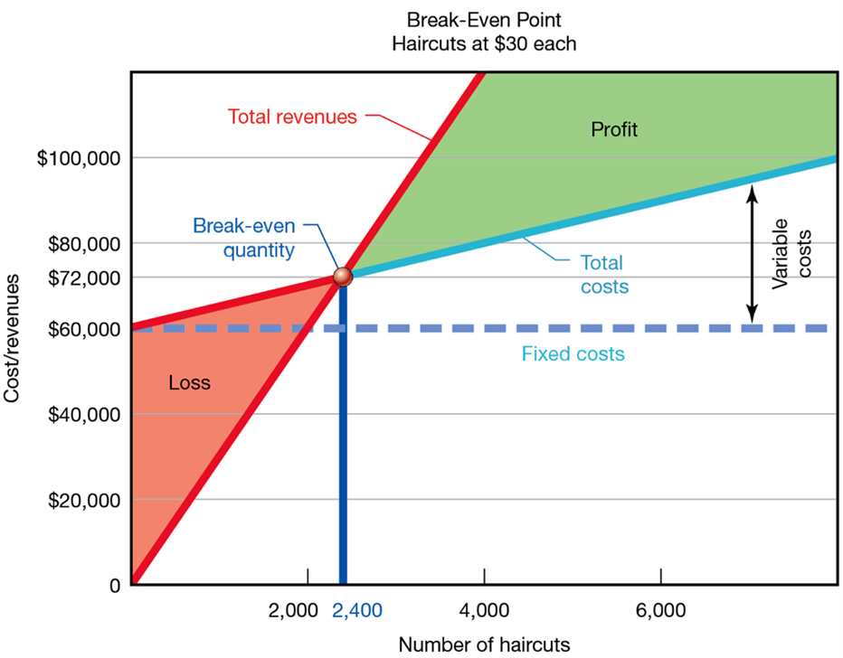

---

## Business in Action: Thriving in the Digital Enterprise

Ninth Edition. Global Edition

__Chapter 13__

Produc and Pricing Strategies

Copyright © 2020 Pearson Education Ltd. All Rights Reserved.

---

## Learning Objectives (1 of 2)

 __13.1__  Identify the main types of consume and organizational products and describe the four stages in the life cycle of a product.

 __13.2__  Describe six stages in the product development process.

 __13.3__  Define __brand__ .and explain the concepts of brand equit and brand loyalty.

 __13.4__  Identify four ways of expanding a product line and discuss two risks that product.line extensions pose.

 __13.5__  List the factors that influence pricing decisions and explain break.even analysis.

 __13.6__  Compare the three foundational pricing methods and list six situational pricing methods.

 __13.7__  Describe how companies are using virtua and augmented reality to create new product and new customer experiences.

---

## Exhibit 13.1 The Product Continuum

---

## Exhibit 13.2 Augmenting the Basic Product

---

## Consumer Products (1 of 2)

* __Convenience products__
  * Everyday good and services that people buy frequently. usually without much conscious planning
* __Shopping products__
  * Fairly important good and services that people buy less frequently with more plannin and comparison

* __Specialty products__
  * Particular brands that the buyer especially want and will seek out. regardless of location or price

---

## Industria and Commercial Products (1 of 2)

* __Expense items__
  * Inexpensive goods generally used within a year of purchase
* __Capital items__
  * More expensive organizational products with a longer useful life. ranging from offic and plant equipment to entire factories

Raw materials

Components

Supplies

Installations

Equipment

Business services

---

## The Product Life Cycle

* __Product life cycle__
  * Four stages through which a product progresses: introduction. growth. maturity and decline

---

## Exhibit 13.3 The Product Life Cycle

__Source:__ Adapted from Philip Kotle and Gary Armstrong. __Principles of Marketing__ . 17th ed. .New York: Pearson. 2018.. 265.

---

## The New-Product Development Process (1 of 3)

* __Product development process__
  * A formal process of generating. selecting. developing and commercializing product ideas

---

## Exhibit 13.4 The Product Development Process

---

## The New-Product Development Process (2 of 3)

* __Prototypes__
  * Pre.production samples of products used for testin and evaluation
* __Test marketing__
  * The stage of product development in which a product is sold on a limited basis to gauge its market appeal

* __Commercialization__
  * Large.scale productio and distribution of a product

---

## Product Identities (1 of 2)

* __Brand__
  * A name. term. sign. symbol. design. or combination of those used to identify the products of a fir and to differentiate them from competing products

* __Brand equity__
  * The value that a company has built up in a brand
* __Brand loyalty__
  * The degree to which customers continue to purchase a specific brand

---

## Brand Name Selection (1 of 2)

* __Brand names__
  * The portion of brands that can be expressed orally. including letters. words. or numbers
* __Brand marks__
  * The portion of brands that cannot be expressed verbally

* __Logo__
  * A graphica and/or textual representation of a brand
* __Trademarks__
  * Brands that have been given legal protection so that their owners have exclusive rights to their use

---

## Brand Ownership (1 of 2)

* __National brands__
  * Brands owned by manufacturer and distributed nationally
* __Private brands__
  * Brands that carry the label of a retailer or a wholesaler rather than a manufacturer

* __Co.branding__
  * A partnership between two or more companies to closely link their brand names together for a single product
* __Brand licensing__
  * Agreement in which one company pays to use another company’s brand on its products.

---

## Product-Lin and Product-Mix Strategies (1 of 2)

* __Brand managers__
  * Managers who develo and implement the marketing strategie and programs for specific products or brands

* __Product line__
  * A series of related products offered by a firm
* __Product mix__
  * The complete portfolio of products that a company offers for sale
* __Family branding__
  * Using a brand name on a variety of related products

---

## Exhibit 13.6 Expanding a Product Line

---

## Strategic Considerations in Pricing

* __Price elasticity__
  * A measure of the sensitivity of demand to changes in price

---

## Cost Structure

* __Fixed costs__
  * Business costs that remain constant regardless of the number of units produced
* __Variable costs__
  * Business costs that increase with the number of units produced

---

## Break-Even Analysis (1 of 2)

* __Break.even analysis__
  * A method of calculating the minimum volume of sales needed at a given price to cover all costs

* __Break.even point__
  * Sales volume at a given price that will cover all of a company’s costs

---

## Exhibit 13.7 Break-Even Analysis (1 of 2)

---

## Pricing Methods (1 of 5)

* __Cost.based pricing__
  * A method of setting prices based on productio and marketing costs. rather than conditions in the marketplace
* __Value.based pricing__
  * A method of setting prices based on customer perceptions of value

* __Competition.based pricing__
  * A method of setting prices based on what suppliers of similar products are charging
* __Algorithmic pricing__
  * A variety of computational methods used to set price. either in more nuanced ways than simple cost. or competition.based pricing or in dynamic ways that respond in real time to fluctuations in deman and other market conditions

* __Skim pricing__
  * Charging a high price for a new product during the introductory stag and lowering the price later
* __Penetration pricing__
  * Introducing a new product at a low price in hopes of building sales volume quickly

* __Loss.leader pricing__
  * Selling one product at a loss as a way to entice customers to consider other products
* __Freemium pricing__
  * A hybrid pricing strategy .free.premium. of offering some products for free while charging for others. or offering a product for free to some customers while charging others for it

* __Subscription pricing__
  * A pricing model in which customers are charged a recurring fee for the right to continuing using a product

---

## Price Adjustment Tactics

* __Discounts__
  * Temporary price reductions to stimulate sales or lower prices to encourage certain behaviors such as paying with cash
* __Bundling__
  * Offering several products for a single price that is presumably lower than the total of the products’individual prices

---

## Thriving in the Digital Enterprise: Virtua and Augmented Reality

* __Virtual reality .V__  __R.__
  * Computer.generated simulations that create the sensation of being in a real environment.
* __Augmented reality .A__  __R.__
  * Systems that superimpose visual or textual information on live images of real scenes.

---

## Applying What You’ve Learned (1 of 2)

Identify the main types of consume and organizational products and describe the four stages in the life cycle of a product.

Describe six stages in the product development process.

Define brand and explain the concepts of brand equit and brand loyalty.

Identify four ways of expanding a product line and discuss two risks that product.line extensions pose.

List the factors that influence pricing decisions and explain break.even analysis.

Compare the three foundational pricing methods and list six situational pricing methods.

Describe how companies are using virtua and augmented reality to create new product and new customer experiences.

