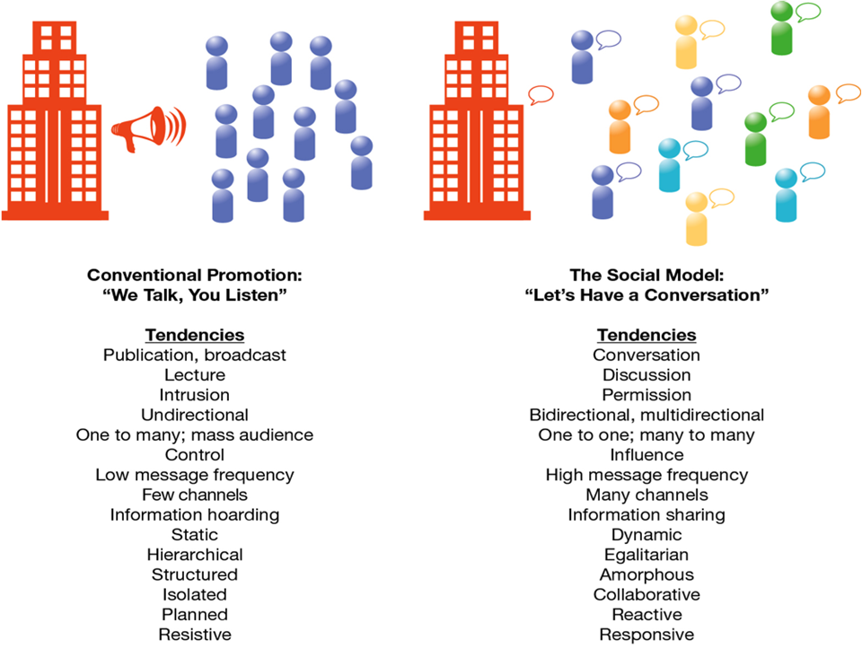
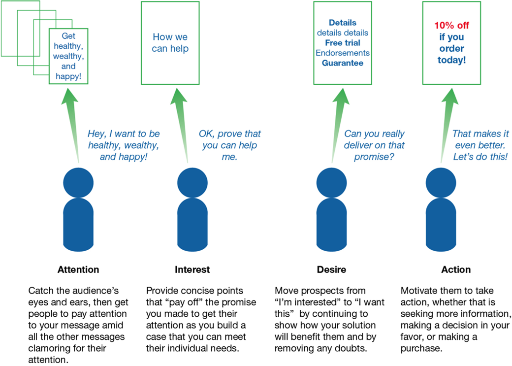
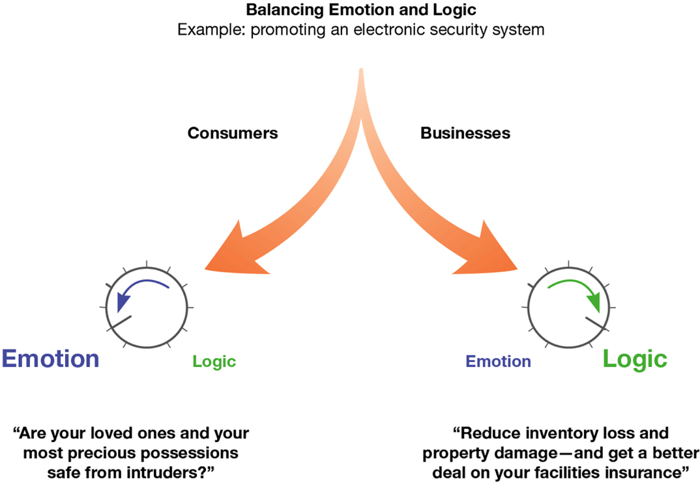
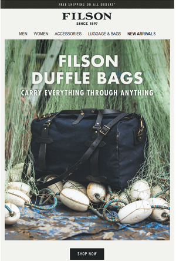
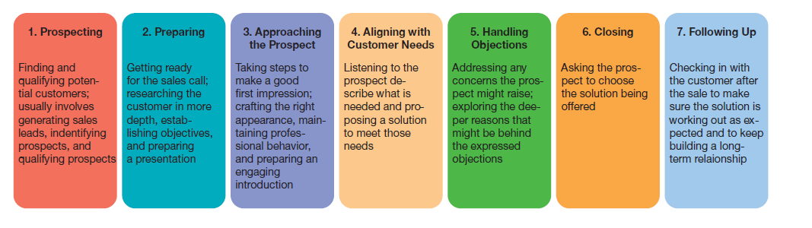
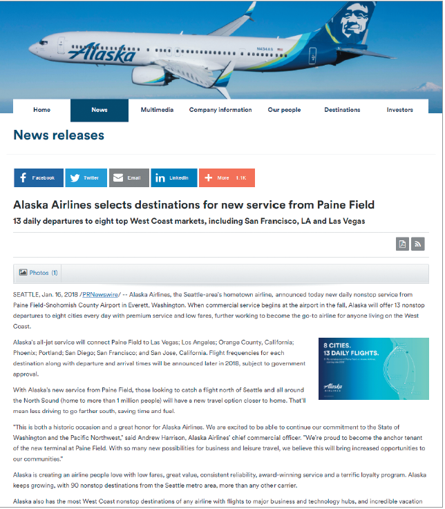
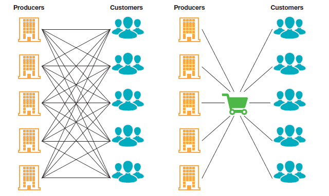
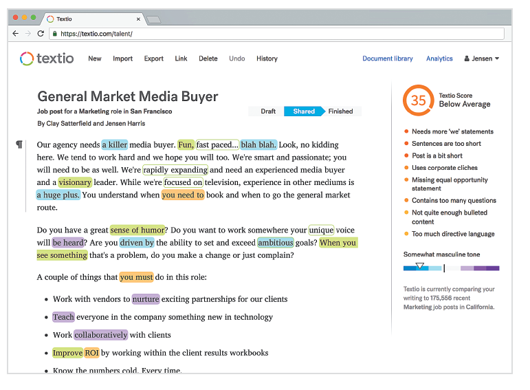
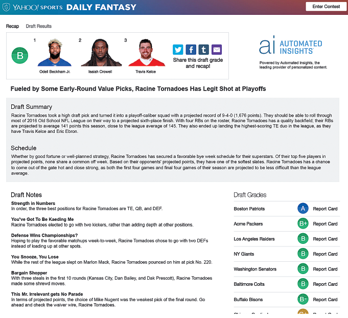

---

## Business in Action: Thriving in the Digital Enterprise

Ninth Edition. Global Edition

__Chapter 14__

Customer Communicatio and Product Distribution

Copyright © 2020 Pearson Education Ltd. All Rights Reserved.

---

## Learning Objectives (1 of 2)

 __14.1__  Describe the three major tasks in crafting a communication strategy and identify six important legal aspects of marketing communication.

 __14.2__  Identify the most common advertising appeal and the most important media used in advertisin and direct response marketing.

 __14.3__  Describe consultative selling and explain the personal.selling process.

 __14.4__  Define sales promotion and characterize the differences between custome and trade promotions.

 __14.5__  Explain the uses of social media in customer communicatio and the role of public relations.

 __14.6__  Discuss the importance of marketing intermediaries and contrast the roles of wholesaler and retailers.

 __14.7__  Describe how companies are using augmente and automated writing to communicate with customers.

---

## Customer Communication

* __Social communication model__
  * An approach to communication based on interactive social medi and conversational communication styles

---

## Exhibit 14.1 The Social Model of Customer Communication

---

## Customer Communication: Challenges, Strategies and Issues

Establish clear communication goals

Define compelling messages to help achieve those goals

Outline a cost.effective media mix to engage target audiences

---

## Establishing Clear Communication Goals

Generating awareness

__Providing information_ and creating positive emotional connections

Building preference

__Stimulating action__

Reminding past customers

---

## Defining Customer Messages

* __Core message__
  * The single most important idea an advertiser hopes to convey to the target audience about its products or the company

---

## Exhibit 14.2 The A I D A Model of Persuasive Communication

---

## Communication

* __Communication mix__
  * A blend of communication vehicles— advertising. direct marketing. personal selling. sales promotion. social media and public relations—that a company uses to reach curren and potential customers

---

## Inbound Versus Outbound Marketing

* __Inbound marketing__
  * Strategy that attracts customers by offering value.added information related to the subjects they are already engaged i and the products that already interest them
* __Content marketing__
  * The tactic of offering helpful. value.added content to potential customers

---

## Exhibit 14.3 Message Integration in Customer Communication

---

## Assembling the Communication Mix

* __Integrated Marketing Communications .I__  __M__  __C.__
  * A strategy of coordinatin and integrating communicatio and promotion efforts with customers to ensure greater efficienc and effectiveness

---

## Communication Law and Ethics

Marketin and sales messages must be truthfu and non.deceptive

You must back up your claims with evidence

“Bai and switch”advertising is illegal

Marketing message and websites aimed at children are subject to special rules

---

## Advertising

* __Advertising__
  * The delivery of announcement and promotional messages via time or space purchased in various media

---

## Advertising Appeals

* __Advertising appeal__
  * A creative tactic designed to capture the audience’s attentio and promote preference for the product or company being advertised
  * Logic. emotion. humor. celebrity. sex. music. scarcity

---

## Exhibit 14.4 Emotiona and Logical Appeals

---

## Advertising Media

* __Advertising media__
  * Communication channels. such as newspapers. radio. television and the World Wide Web
* __Product Placemat__
  * The paid display or use of products in television shows. movies and video games

---

## Exhibit 14.5 Combining Advertising Appeals

---

## Exhibit 14.6 Advantage and Disadvantages of Major Advertising Media (1 of 3)

---

## Direct Response Marketing

* __Direct response marketing__
  * Direct communication with potential customers other than personal sales contacts designed to stimulate a measurable response; also known as direct marketing

---

## Personal Selling

* __Personal selling__
  * One.on.one interaction between a salesperso and a prospective buyer
* __Consultative selling__
  * An approach in which a salesperson acts as a consultan and advisor to help customers find the best solutions to their personal or business needs

---

## The Personal Selling Process

* __Prospecting__
  * The process of findin and qualifying potential customers
* __Closing__
  * The point at which a sale is completed

---

## Exhibit 14.7 The Personal Selling Process

---

## Sales Promotion

* __Sales promotion__
  * A wide range of event and activities designed to promote a brand or stimulate interest in a product
* __Experiential Marketing__
  * Special events that emphasize fun. discovery. or community involvement

---

## Consumer Promotions

* __Rebates__
  * Partial reimbursement of price. offered as a purchase incentive
* __Point.of.purchase .P__  __O__  __P. display__
  * Advertising or other display materials set up at retail locations to promote products to potential customers as they are making their purchase decisions

---

## Trade Promotions

* __Trade promotions__
  * Sales.promotion efforts aimed at inducing distributors or retailers to push a producer’s products
* __Trade allowances__
  * Discounts or other financial considerations offered by producers to wholesaler and retailers

---

## Social Medi and Public Relations

* __Word of mouth__
  * Communication among customer and other parties. transmitting information about companie and products through online or offline personal conversations
* __Conversation marketing__
  * An approach to customer communication in which companies initiat and facilitate conversations in a networked community of potential buyer and other interested parties

---

## Brand Communities

* __Brand communities__
  * Formal or informal groups of people united by their interest i and ownership of particular products

---

## Exhibit 14.8 Using Social Media to Deliver Value-Added Content

---

## Social Customer Care

* __Social customer care__
  * The use of social media to listen for complaints or frustrations. to respond to customers who ask for help and to share useful information with their brand communities

---

## Public Relations (1 of 3)

* __Public relations__
  * Non.sales communication that businesses have with their various audiences .including both communication with the general publi and press relations.

---

## Exhibit 14.9 Media Relations

---

## Public Relations (2 of 3)

* __Press conference__
  * An in.person or online gathering of media representatives at which companies announce new information
  * Also called a __news conference__

* __Press release__
  * A brief statement or video program released to the press announcing new products. management changes. sales performance and other potential news items
  * Also called a __news release__

---

## The Role of Intermediaries

* __Marketing intermediaries__
  * Businesspeopl and organizations that assist in movin and marketing good and services between producer and consumers
* __Distribution channel__
  * An organized network of intermediaries that work together to move goods from producer to customer or to facilitate the delivery of services

---

## Wholesaler and Retailers

* __Wholesalers__
  * Intermediaries that sell products to other intermediaries for resale or to organizations for internal use
* __Retailers__
  * Intermediaries that sell good and services to individuals for their own personal use
* __Merchant wholesalers__
  * Independent wholesalers that take legal title to goods they distribute

---

## Exhibit 14.10 How Intermediaries Simplify Commerce

---

## Retailing

* __Omnichannel retailing__
  * Strategy in which a company builds an integrated online and offline presence so that consumers have a seamless experience throughout the buying process
* __Retail theater__
  * Tactics designed to engage retail consumers in ways that foster store loyalty, keep shoppers in stores longer, and encourage repeat business

---

## Distribution Decisions (1 of 2)

* __Distribution strategy__
  * A firm’s overall plan for moving products through intermediaries and on to final customers
* __Intensive distribution__
  * A market coverage strategy that tries to place a product in as many outlets as possible

---

## Exhibit 14.11 Common Distribution Channel Models

---

## Distribution Decisions (2 of 2)

* __Exclusive distribution__
  * A market coverage strategy that gives intermediaries exclusive rights to sell a product in a specific geographic area
* __Selective distribution__
  * A market coverage strategy that uses a limited number of carefully chosen outlets to distribute products

---

## Thriving in the Digital Enterprise: Augmented and Automated Writing

* __Augmented writing__
  * Systems that provide real-time advice about the effectiveness of written language
* __Automated writing__
  * The use of AI to produce finished or near-finished writing

---

## Exhibit 14.12 Augmented Writing

---

## Exhibit 14.13 Automated Writing

---

## Applying What You’ve Learned (1 of 2)

Describe the three major tasks in crafting a communication strategy and identify six important legal aspects of marketing communication.

Identify the most common advertising appeal and the most important media used in advertising and direct response marketing.

Describe consultative selling and explain the personal selling process.

Define sales promotion and characterize the differences between consume and trade promotions.

Explain the uses of social media in customer communications and the role of public relations.

Discuss the importance of marketing intermediaries and contrast the roles of wholesaler and retailers.

Describe how companies are using augmented and automated writing to communicate with customers.

