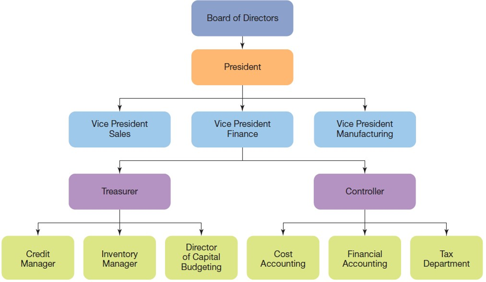
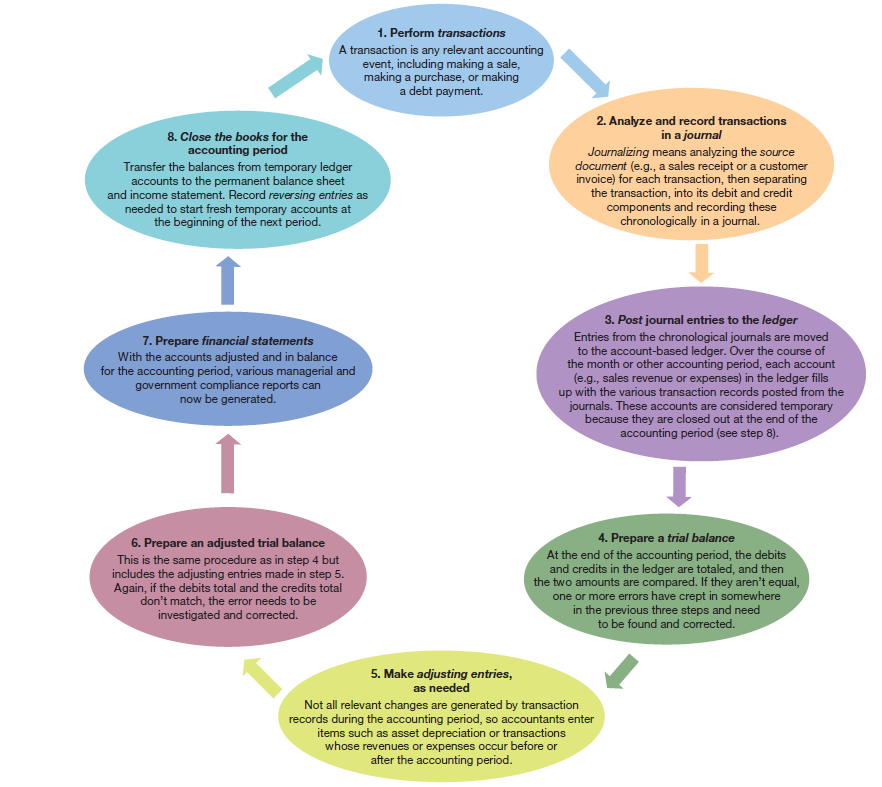
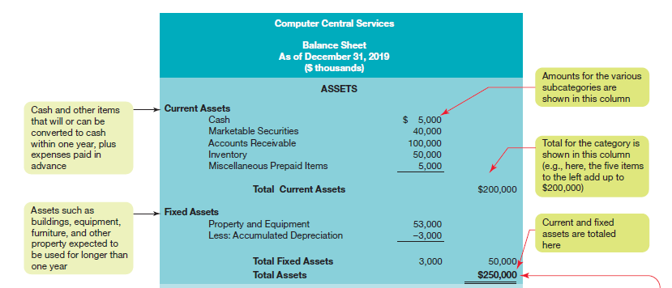
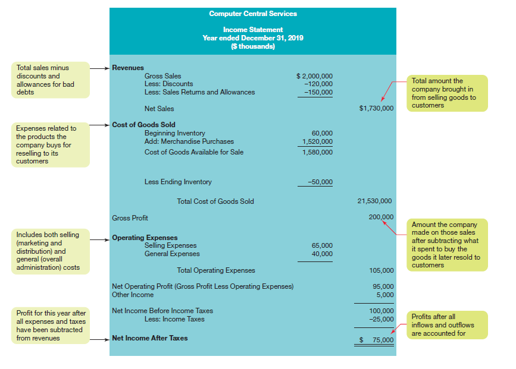
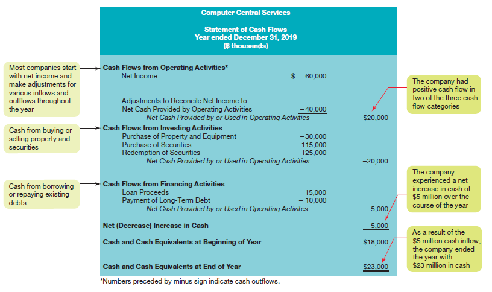
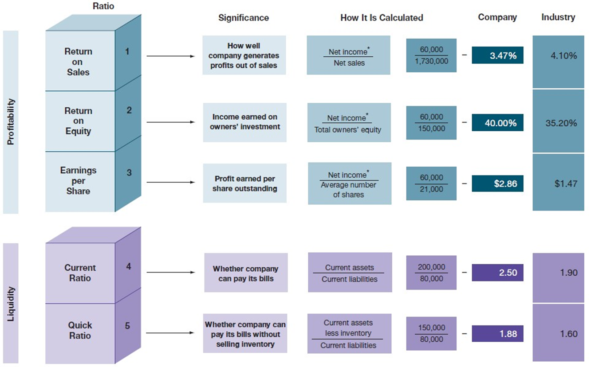

---

## Business in Action: Thriving in the Digital Enterprise

Ninth Edition' Global Edition

__Chapter 15__

Financial Information and Accounting Concepts

Copyright © 2020 Pearson Education Ltd. All Rights Reserved.

---

## Learning Objectives (1 of 2)

__15.1__ Define accounting'and describe the roles of private and public accountants.

__15.2__ Explain the impact of accounting standards such as GAAP and the Sarbanes.Oxley Act on corporate accounting.

__15.3__ Describe the accounting equation'and explain the purpose of double.entry bookkeeping and the matching principle.

__15.4__ Identify the major financial statements' and explain how to read a balance sheet.

__15.5__ Explain the purpose of the income statement and the statement of cash flows.

__15.6__ Explain the purpose of ratio analysis' and list the four main categories of financial ratios.

__15.7__ Explain why businesses would be interested in blockchain and other distributed ledger technologies.

---

## Agenda 21W

1. Revenue, Costs, and Profit
2. Assets and Liabilities
3. Value Chain and P&L
  - Exercise: Estimating Gross Margins
4. Business Models and Financial Planning
  - Exercise: What and how to charge? 

---

## Understanding Accounting (1 of 2)

* __Accounting__
  * Measuring' interpreting' and communicating financial information to support internal and external decision making

* __Financial accounting__
  * The area of accounting concerned with preparing financial information for users outside the organization
* __Management accounting__
  * The area of accounting concerned with preparing data for use by managers within the organization

---

## Private Accountants (1 of 2)

* __Bookkeeping__
  * Recordkeeping; the clerical aspect of accounting
* __Private accountants__
  * In.house accountants employed by organizations and businesses other than a public accounting firm
  * Also called corporate accountants' managerial accountants' and cost accountants

* __Controller__
  * The highest.ranking accountant in a company' responsible for overseeing all accounting functions
* __Certified public accountants .C__  __P__  __As.__
  * Professionally licensed accountants who meet certain requirements for education and experience' and who pass a comprehensive examination

---

## Exhibit 15.1 Typical Finance Department

---

## Public Accountants

* __Public accountants__
  * Professionals who provide accounting services to other businesses and individuals for a fee
* __Audit__
  * Formal evaluation of the fairness and reliability of a client’s financial statements

---

## Major Accounting Rules (1 of 2)

* __G__  __A__  __A__  __P .generally accepted accounting practices.__
  * Standards and practices used by publicly held corporations in the United States and a few other countries in the preparation of financial statements; on course to converge with IFRS

* __External auditors__
  * Independent accounting firms that provide auditing services for public companies
* __International financial reporting standards .I__  __F__  __R__  __S.__
  * Accounting standards and practices used in many countries outside the United States

---

## Sarbanes-Oxley

* __Sarbanes.Oxley__
  * The informal name of comprehensive legislation designed to improve the integrity and accountability of financial information

---

## Fundamental Accounting Concepts

* __Assets__
  * Any things of value owned or leased by a business
* __Liabilities__
  * Claims against a firm’s assets by creditors
* __Owners__  __’__  __equity__
  * The portion of a company’s assets that belongs to the owners after obligations to all creditors have been met

---

## The Accounting Equation

* __Accounting equation__
  * The basic accounting equation' stating that assets equal liabilities plus owners’equity

---

## Double-Entry Bookkeeping and the Matching Principle (1 of 4)

* __Double.entry bookkeeping__
  * A method of recording financial transactions that requires a debit entry and credit entry for each transaction to ensure that the accounting equation is always kept in balance

* __Matching principle__
  * The fundamental principle requiring that expenses incurred in producing revenue be deducted from the revenues they generate during an accounting period

* __Accrual basis__
  * An accounting method in which revenue is recorded when a sale is made and an expense is recorded when it is incurred
* __Cash basis__
  * An accounting method in which revenue is recorded when payment is received and an expense is recorded when cash is paid

* __Depreciation__
  * An accounting procedure for systematically spreading the cost of a tangible asset over its estimated useful life

---

## Using Financial Statements: The Balance Sheet

* __Balance sheet__
  * A statement of a firm’s financial position on a particular date
  * Also known as a __statement of financial position__
* __Fiscal year__
  * Any 12 consecutive months used as an accounting period

---

## Exhibit 15.2 The Accounting Cycle

---

## The Accounting Cycle

Perform transactions

Analyze and record transactions in a journal

Post journal entries to the ledger

Prepare a trial balance

Make adjusting entries' as needed

Prepare an adjusted trial balance

Prepare financial statements

Close the books for the accounting period

---

## Exhibit 15.3 Balance Sheet for Computer Central Services (1 of 2)

---

## Balance Sheet (1 of 3)

* __Current assets__
  * Cash and items that can be turned into cash within one year
* __Fixed assets__
  * Assets retained for long.term use' such as land' buildings' machinery' and equipment .also referred to as __property' plant' and equipment.__

* __Current liabilities__
  * Obligations that must be met within a year
* __Long.term liabilities__
  * Obligations that fall due more than a year from the date of the balance sheet

* __Retained earnings__
  * The portion of shareholders’equity earned by the company but not distributed to its owners in the form of dividends

---

## Using Financial Statements: Income and Cash Flow Statements (1 of 4)

* __Income statement__
  * A financial record of a company’s revenues' expenses' and profits over a given period of time
  * Also known as a __profit and loss statement__

* __Expenses__
  * Costs created in the process of generating revenues
* __Net income__
  * Profit earned or loss incurred by a firm' determined by subtracting expenses from revenues
  * Referred to as the __bottom line__

---

## Exhibit 15.4 Income Statement for Computer Central Services

---

## Using Financial Statements: Income and Cash Flow Statements (3 of 4)

* __Cost of goods sold__
  * The cost of producing or acquiring a company’s products for sale during a given period
* __Gross profit__
  * The amount remaining when the cost of goods sold is deducted from net sales
  * Also known as __gross margin__

* __Operating expenses__
  * All costs of operation that are not included under cost of goods sold
* __E__  __B__  __I__  __T__  __D__  __A__
  * Earnings before interest' taxes' depreciation' and amortization

---

## Statement of Cash Flows

* __Statement of cash flows__
  * A statement of a firm’s cash receipts and cash payments that presents information on its sources and uses of cash

---

## Exhibit 15.5 Statement of Cash Flows for Computer Central Services

---

## Profitability Ratios (1 of 2)

* __Return on sales__
  * The ratio between net income after taxes and net sales
  * Also known as the __profit margin__
* __Return on equity__
  * The ratio between net income after taxes and total owners’equity

* __Earnings per share__
  * A measure of a firm’s profitability for each share of outstanding stock' calculated by dividing net income after taxes by the average number of shares of common stock outstanding

---

## Liquidity Ratios (1 of 2)

* __Working capital__
  * Current assets minus current liabilities
* __Current ratio__
  * A measure of a firm’s short.term liquidity' calculated by dividing current assets by current liabilities

---

## Exhibit 15.6 How Well Does This Company Stack Up? (1 of 2)

---

## Liquidity Ratios (2 of 2)

* __Quick ratio__
  * A measure of a firm’s short.term liquidity' calculated by adding cash' marketable securities' and receivables' then dividing that sum by current liabilities
  * Also known as the __acid.test ratio__

---

## Activity Ratios (1 of 2)

* __Inventory turnover ratio__
  * A measure of the time a company takes to turn its inventory into sales' calculated by dividing cost of goods sold by the average value of inventory for a period

* __Accounts receivable turnover ratio__
  * A measure of the time a company takes to turn its accounts receivable into cash' calculated by dividing sales by the average value of accounts receivable for a period

---

## Leverage, or Debt, Ratios (1 of 2)

* __Debt.to.equity ratio__
  * A measure of the extent to which a business is financed by debt as opposed to invested capital' calculated by dividing the company’s total liabilities by owners’equity

* __Debt.to.assets ratio__
  * A measure of a firm’s ability to carry long.term debt' calculated by dividing total liabilities by total assets

---

## Thriving in the Digital Enterprise: Distributed Ledgers and Blockchain

* __Distributed ledger__
  * Method of verifying and recording transactions that replaces the individual ledgers of market participants with a shared ledger that everyone can access
* __Blockchain__
  * A type of distributed ledger in which each new transaction is captured in a “block'” which is then appended to the previous block in a continuous chain

---

## Applying What You’ve Learned (1 of 2)

Define accounting' and describe the roles of private and public accountants.

Explain the impact of accounting standards such as GAAP and the Sarbanes.Oxley Act on corporate accounting.

Describe the accounting equation' and explain the purpose of double.entry bookkeeping and the matching principle.

Identify the major financial statements' and explain how to read a balance sheet.

Explain the purpose of the income statement and the statement of cash flows.

Explain the purpose of ratio analysis' and list the four main categories of financial ratios.

Explain why businesses would be interested in blockchain and other distributed ledger technologies.

