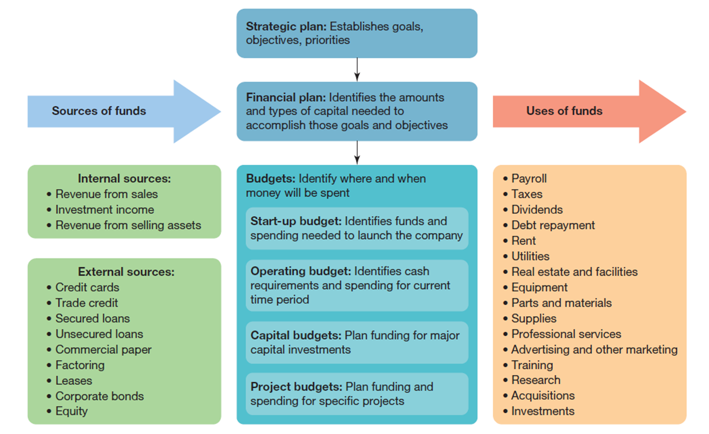
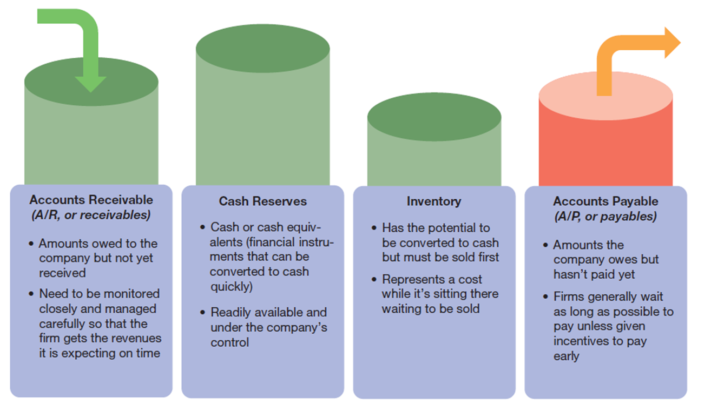
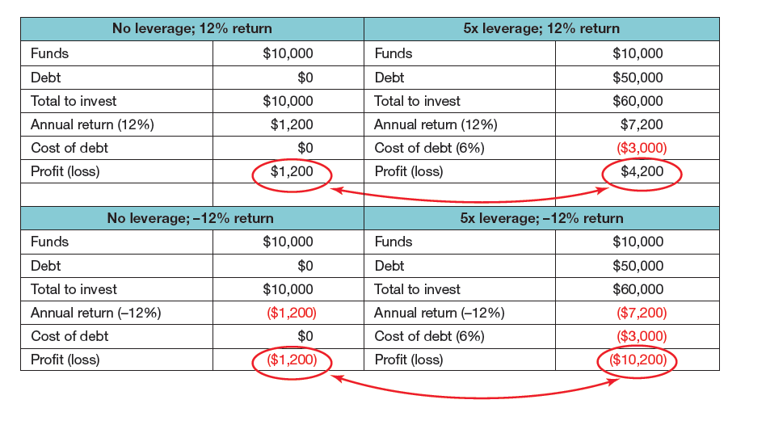
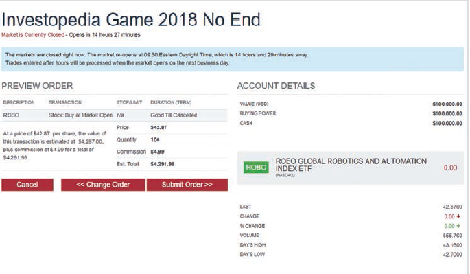

---

## Business in Action: Thriving in the Digital Enterprise

Ninth Edition. Global Edition

__Chapter 16__

Financial Managemen and Financial Markets

Copyright © 2020 Pearson Education Ltd. All Rights Reserved.

---

## Learning Objectives (1 of 2)

__16.1__ Identify three fundamental concepts that affect financial decisions and describe the primary responsibilities of a financial manager.

__16.2__ Compare the advantage and disadvantages of deb and equity financing and explain the two major considerations in choosing from financing alternatives.

16.3 Identify the major categories of debt financing.

__16.4__ Outline the advantage and disadvantages of equity financing.

__16.5__ Identify the four most important financial markets for most businesses.

__16.6__ Describe four major steps required to become an investor.

__16.7__ Explain how businesses can use __smart contracts__ to facilitate transactions.

---

## The Role of Financial Management

* __Financial management__
  * Planning for a firm’s money need and managing the allocatio and spending of funds
* __Risk/return trade.off__
  * The balance of potential risks against potential rewards

---

## Exhibit 16.1 Financial Management: Three Fundamental Concepts

__Balancing short.ter and long.term demands__

  * Must have ready cash to pay salaries. bills and taxes
  * Needs a financial cushion to ride out rough times
  * May need money for acquisitions of other extraordinary expenses
  * Must make strategic long.term investments

__Balancing potential risk and potential rewards__

  * Every decision involves a risk/reward trade.off
  * Higher risks may yield higher rewards
  * The safest choices aren’t always the best choices

__Balancing leverag and flexibility__

  * Can use debt strategicall and sometimes out of necessity
  * Debt can be a tool. but it can also be a trap
  * Highly leveraged companies have far less ability to maneuve and are more vulnerable to setbacks

---

## Developing a Financial Plan

* __Financial plan__
  * A document that outlines the funds needed for a certain period of time. along with the source and intended uses of those funds
  * Strategic plan. company’s financial statements. external financial environment

---

## Exhibit 16.2 Findin and Allocating Funds

---

## Managing Accounts Receivabl and Accounts Payable

* __Accounts receivable__
  * Amounts that are currently owed to a firm
* __Accounts payable__
  * Amounts that a firm currently owes to other parties

---

## Exhibit 16.3 Monitoring the Working Capital Accounts

---

## The Budgeting Process (1 of 2)

* __Budget__
  * A plannin and control tool that reflects expected revenues. operating expenses and cash receipt and outlays
* __Financial control__
  * The process of analyzin and adjusting the basic financial plan to correct for deviations from forecasted events

---

## Exhibit 16.4 Budgeting Challenges

__Every company has a limited amount of money to spend.__

  * Project and departments are often in competition for resources.
  * Managers need to make tough choices. occasionally taking money from one grou and giving it to another.

__Revenue and costs are often difficult to predict.__

  * Sales forecasts are never certain. particularly for new products or for sales into new markets.
  * Fixed costs are easy to predict. but variable costs can be hard to predict. particularly more than a few months out.

__It’s not always clear how much should be spent.__

  * With some expenses. such as advertising. managers aren’t always sure how much is enough.
  * Uncertainty leads to budgeting based on past expenditure. which might be out of line with current strategic needs.

---

## The Budgeting Process (2 of 2)

* __Zero.based budgeting__
  * A budgeting approach in which each year starts from zer and must justify every item in the budget. rather than simply adjusting the previous year’s budget amounts

---

## Debt Financing versus Equity Financing

* __Debt financing__
  * Arranging funding by borrowing money
* __Equity financing__
  * Arranging funding by selling ownership shares in the company. publicly or privately
* __Capital structure__
  * A firm’s mix of deb and equity financing

---

## Exhibit 16.5 Debt versus Equity Financing

---

## Length of Term

* __Short.term financing__
  * Financing used to cover current expenses .generally repaid within a year.
* __Long.term financing__
  * Financing used to cover long.term expenses such as assets .generally repaid over a period of more than one year.
* __Cost of Capital__
  * The average rate of interest a firm pays on its combination of deb and equity

---

## Exhibit 16.6 Financial Leverage

---

## Leverage

* __Leverage__
  * The technique of increasing the rate of return on an investment by financing it with borrowed funds

---

## Exhibit 16.7 Sources of Short-Term Debt Financing (1 of 2)

---

## Short-Term Debt

* __Trade credit__
  * Credit obtained by a purchaser directly from a supplier
* __Secured loans__
  * Loans backed up with assets that the lender can claim in case of default. such as a piece of property
* __Collateral__
  * A tangible asset a lender can claim if a borrower defaults on a loan

---

## Other Short-Term Debt Financing

* __Unsecured loans__
  * Loans that require a good credit rating but no collateral
* __Line of credit__
  * An arrangement in which a financial institution makes money available for use at any time after the loan has been approved
* __Commercial paper__
  * Short.term promissory notes. or contractual agreements. to repay a borrowed amount by a specified time with a specified interest rate

---

## Factoring

* __Factoring__
  * Obtaining funding by selling accounts receivable

---

## Exhibit 16.8 Sources of Long-Term Debt Financing

---

## Long-Term Debt Financing

* __Lease__
  * An agreement to use an asset in exchange for regular payment; similar to renting
* __Bonds__
  * A method of funding in which the issuer borrows from an investo and provides a written promise to make regular interest payment and repay the borrowed amount in the future

---

## Private Equity

* __Private equity__
  * Ownership assets that aren’t publicly traded
  * Includes venture capital

---

## Financial Markets

* __Stock exchanges__
  * Organizations that facilitate the buyin and selling of stock
* __Bond market__
  * The collective buyin and selling of bonds; most bond trading is done over the counter. rather than in organized exchanges
* __Money market__
  * An over.the.counter marketplace for short.term debt instruments such as Treasury bill and commercial paper

---

## The Derivatives Market

* __Derivatives__
  * Contracts whose value is derived from some other entity .usually an asset of some kind. but not necessarily.; used to hedge against or speculate on risk
* __Derivatives market__
  * A market that includes exchange trading .for future and some options and over.the.counter trading .for all other derivatives. at least currently.

---

## Exhibit 16.9 No-Risk Ways to Hone Your Investing Skills

---

## Learning to Analyze Financial News

* __Bull market__
  * A market situation in which most stocks are increasing in value
* __Bear market__
  * A market situation in which most stocks are decreasing in value

---

## Creating an Investment Portfolio

* __Investment portfolios__
  * Collections of various types of investments
* __Asset allocation__
  * Management of a portfolio to balance potential returns with an acceptable level of risk
* __Broker__
  * A certified expert who is legally registered to bu and sell securities on behalf of individua and institutional investors

---

## Exhibit 16.10

---

## Thriving in the Digital Enterprise: Smart Contracts

* __Smart contract__
  * Digital agreement in a distributed ledger such as blockchain that automatically executes when its criteria are fulfilled by incoming data

---

## Applying What You’ve Learned (1 of 2)

Identify three fundamental concepts that affect financial decision and describe the primary responsibilities of a financial manager.

Compare the advantage and disadvantages of debt and equity financing and explain the two major considerations in choosing from financing alternatives.

Identify the major categories of debt financing.

Outline the advantage and disadvantages of equity financing.

Identify the four most important financial markets for most businesses.

Describe four major steps required to become an investor.

Explain how businesses can use smart contracts to facilitate transactions.

